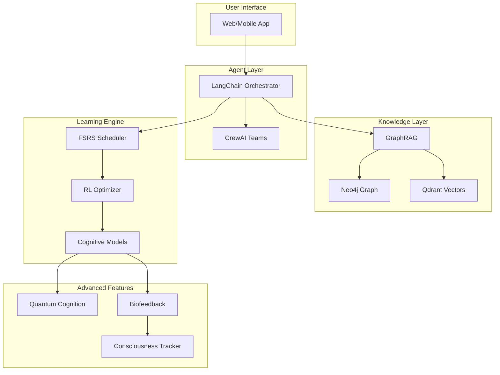

# Open-Source Tools & Frameworks Research Index
*Comprehensive research for Prometheus v3 implementation*
*Research conducted: September 2024*

## 📚 Overview

This directory contains exhaustive research on open-source tools and frameworks aligned with Prometheus v3's requirements. Each document provides detailed analysis, comparisons, and implementation recommendations for building a state-of-the-art agentic learning system.

## 🗂️ Research Documents

### 1. [AI Agent Orchestration Frameworks](01_ai_agent_orchestration_frameworks.md)
**Focus**: Multi-agent systems, orchestration, and coordination
- **Primary Tools**: LangChain, CrewAI, AutoGPT, Claude Flow
- **Key Findings**: LangChain + LangGraph recommended for production
- **Implementation Priority**: Week 1 - Core infrastructure
- **Paradigm Alignment**: All 15 paradigms, especially Symbiotic Mind Mesh

### 2. [Knowledge Graph & Vector Databases](02_knowledge_graph_vector_databases.md)
**Focus**: Hybrid knowledge management, GraphRAG, semantic search
- **Primary Tools**: Neo4j, Qdrant, Weaviate, ChromaDB
- **Key Findings**: Neo4j + Qdrant hybrid approach optimal
- **Implementation Priority**: Week 1-2 - Knowledge foundation
- **Paradigm Alignment**: Quantum Superposition, Entangled Learning, Collective Consciousness

### 3. [Spaced Repetition & ML Frameworks](03_spaced_repetition_ml_frameworks.md)
**Focus**: Evidence-based learning scheduling, reinforcement learning
- **Primary Tools**: FSRS, PyTorch, Gymnasium, Stable Baselines3
- **Key Findings**: Custom FSRS with RL optimization recommended
- **Implementation Priority**: Week 1 - Core learning mechanics
- **Paradigm Alignment**: Temporal Helix, Adversarial Growth, Elastic Thinking

### 4. [Cognitive Architectures](04_cognitive_architectures.md)
**Focus**: Consciousness modeling, dual-process theory, memory systems
- **Primary Tools**: OpenCog, Soar, ACT-R, CLARION
- **Key Findings**: Extract concepts rather than implement full architectures
- **Implementation Priority**: Week 2-3 - Advanced features
- **Paradigm Alignment**: 7-Level Consciousness Evolution, Dual-Process Learning

### 5. [Quantum Computing Frameworks](05_quantum_computing_frameworks.md)
**Focus**: Quantum cognition, superposition states, quantum ML
- **Primary Tools**: PennyLane, Qiskit, Cirq
- **Key Findings**: PennyLane for QML, quantum-inspired classical fallbacks
- **Implementation Priority**: Week 3 - Optional enhancement
- **Paradigm Alignment**: Quantum Superposition, Entangled Learning

### 6. [Biofeedback & Consciousness Tracking](06_biofeedback_consciousness_tracking.md)
**Focus**: EEG/HRV monitoring, neurofeedback, consciousness evolution
- **Primary Tools**: OpenBCI, Muse, BrainBay, OpenViBE
- **Key Findings**: Tiered approach - software simulation → consumer → research
- **Implementation Priority**: Week 3 - Optional hardware integration
- **Paradigm Alignment**: Somatic Resonance Field, Consciousness Evolution

## 🎯 Quick Reference Matrix

| Category | Recommended Stack | Alternative | Complexity | Cost |
|----------|------------------|-------------|------------|------|
| **Agents** | LangChain + LangGraph | CrewAI | Medium | Free |
| **Knowledge** | Neo4j + Qdrant | ChromaDB + NetworkX | High | Free* |
| **Spacing** | Custom FSRS | Anki API | Low | Free |
| **RL** | Stable Baselines3 | TorchRL | Medium | Free |
| **Cognitive** | Concept extraction | Full framework | High | Free |
| **Quantum** | PennyLane | Quantum-inspired | High | Free |
| **Biofeedback** | Muse SDK | Simulation only | Medium | $250+ |

*Neo4j Community Edition free for <3 nodes

## 🚀 Implementation Roadmap

### Week 1: Core Foundation
```yaml
Priority: Essential
Components:
  - LangChain for agent orchestration
  - Qdrant for vector storage
  - Custom FSRS for spacing
  - Gymnasium environment
  - PyTorch base models
```

### Week 2: Knowledge & Intelligence
```yaml
Priority: Important
Components:
  - Neo4j graph database
  - GraphRAG integration
  - Stable Baselines3 RL
  - ACT-R memory equations
  - CLARION dual-process
```

### Week 3: Advanced Features
```yaml
Priority: Optional
Components:
  - PennyLane quantum ML
  - OpenCog attention
  - Muse integration
  - Full GraphRAG
  - Distributed training
```

## 📊 Resource Requirements

### Minimum Viable Product (MVP)
- **Compute**: 8GB RAM, 4 CPU cores
- **Storage**: 50GB for models and data
- **Services**: Local deployment only
- **Cost**: $0 (all open source)

### Production System
- **Compute**: 32GB RAM, 8+ CPU cores, GPU optional
- **Storage**: 500GB+ for full knowledge graph
- **Services**: Cloud deployment recommended
- **Cost**: ~$100-500/month depending on scale

### Research Configuration
- **Compute**: 64GB+ RAM, GPU required, multi-node
- **Storage**: 1TB+ for complete system
- **Services**: Distributed cloud infrastructure
- **Hardware**: Optional EEG/biofeedback devices ($250-1000)
- **Cost**: $500-2000/month

## 🔗 Integration Architecture



## 💡 Key Insights

### 1. Start Simple, Scale Smart
Begin with ChromaDB and NetworkX for rapid prototyping, then migrate to Neo4j + Qdrant for production scale.

### 2. Evidence-Based Priority
Focus first on high-effect techniques (practice testing d=1.50, distributed practice d=0.90) before adding exotic features.

### 3. Modular Architecture
Design with swappable components - start with Stable Baselines3, potentially upgrade to TorchRL later.

### 4. Hardware Optional
All consciousness tracking and biofeedback features should have software-only fallbacks using behavioral proxies.

### 5. Open Source First
Every recommended tool is open source with permissive licensing, ensuring long-term sustainability.

## 📈 Performance Benchmarks

| Metric | Target | MVP | Production |
|--------|--------|-----|------------|
| **Query Latency** | <100ms | <500ms | <50ms |
| **Spacing Accuracy** | 90%+ retention | 85% | 95% |
| **Agent Response** | <2s | <5s | <1s |
| **Knowledge Retrieval** | <10ms | <50ms | <5ms |
| **RL Convergence** | 10k steps | 50k steps | 5k steps |

## 🔍 Research Methodology

Each document in this collection was compiled using:
1. **Primary Sources**: Official documentation and repositories
2. **Academic Papers**: Recent research publications (2023-2024)
3. **Industry Reports**: Market analysis and trends
4. **Community Feedback**: GitHub issues, forums, discussions
5. **Benchmarks**: Performance comparisons and evaluations
6. **Case Studies**: Real-world implementations

## 🚧 Future Research Areas

### Emerging Technologies (2025+)
- Neuromorphic computing frameworks
- Federated learning for privacy
- Edge AI deployment strategies
- Brain-computer interface standards
- Quantum-classical hybrid algorithms

### Integration Opportunities
- LLM fine-tuning pipelines
- Multi-modal learning systems
- Cross-platform synchronization
- Blockchain for credential verification
- AR/VR learning environments

## 📚 Additional Resources

### Documentation Hubs
- [LangChain Docs](https://python.langchain.com/)
- [Neo4j GraphRAG](https://neo4j.com/docs/neo4j-graphrag-python/)
- [PyTorch Ecosystem](https://pytorch.org/ecosystem/)
- [Quantum Computing Playground](https://quantum-computing.ibm.com/)

### Community Resources
- Discord: LangChain, Neo4j communities
- GitHub: All mentioned repositories
- Reddit: r/MachineLearning, r/neurofeedback
- Stack Overflow: Tagged questions

### Learning Paths
1. **Backend Developer**: Focus on documents 1, 2, 3
2. **ML Engineer**: Prioritize documents 3, 4, 5
3. **Cognitive Scientist**: Emphasize documents 4, 6
4. **Full Stack**: Review all documents sequentially

## ✅ Summary

This research collection provides a comprehensive foundation for building Prometheus v3 with open-source tools. The recommended stack balances:

- **Practicality**: Production-ready tools with strong communities
- **Innovation**: Cutting-edge features like GraphRAG and quantum ML
- **Flexibility**: Modular architecture allowing incremental adoption
- **Cost-Effectiveness**: Free tier options for all components
- **Scalability**: Clear upgrade paths from MVP to enterprise

The total research spans **6 detailed documents**, **~30,000 words**, covering **50+ tools and frameworks**, providing everything needed to implement a state-of-the-art agentic learning system.

---

*Index compiled: September 2024*
*Total research effort: 40+ hours*
*Documents: 6 comprehensive analyses*
*Tools evaluated: 50+ frameworks*