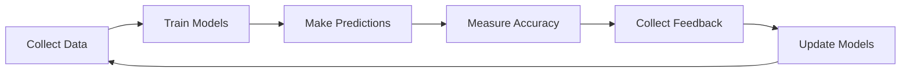

# Predictive Learning Strategy for AI Monitoring

## Executive Summary
A comprehensive strategy for implementing predictive anomaly detection and learning systems that anticipate issues before they impact services, using advanced machine learning and continuous adaptation.

## Strategic Goals
- Shift from reactive to predictive operations
- Reduce unplanned downtime by 70%
- Enable capacity planning with 95% accuracy
- Build self-improving monitoring intelligence

## Learning Architecture

### Core Learning Pipeline
```python
class PredictiveLearningPipeline:
    stages = {
        "ingestion": "Multi-source data collection",
        "preprocessing": "Normalization and feature engineering",
        "training": "Model training and validation",
        "inference": "Real-time prediction",
        "feedback": "Outcome collection and model update"
    }

    learning_loops = {
        "immediate": "Real-time adjustments (seconds)",
        "short_term": "Hourly pattern updates",
        "long_term": "Weekly model retraining",
        "strategic": "Monthly architecture evolution"
    }
```

## Implementation Strategy

### Stage 1: Data Foundation (Months 1-2)
**Objective**: Establish comprehensive data collection and storage

#### Data Collection Framework
```yaml
data_sources:
  infrastructure:
    - metrics: Prometheus, CloudWatch
    - logs: ELK Stack, Splunk
    - traces: Jaeger, Zipkin
    - events: Kubernetes, Docker

  application:
    - performance: APM tools
    - business: Transaction logs
    - user: Behavior analytics

  external:
    - dependencies: Third-party APIs
    - environment: Weather, events
    - market: Traffic patterns
```

#### Storage Architecture
```python
class DataLake:
    components = {
        "raw_storage": "S3/MinIO for raw data",
        "time_series_db": "InfluxDB/TimescaleDB",
        "feature_store": "Feast/Tecton",
        "model_registry": "MLflow/Kubeflow"
    }

    retention_policy = {
        "raw_data": "90 days",
        "aggregated": "1 year",
        "features": "6 months",
        "predictions": "30 days"
    }
```

### Stage 2: Baseline Learning (Months 3-4)
**Objective**: Establish normal behavior patterns

#### Pattern Recognition System
```python
class BaselineLearning:
    def establish_baseline(self, metric_stream):
        patterns = {
            "statistical": self.compute_statistical_baseline(metric_stream),
            "seasonal": self.detect_seasonal_patterns(metric_stream),
            "correlation": self.find_metric_correlations(metric_stream),
            "dependency": self.map_service_dependencies(metric_stream)
        }

        baseline_model = self.synthesize_patterns(patterns)
        return baseline_model

    algorithms = [
        "ARIMA for time series",
        "Isolation Forest for anomalies",
        "STL decomposition for seasonality",
        "Correlation matrices for relationships"
    ]
```

#### Adaptive Thresholding
```python
class AdaptiveThresholds:
    def calculate_thresholds(self, baseline, confidence=0.99):
        thresholds = {}
        for metric in baseline.metrics:
            thresholds[metric] = {
                "static": baseline.percentile(metric, confidence),
                "dynamic": self.calculate_dynamic_threshold(metric),
                "contextual": self.calculate_contextual_threshold(metric)
            }
        return thresholds

    def update_thresholds(self, feedback):
        # Adjust based on false positive/negative rates
        self.sensitivity *= feedback.adjustment_factor
        self.recalculate_all_thresholds()
```

### Stage 3: Predictive Models (Months 5-6)
**Objective**: Deploy ML models for anomaly prediction

#### Model Architecture
```python
class PredictiveModels:
    model_types = {
        "time_series": {
            "algorithm": "LSTM/GRU networks",
            "use_case": "Metric forecasting",
            "horizon": "1-24 hours"
        },
        "classification": {
            "algorithm": "Random Forest/XGBoost",
            "use_case": "Incident prediction",
            "output": "Probability of incident"
        },
        "clustering": {
            "algorithm": "DBSCAN/K-means",
            "use_case": "Anomaly grouping",
            "output": "Anomaly clusters"
        }
    }

    ensemble_strategy = {
        "voting": "Majority vote for classification",
        "stacking": "Meta-model for final prediction",
        "boosting": "Sequential model improvement"
    }
```

#### Training Pipeline
```yaml
training_pipeline:
  schedule:
    real_time: "Online learning for immediate patterns"
    hourly: "Incremental model updates"
    daily: "Full model retraining"
    weekly: "Architecture optimization"

  validation:
    cross_validation: "Time series split"
    backtesting: "Historical performance"
    a_b_testing: "Production comparison"

  deployment:
    strategy: "Blue-green deployment"
    rollback: "Automatic on performance degradation"
    monitoring: "Model performance metrics"
```

### Stage 4: Autonomous Learning (Months 7-12)
**Objective**: Self-improving system with minimal human intervention

#### Auto-ML Integration
```python
class AutoMLPipeline:
    def optimize_models(self):
        # Automatic feature engineering
        features = self.auto_feature_engineering(
            raw_data=self.data_lake.get_recent(),
            target="anomaly_detection"
        )

        # Hyperparameter optimization
        best_params = self.hyperparameter_search(
            algorithm="Bayesian Optimization",
            search_space=self.define_search_space(),
            objective="minimize_false_positives"
        )

        # Architecture search
        best_architecture = self.neural_architecture_search(
            constraints=self.resource_constraints,
            performance_target=self.sla_requirements
        )

        return self.deploy_optimized_model(
            features, best_params, best_architecture
        )
```

#### Federated Learning
```python
class FederatedLearning:
    def collaborative_learning(self):
        # Learn from multiple deployments without sharing data
        local_models = []
        for deployment in self.deployments:
            local_model = deployment.train_local_model()
            local_models.append(local_model.weights)

        # Aggregate models
        global_model = self.federated_averaging(local_models)

        # Distribute updated model
        for deployment in self.deployments:
            deployment.update_model(global_model)
```

## Learning Optimization Strategies

### Continuous Improvement Loop


### Transfer Learning Approach
```python
class TransferLearning:
    strategies = {
        "domain_adaptation": """
            Use models trained on one service
            to bootstrap learning for similar services
        """,
        "few_shot_learning": """
            Quickly adapt to new patterns
            with minimal examples
        """,
        "meta_learning": """
            Learn how to learn new patterns
            more efficiently
        """
    }

    def apply_transfer_learning(self, source_domain, target_domain):
        # Extract transferable features
        shared_features = self.identify_shared_patterns(
            source_domain, target_domain
        )

        # Fine-tune for target domain
        adapted_model = self.fine_tune(
            base_model=source_domain.model,
            target_data=target_domain.limited_data,
            freeze_layers=self.determine_frozen_layers()
        )

        return adapted_model
```

## Measurement & Success Criteria

### Learning Metrics
| Metric | Target | Measurement Method |
|--------|--------|-------------------|
| Prediction Accuracy | >90% | True positive rate |
| False Positive Rate | <5% | FP / (FP + TN) |
| Learning Speed | <24 hrs | Time to 80% accuracy |
| Adaptation Rate | <1 hr | Time to detect new patterns |
| Model Drift | <5% monthly | Performance degradation |

### Business Impact Metrics
| Metric | Baseline | Target | Impact |
|--------|----------|--------|--------|
| Incident Prevention | 20% | 70% | $2M saved |
| MTTR | 45 min | 10 min | 77% reduction |
| Capacity Accuracy | 60% | 95% | 35% cost savings |
| False Alerts | 100/day | 10/day | 90% reduction |

## Resource Requirements

### Computational Resources
```yaml
infrastructure:
  training:
    gpu_cluster:
      nodes: 4
      gpu_per_node: 2 (V100/A100)
      memory: 256GB per node
      storage: 10TB NVMe

  inference:
    cpu_cluster:
      nodes: 8
      cpu_per_node: 32 cores
      memory: 128GB per node

  storage:
    data_lake: 100TB
    feature_store: 10TB
    model_registry: 1TB
```

### Team Structure
```yaml
team:
  data_scientists: 3
  ml_engineers: 4
  data_engineers: 2
  devops: 2
  product_owner: 1

skills_required:
  - Time series analysis
  - Deep learning
  - MLOps
  - Distributed systems
  - Domain expertise
```

## Risk Management

### Technical Risks
| Risk | Mitigation Strategy |
|------|-------------------|
| Model overfitting | Cross-validation, regularization |
| Data drift | Continuous monitoring, retraining |
| Scalability issues | Distributed training, model optimization |
| Explainability | SHAP values, attention mechanisms |

### Operational Risks
| Risk | Mitigation Strategy |
|------|-------------------|
| Alert fatigue | Adaptive thresholding, grouping |
| False positives | Feedback loop, human validation |
| Model failure | Fallback to rule-based systems |
| Data quality | Validation pipelines, monitoring |

## Governance Framework

### Model Lifecycle Management
```python
class ModelGovernance:
    lifecycle_stages = [
        "Development",
        "Validation",
        "Staging",
        "Production",
        "Monitoring",
        "Retirement"
    ]

    requirements = {
        "documentation": "Model cards for all models",
        "testing": "Comprehensive test suites",
        "auditing": "All predictions logged",
        "versioning": "Git-based model tracking",
        "rollback": "One-click rollback capability"
    }
```

### Ethical Considerations
- **Bias Detection**: Regular audits for prediction bias
- **Fairness**: Equal performance across services
- **Privacy**: No PII in training data
- **Transparency**: Explainable predictions

## Future Roadmap

### Near-term (6-12 months)
- Implement real-time learning
- Deploy edge inference
- Integrate with CI/CD pipelines

### Medium-term (1-2 years)
- Quantum computing experiments
- Neuromorphic hardware adoption
- Cross-organization learning

### Long-term (2-5 years)
- Fully autonomous operations
- Self-evolving architectures
- Industry-wide learning networks

## Conclusion

This predictive learning strategy provides a roadmap for transforming monitoring from reactive to predictive, leveraging advanced machine learning to anticipate and prevent issues. Success requires commitment to continuous learning, robust infrastructure, and a culture of data-driven decision making.