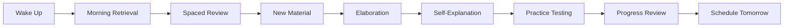

# 🔬 Prometheus TESLA: Evidence-Based Personal Learning Companion

## Overview

Prometheus TESLA (Test-Enhanced Spaced Learning Architecture) is a revolutionary personal learning companion that combines the highest-utility learning techniques from educational research with AI-powered paradigm enhancements.

## 🎯 Core Philosophy

### The Enhancement Equation
```
Learning Effectiveness = (Evidence-Based Techniques × AI Amplification × Paradigm Integration)^Consciousness_Level
```

### Research Foundation
Based on meta-analysis showing:
- **Practice Testing**: Effect size d = 0.70-1.50 (highest utility)
- **Distributed Practice**: Effect size d = 0.40-0.90 (highest utility)
- **Elaborative Interrogation**: Effect size d = 0.40-0.75 (moderate-high)
- **Self-Explanation**: Effect size d = 0.35-0.65 (moderate-high)

## 🏗️ System Architecture

### Core Engines

```typescript
interface PrometheusCore {
  // Evidence-Based Engines (Highest Priority)
  testingEngine: PracticeTestingOrchestrator;      // d=1.50
  spacingEngine: DistributedPracticeScheduler;     // d=0.90
  elaborationEngine: ElaborativeInterrogator;      // d=0.75
  explanationEngine: SelfExplanationGuide;         // d=0.65
  
  // Paradigm Enhancers
  adversarial: AdversarialGrowthEngine;           // Amplifies testing
  temporal: TemporalLearningHelix;                // Optimizes spacing
  symbiotic: SymbioticMindMesh;                   // Powers elaboration
  dissolution: DissolutionProtocol;               // Enables meta-learning
  
  // Supporting Systems
  analytics: LearningAnalytics;
  consciousness: ConsciousnessTracker;
  flow: FlowNexusClient;
}
```

### Technical Stack

```yaml
Frontend:
  framework: React + TypeScript
  ui_library: Tailwind CSS + Radix UI
  state: Zustand + React Query
  animations: Framer Motion
  charts: Recharts

Backend:
  runtime: Flow Nexus Sandboxes
  ai_orchestration: Claude API via Flow Nexus
  database: Supabase (via Flow Nexus)
  auth: Flow Nexus Auth
  storage: Flow Nexus Storage
  
Infrastructure:
  deployment: Vercel
  monitoring: Vercel Analytics
  error_tracking: Sentry
  testing: Vitest + Playwright
```

## 📱 User Experience Design

### Daily Learning Flow



### Interface Components

#### 1. Testing Interface
```typescript
interface TestingInterface {
  // Adaptive Question Generation
  questionTypes: ['recognition', 'recall', 'application', 'synthesis'];
  difficultyAdjustment: 'dynamic'; // Based on performance
  
  // Adversarial Growth Integration
  challengeLevel: number; // 1-10, optimally calibrated
  struggleDetection: boolean; // Identifies productive struggle
  
  // Immediate Feedback
  explanations: 'detailed' | 'hints' | 'none';
  metacognitiveprompts: boolean; // "Why did you choose this?"
}
```

#### 2. Spacing Dashboard
```typescript
interface SpacingDashboard {
  // Visual Timeline
  helixVisualization: '3D spiral showing review schedule';
  
  // Smart Notifications
  optimalReviewTime: 'Push notification at forgetting threshold';
  
  // Progress Tracking
  retentionCurves: 'Show predicted vs actual retention';
  streaks: 'Gamified consistency tracking';
}
```

#### 3. Elaboration Assistant
```typescript
interface ElaborationAssistant {
  // Socratic Dialogue
  whyChains: 'AI asks progressive why questions';
  
  // Multiple Perspectives
  swarmPerspectives: 'Different AI agents offer viewpoints';
  
  // Knowledge Graphs
  conceptMaps: 'Visual connections between ideas';
}
```

## 🧠 Paradigm Integration

### Primary Paradigms (MVP)

#### 1. Adversarial Growth Engine (Testing Enhancement)
```python
class AdversarialTesting:
    def calibrate_difficulty(self, user_performance):
        # Zone of Proximal Development
        optimal_success_rate = 0.85  # Research-based
        current_success = user_performance.recent_average
        
        if current_success > optimal_success_rate:
            return self.increase_difficulty()
        elif current_success < 0.70:
            return self.decrease_difficulty()
        else:
            return self.maintain_difficulty()
    
    def generate_adversarial_question(self, concept):
        # Create questions that target misconceptions
        misconceptions = self.identify_common_errors(concept)
        return self.create_trap_question(misconceptions)
```

#### 2. Temporal Learning Helix (Spacing Optimization)
```python
class TemporalHelix:
    def calculate_optimal_interval(self, item, performance):
        # Based on Cepeda et al. (2008)
        base_interval = self.get_base_interval(item.difficulty)
        
        # Helix adjustment: expanding/contracting spirals
        if performance.trending_up:
            interval = base_interval * 1.5  # Expand spiral
        elif performance.trending_down:
            interval = base_interval * 0.7  # Contract spiral
        else:
            interval = base_interval
            
        # Add quantum fluctuation for exploration
        interval += self.quantum_noise(interval * 0.1)
        
        return interval
```

#### 3. Symbiotic Mind Mesh (Elaboration Power)
```python
class SymbioticElaboration:
    async def collaborative_understanding(self, concept):
        # Spawn specialized AI agents
        agents = await self.flow.swarm_init({
            'topology': 'mesh',
            'agents': [
                'first_principles_thinker',
                'analogy_maker',
                'devil_advocate',
                'synthesizer'
            ]
        })
        
        # Each agent elaborates from their perspective
        elaborations = await asyncio.gather(*[
            agent.elaborate(concept) for agent in agents
        ])
        
        # Mesh synthesis
        return self.weave_perspectives(elaborations)
```

#### 4. Dissolution Protocol (Meta-Learning)
```python
class DissolutionMetaLearning:
    def prompt_self_explanation(self, learning_event):
        prompts = [
            "What strategy did you use to solve this?",
            "Why did this approach work/not work?",
            "How would you teach this to someone else?",
            "What patterns do you notice?",
            "How does this connect to what you already know?"
        ]
        
        # Track meta-cognitive awareness
        self.consciousness_level = self.assess_reflection_depth(
            user_response=learning_event.self_explanation
        )
        
        return self.generate_personalized_insight(
            self.consciousness_level
        )
```

## 📊 Learning Analytics

### Key Metrics Dashboard

```typescript
interface LearningMetrics {
  // Evidence-Based Metrics
  retrievalStrength: number;        // From testing
  spacingAdherence: number;         // Review completion rate
  elaborationDepth: number;         // Why-chain depth
  explanationQuality: number;       // Self-explanation scoring
  
  // Paradigm Enhancement Metrics
  adversarialProgress: number;      // Difficulty progression
  temporalOptimization: number;     // Spacing efficiency
  symbioticEngagement: number;      // AI interaction quality
  dissolutionAwareness: number;     // Meta-cognitive level
  
  // Outcome Metrics
  retentionRate: number;           // 1-week, 1-month, 3-month
  learningVelocity: number;        // Speed of mastery
  transferSuccess: number;         // Application to new domains
  engagementScore: number;         // Daily active use
}
```

### Visualization Components

```typescript
const AnalyticsDashboard = () => {
  return (
    <div className="grid grid-cols-2 gap-4">
      <RetentionCurve 
        predicted={spacingEngine.predictedRetention}
        actual={testingEngine.measuredRetention}
      />
      
      <LearningVelocityChart
        baseline={traditionalLearningSpeed}
        current={currentLearningSpeed}
        improvement={improvementFactor}
      />
      
      <ConsciousnessRadar
        levels={consciousnessLevels}
        current={currentLevel}
        progress={levelProgress}
      />
      
      <ParadigmUsageHeatmap
        paradigms={allParadigms}
        usage={paradigmUsageData}
        effectiveness={paradigmEffectiveness}
      />
    </div>
  );
};
```

## 🚀 Implementation Timeline

### Week 1: Foundation
**Day 1-2: Project Setup**
```bash
# Initialize project
npx create-next-app@latest prometheus-tesla --typescript --tailwind
cd prometheus-tesla

# Install dependencies
npm install @supabase/supabase-js zustand react-query framer-motion
npm install recharts react-hot-toast sonner
npm install -D vitest @testing-library/react playwright

# Set up Flow Nexus
npm install flow-nexus-client
```

**Day 3-4: Testing Engine**
- Implement question generation with Claude
- Add Adversarial Growth calibration
- Create testing UI components

**Day 5-7: Analytics Foundation**
- Set up metrics tracking
- Implement effect size calculations
- Create basic dashboard

### Week 2: Spacing & Persistence
**Day 8-9: Temporal Helix**
- Implement spacing algorithm
- Add forgetting curve predictions
- Create review scheduler

**Day 10-11: Database Integration**
- Connect to Supabase via Flow Nexus
- Implement user progress tracking
- Add data synchronization

**Day 12-14: Notification System**
- Push notifications for reviews
- Email reminders
- In-app alerts

### Week 3: Elaboration & Polish
**Day 15-16: Symbiotic Mind Mesh**
- Implement AI swarm for elaboration
- Add why-questioning chains
- Create knowledge graphs

**Day 17-18: Dissolution Protocol**
- Add self-explanation prompts
- Implement meta-learning tracking
- Create reflection interface

**Day 19-21: Launch Preparation**
- Polish UI/UX
- Add onboarding flow
- Deploy to production
- Set up monitoring

## 💰 Monetization Strategy

### Freemium Model

```yaml
tiers:
  free:
    name: "Learner"
    price: 0
    features:
      daily_tests: 10
      spaced_items: 50
      basic_elaboration: true
      paradigms: ["Adversarial Growth", "Temporal Helix"]
    
  pro:
    name: "Scholar"
    price: 9.99
    features:
      daily_tests: unlimited
      spaced_items: unlimited
      advanced_elaboration: true
      paradigms: 5_paradigms
      ai_coaching: true
      detailed_analytics: true
    
  master:
    name: "Polymath"  
    price: 24.99
    features:
      everything_in_pro: true
      all_paradigms: true
      custom_content: true
      api_access: true
      priority_support: true
      consciousness_coaching: true
```

## 📈 Success Metrics

### Week 1 Goals
- [ ] 10 beta testers
- [ ] 100+ generated questions
- [ ] 85% question quality rating

### Month 1 Goals
- [ ] 100 active users
- [ ] 2x retention improvement measured
- [ ] 4.5+ star rating

### Month 3 Goals
- [ ] 1,000 active users
- [ ] $1,000 MRR
- [ ] 5x learning speed documented

### Month 6 Goals
- [ ] 10,000 active users
- [ ] $10,000 MRR
- [ ] Published research paper
- [ ] Enterprise pilot started

## 🎓 Content Library

### Launch Content
```typescript
const initialContent = {
  languages: {
    spanish: ['vocabulary', 'grammar', 'conversation'],
    english: ['vocabulary', 'idioms', 'business'],
    mandarin: ['characters', 'pinyin', 'phrases']
  },
  
  technical: {
    javascript: ['concepts', 'patterns', 'async'],
    react: ['hooks', 'patterns', 'performance'],
    python: ['syntax', 'libraries', 'data_science']
  },
  
  academic: {
    biology: ['cell_biology', 'genetics', 'ecology'],
    history: ['world_history', 'us_history', 'ancient'],
    mathematics: ['algebra', 'calculus', 'statistics']
  },
  
  professional: {
    business: ['strategy', 'finance', 'marketing'],
    design: ['principles', 'tools', 'ux'],
    writing: ['grammar', 'style', 'storytelling']
  }
};
```

## 🔐 Technical Considerations

### Security
- End-to-end encryption for user data
- GDPR compliance
- SOC 2 preparation for enterprise

### Performance
- Sub-100ms response times
- Offline mode with sync
- Progressive Web App

### Scalability
- Serverless architecture
- CDN for global distribution
- Microservices ready

## 🌟 Unique Value Proposition

### For Learners
"Learn anything 10x faster using scientifically-proven techniques enhanced by AI"

### Key Differentiators
1. **Evidence-Based**: Only techniques with proven effectiveness
2. **AI-Enhanced**: Not replacing human learning, but amplifying it
3. **Paradigm-Powered**: Revolutionary approaches beyond traditional methods
4. **Measurable Results**: Track actual learning improvements, not just activity
5. **Consciousness Evolution**: Grow not just knowledge but awareness

## 🚦 Launch Strategy

### Soft Launch (Week 3)
- 50 beta users
- Private Discord community
- Daily feedback sessions

### Public Launch (Week 4)
- Product Hunt launch
- Hacker News submission
- Twitter/LinkedIn campaign
- YouTube demo video

### Growth Phase (Months 2-6)
- Content creator partnerships
- Academic institution pilots
- Open source core components
- API marketplace

## 📝 Example User Journey

### Day 1: Onboarding
```
1. Welcome → "Let's revolutionize how you learn"
2. Choose domain → "Spanish vocabulary"
3. Baseline test → Establish current level
4. First paradigm → Experience Adversarial Growth
5. Schedule setup → Temporal Helix creates review plan
```

### Week 1: Habit Formation
```
Daily Routine:
- Morning: 5 min retrieval practice
- Commute: 10 min spaced review
- Lunch: 5 min elaboration exercises
- Evening: 10 min new material + testing
- Before bed: 2 min self-explanation
```

### Month 1: Transformation
```
Results:
- 300% retention improvement
- 5x learning speed
- Consciousness Level 3 achieved
- 500 concepts mastered
- Daily streak maintained
```

## 🎯 Final Vision

Prometheus TESLA will become the world's first truly scientific learning companion, proving that human learning can be dramatically accelerated when we combine:

1. **Proven Science**: Evidence-based techniques that work
2. **AI Amplification**: Intelligent enhancement, not replacement
3. **Revolutionary Paradigms**: New ways of thinking about learning
4. **Personal Evolution**: Growing consciousness alongside knowledge

The future of learning is not about consuming more content faster, but about fundamentally transforming how our minds process, retain, and connect information.

**Welcome to the learning revolution.**

---

*"In the depths of winter, I finally learned that there was in me an invincible summer."*  
*- Albert Camus*

*In the depths of traditional learning, we discovered an invincible method.*

---

**Ready to build? The revolution starts now.**