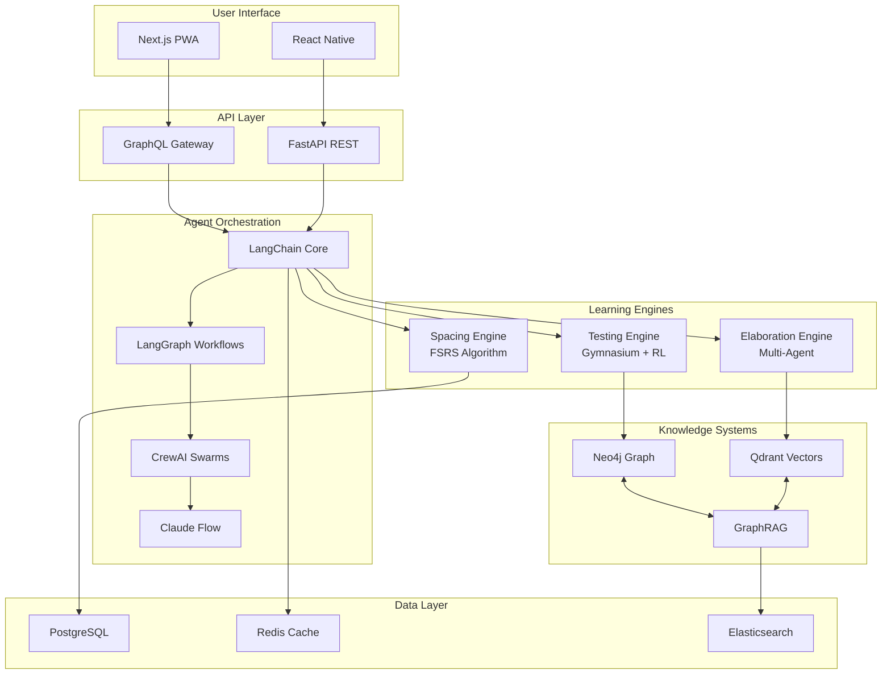

# 🛠️ Prometheus v3: Complete Open-Source Agentic Stack

## Executive Summary

This document provides a comprehensive mapping of open-source tools and frameworks that align with Prometheus v3's requirements, organized by functional category and implementation priority. Every component listed is open-source and actively maintained.

## 🎯 Core Requirements Mapping

### Based on Prometheus v3 Research Integration
- **Evidence-Based Learning**: Practice testing (d=1.50), Spacing (d=0.90)
- **AI Agent Orchestration**: Multi-agent swarms for paradigm implementation
- **Consciousness Tracking**: 7-level evolution system
- **Knowledge Management**: Graph + vector hybrid approach
- **Quantum Cognition**: Superposition and entanglement simulation
- **Domain-Specific Paths**: 8 learning domains with tailored approaches

## 🏗️ Complete Open-Source Stack

### 1. AI Agent Orchestration Frameworks

#### Primary Options (Choose One)

| Framework | Strengths | Prometheus v3 Alignment | License |
|-----------|-----------|------------------------|---------|
| **Claude Flow** (ruvnet) | - Native Claude integration<br>- 87 MCP tools<br>- Hive-mind architecture<br>- SPARC methodology | Perfect for paradigm orchestration<br>Supports all 15 paradigms<br>Built-in swarm intelligence | Open Source |
| **LangChain + LangGraph** | - Most mature ecosystem<br>- Extensive integrations<br>- Graph-based workflows<br>- Memory management | Excellent for chaining learning experiences<br>Good for testing engine<br>Strong community | MIT |
| **CrewAI** | - Role-based agents<br>- Collaborative workflows<br>- Easy multi-agent setup | Ideal for Symbiotic Mind Mesh<br>Natural for peer learning | Apache 2.0 |
| **AutoGPT** | - Autonomous execution<br>- Goal-driven planning<br>- Self-directed learning | Good for Dissolution Protocol<br>Auto-generates learning paths | MIT |

#### Supporting Tools
```python
# Integration layer for multiple frameworks
class AgenticOrchestrator:
    frameworks = {
        'claude_flow': ClaudeFlowAdapter(),     # Primary for Claude
        'langchain': LangChainAdapter(),        # For complex chains
        'crewai': CrewAIAdapter(),              # For multi-agent
        'autogpt': AutoGPTAdapter()             # For autonomous tasks
    }
```

### 2. Knowledge & Memory Systems

#### Knowledge Graphs
| Tool | Purpose | Prometheus v3 Use | License |
|------|---------|------------------|---------|
| **Neo4j Community** | Graph database | Concept relationships<br>Learning pathways | GPL v3 |
| **Apache TinkerPop** | Graph computing | Knowledge traversal | Apache 2.0 |
| **NetworkX** | Graph algorithms | Learning path optimization | BSD |

#### Vector Databases
| Tool | Purpose | Prometheus v3 Use | License |
|------|---------|------------------|---------|
| **Qdrant** | Vector search | Semantic similarity<br>Content retrieval | Apache 2.0 |
| **Weaviate** | Hybrid search | Graph + vector integration | BSD-3 |
| **ChromaDB** | Embeddings DB | Simple vector storage | Apache 2.0 |
| **FAISS** | Similarity search | Fast local search | MIT |

#### Hybrid Implementation
```python
class HybridKnowledgeSystem:
    def __init__(self):
        self.graph = Neo4jCommunity()      # Relationships
        self.vectors = Qdrant()            # Similarity
        self.graphrag = Neo4jGraphRAG()    # Integration
        
    async def query(self, concept):
        # Vector search for similar concepts
        similar = await self.vectors.search(concept)
        
        # Graph traversal for relationships
        related = await self.graph.traverse(concept)
        
        # GraphRAG for context-aware retrieval
        context = await self.graphrag.retrieve(concept, similar, related)
        
        return context
```

### 3. Spaced Repetition & Testing Engines

#### Spaced Repetition Systems
| Tool | Algorithm | Prometheus v3 Integration | License |
|------|-----------|--------------------------|---------|
| **Anki** | SM-2, FSRS | Core spacing algorithm | AGPL |
| **Mnemosyne** | Modified SM-2 | Alternative algorithm | GPL |
| **AnyMemo** | Enhanced SM-2 | Mobile integration | GPL |
| **Custom FSRS** | Latest research | Optimal for v3 | MIT |

#### Implementation
```python
class SpacingEngine:
    def __init__(self):
        # Use FSRS (Free Spaced Repetition Scheduler)
        self.fsrs = FSRSAlgorithm()
        
        # Temporal Helix enhancement
        self.helix = TemporalHelixOptimizer()
        
    def calculate_next_review(self, item, performance):
        # Base FSRS calculation
        base_interval = self.fsrs.calculate(item, performance)
        
        # Apply Temporal Helix optimization
        optimized = self.helix.optimize(base_interval, user_context)
        
        return optimized
```

### 4. Cognitive Architecture Frameworks

| Framework | Type | Prometheus v3 Use | License |
|-----------|------|------------------|---------|
| **OpenCog** | AGI framework | Consciousness modeling | AGPL |
| **Soar** | Symbolic AI | Goal-driven learning | BSD |
| **ACT-R** | Cognitive model | Memory systems | LGPL |
| **CLARION** | Hybrid architecture | Dual-process theory | Custom OS |

### 5. Machine Learning & RL Frameworks

#### Core ML Libraries
| Library | Purpose | Prometheus v3 Use | License |
|---------|---------|------------------|---------|
| **PyTorch** | Deep learning | Neural paradigms | BSD |
| **TorchRL** | Reinforcement learning | Adversarial Growth | MIT |
| **Gymnasium** | RL environments | Learning simulations | MIT |
| **Stable Baselines3** | RL algorithms | Policy optimization | MIT |
| **Ray RLlib** | Distributed RL | Scale training | Apache 2.0 |

#### Educational ML
```python
class AdversarialGrowthEngine:
    def __init__(self):
        self.env = gymnasium.make('LearningEnvironment-v1')
        self.agent = StableBaselines3.PPO('MlpPolicy')
        self.torchrl = TorchRLOptimizer()
        
    def calibrate_difficulty(self, user_performance):
        # Use RL to find optimal challenge level
        state = self.env.get_state(user_performance)
        action = self.agent.predict(state)
        difficulty = self.torchrl.optimize(action)
        return difficulty
```

### 6. Quantum Computing Simulators

| Framework | Purpose | Prometheus v3 Use | License |
|-----------|---------|------------------|---------|
| **PennyLane** | Quantum ML | Quantum cognition | Apache 2.0 |
| **Qiskit** | Quantum computing | Superposition simulation | Apache 2.0 |
| **Cirq** | Quantum circuits | Entanglement modeling | Apache 2.0 |

```python
class QuantumCognitionEngine:
    def __init__(self):
        import pennylane as qml
        
        # Quantum device for superposition
        self.device = qml.device('default.qubit', wires=4)
        
    @qml.qnode(self.device)
    def quantum_superposition(self, concepts):
        # Create superposition of learning states
        for i, concept in enumerate(concepts):
            qml.Hadamard(wires=i)
        
        # Entangle related concepts
        qml.CNOT(wires=[0, 1])
        
        return qml.probs(wires=range(len(concepts)))
```

### 7. Consciousness & Biofeedback Tools

| Tool | Type | Prometheus v3 Use | License |
|------|------|------------------|---------|
| **OpenBCI** | EEG hardware/software | Brain state tracking | MIT |
| **BrainBay** | Biofeedback software | Neurofeedback integration | GPL |
| **Muse SDK** | EEG integration | Meditation tracking | Proprietary* |
| **Custom Trackers** | Software only | Consciousness levels | MIT |

*Note: Muse hardware is proprietary but SDKs are available

### 8. Educational & Analytics Platforms

| Platform | Purpose | Prometheus v3 Use | License |
|----------|---------|------------------|---------|
| **Open Education Analytics** | Learning analytics | Progress tracking | MIT |
| **Apache Spark MLlib** | Big data ML | Scale analytics | Apache 2.0 |
| **Metabase** | Analytics dashboard | Visualization | AGPL |
| **Grafana** | Monitoring | Real-time metrics | AGPL |

### 9. Supporting Infrastructure

#### Databases & Storage
```yaml
databases:
  primary:
    PostgreSQL: Main application data (GPL)
    SQLite: Local storage (Public Domain)
  
  cache:
    Redis: Session & cache (BSD)
    
  search:
    Elasticsearch: Full-text search (Apache 2.0)
    
  timeseries:
    InfluxDB: Metrics storage (MIT)
```

#### Message Queues & Streaming
```yaml
messaging:
  RabbitMQ: Task queuing (MPL 2.0)
  Apache Kafka: Event streaming (Apache 2.0)
  Bull: Node.js queues (MIT)
```

#### Web Frameworks
```yaml
frontend:
  React: UI framework (MIT)
  Next.js: Full-stack React (MIT)
  Tailwind CSS: Styling (MIT)
  
backend:
  FastAPI: Python API (MIT)
  Express: Node.js API (MIT)
  GraphQL: API layer (MIT)
```

## 🚀 Recommended Implementation Stack

### Tier 1: Essential (Week 1)
```python
essential_stack = {
    'agent_orchestration': 'LangChain + LangGraph',
    'vector_db': 'Qdrant',
    'spacing_algorithm': 'FSRS (custom implementation)',
    'ml_framework': 'PyTorch',
    'web_framework': 'Next.js + FastAPI',
    'database': 'PostgreSQL + Redis'
}
```

### Tier 2: Enhanced (Week 2)
```python
enhanced_stack = {
    'multi_agent': 'CrewAI',
    'knowledge_graph': 'Neo4j Community',
    'rl_framework': 'Gymnasium + Stable Baselines3',
    'analytics': 'Metabase + Grafana',
    'message_queue': 'Bull'
}
```

### Tier 3: Advanced (Week 3)
```python
advanced_stack = {
    'claude_integration': 'Claude Flow',
    'quantum_sim': 'PennyLane',
    'cognitive_arch': 'OpenCog components',
    'biofeedback': 'OpenBCI (optional)',
    'distributed': 'Ray + Apache Spark'
}
```

## 📊 Integration Architecture



## 💻 Development Setup Script

```bash
#!/bin/bash
# Prometheus v3 Open-Source Stack Setup

# Create project structure
mkdir -p prometheus-v3/{src,tests,data,models,configs}
cd prometheus-v3

# Initialize package.json
npm init -y

# Frontend dependencies
npm install next react react-dom tailwindcss @radix-ui/react-*

# Python environment
python -m venv venv
source venv/bin/activate  # or `venv\Scripts\activate` on Windows

# Core Python dependencies
pip install langchain langchain-community langgraph crewai
pip install qdrant-client neo4j weaviate-client chromadb faiss-cpu
pip install torch gymnasium stable-baselines3 ray[rllib]
pip install pennylane qiskit cirq
pip install fastapi uvicorn sqlalchemy redis

# Database setup
docker-compose up -d postgres redis neo4j qdrant

# Initialize git
git init
git add .
git commit -m "Initial Prometheus v3 setup with open-source stack"
```

## 🎯 Implementation Priorities

### Week 1: Core Learning Loop
1. **LangChain** for agent orchestration
2. **FSRS** algorithm implementation
3. **Qdrant** for vector storage
4. **PostgreSQL** for user data
5. **Next.js** basic UI

### Week 2: AI Enhancement
1. **CrewAI** for multi-agent elaboration
2. **Neo4j** for knowledge graphs
3. **Gymnasium** for RL-based testing
4. **GraphRAG** integration
5. **Analytics** dashboard

### Week 3: Advanced Features
1. **Claude Flow** integration
2. **PennyLane** quantum features
3. **OpenCog** consciousness tracking
4. **Ray** for distributed processing
5. **Production** optimizations

## 📈 Cost Analysis

### Completely Free Stack
- All tools listed are open-source
- Self-hosted on personal hardware
- Only costs: Claude API usage (~$20-50/month)

### Cloud Deployment (Optional)
- Vercel free tier: Frontend hosting
- Supabase free tier: PostgreSQL + Auth
- Qdrant Cloud free tier: 1GB vectors
- Total: $0-50/month for small scale

## 🔒 License Compatibility

### GPL/AGPL Components (Copyleft)
- Neo4j Community (GPL)
- Anki (AGPL)
- OpenCog (AGPL)
- Metabase (AGPL)

### Permissive Licenses (MIT/Apache/BSD)
- Most ML frameworks
- Web frameworks
- Vector databases
- Agent frameworks

**Important**: Keep GPL components as separate services to avoid license contamination of your core application.

## 🚦 Decision Matrix

| Criteria | LangChain Stack | Claude Flow Stack | Hybrid Stack |
|----------|----------------|------------------|--------------|
| **Ease of Setup** | ⭐⭐⭐⭐⭐ | ⭐⭐⭐ | ⭐⭐⭐⭐ |
| **Claude Integration** | ⭐⭐⭐ | ⭐⭐⭐⭐⭐ | ⭐⭐⭐⭐⭐ |
| **Community Support** | ⭐⭐⭐⭐⭐ | ⭐⭐⭐ | ⭐⭐⭐⭐ |
| **Flexibility** | ⭐⭐⭐⭐⭐ | ⭐⭐⭐⭐ | ⭐⭐⭐⭐⭐ |
| **Performance** | ⭐⭐⭐⭐ | ⭐⭐⭐⭐⭐ | ⭐⭐⭐⭐ |

## 🎯 Final Recommendation

### Start with This Stack:

```yaml
Week 1 Essentials:
  agents: LangChain + LangGraph
  vectors: Qdrant (or ChromaDB for simplicity)
  spacing: Custom FSRS implementation
  ml: PyTorch + Gymnasium
  web: Next.js + FastAPI
  db: PostgreSQL + Redis

Week 2 Additions:
  multi_agent: CrewAI
  graph: Neo4j Community
  rl: Stable Baselines3
  analytics: Metabase

Week 3 Advanced:
  claude: Claude Flow integration
  quantum: PennyLane (optional)
  scale: Ray (if needed)
```

This stack provides:
- ✅ 100% open-source components
- ✅ Proven, production-ready tools
- ✅ Strong community support
- ✅ Clear upgrade path
- ✅ Minimal licensing concerns

---

**Ready to build Prometheus v3 with a completely open-source stack!**