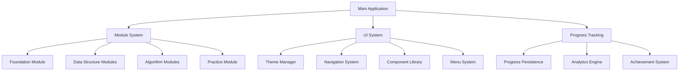

# System Architecture Documentation

The Interactive Algorithms Learning Platform is built with a modular, scalable architecture designed for educational excellence and developer productivity.

## 📐 Architectural Overview

### High-Level Architecture



### Core Architectural Principles

1. **Modularity**: Each learning topic is an independent, pluggable module
2. **Extensibility**: New modules and components can be added without core changes
3. **Separation of Concerns**: UI, business logic, and data are cleanly separated
4. **Progressive Enhancement**: Features gracefully degrade based on terminal capabilities
5. **Performance First**: Optimized for fast startup and responsive interactions

## 🏗️ Component Hierarchy

### Application Layer (`src/index.js`)

The main application entry point orchestrates the entire learning platform:

```javascript
class AlgorithmsLearningPlatform {
  constructor()          // Initialize platform state
  loadProgress()         // Restore user progress
  displayWelcome()       // Show branded welcome screen
  showMainMenu()         // Present module selection
  loadModule()           // Dynamically load learning modules
  showProgress()         // Display user achievement dashboard
  run()                  // Main application loop
}
```

**Key Responsibilities:**
- Application lifecycle management
- Module orchestration and loading
- Progress state management
- Main menu navigation
- User session coordination

### Module System (`src/modules/`)

Learning modules follow a standardized interface for consistency:

```javascript
// Module Interface
export default {
  name: string,
  description: string,
  prerequisites: string[],
  
  async run(platform) {
    // Module execution logic
    // Interactive lessons and exercises
    // Progress tracking integration
  }
}
```

**Module Categories:**

#### Foundation Modules
- **Mental Models**: Algorithm thinking patterns
- **Complexity Analysis**: Big O notation and performance

#### Data Structure Modules
- **Arrays** (`arrays.js`): Sequential data organization
- **Linked Lists** (`linkedlists.js`): Dynamic node-based structures
- **Stacks** (`stacks.js`): LIFO data management
- **Queues** (`queues.js`): FIFO data processing
- **Trees** (`trees.js`): Hierarchical data organization
- **Graphs** (`graphs.js`): Network and relationship modeling

#### Algorithm Modules
- **Sorting** (`sorting.js`): Data ordering algorithms
- **Searching** (`searching.js`): Data retrieval strategies
- **Recursion** (`recursion.js`): Self-referential problem solving
- **Dynamic Programming** (`dynamic_programming.js`): Optimization techniques

### UI System (`src/ui/`)

Modern, themeable UI components built for terminal interfaces:

```
src/ui/
├── components/           # Reusable UI components
│   ├── input/           # User input components
│   ├── display/         # Information display components
│   └── layout/          # Layout and structure components
├── themes/              # Theme definitions and management
├── navigation/          # Navigation and menu systems
├── menu/               # Advanced menu components
└── types/              # TypeScript definitions
```

#### Component Architecture

**Base Component Pattern:**
```typescript
interface ComponentProps {
  theme?: Partial<Theme>;
  visible?: boolean;
  position?: Partial<Position>;
  size?: Partial<Size>;
  style?: StyleOptions;
  onKeyPress?: (key: string, matches: any) => void;
}
```

**Input Components:**
- `TextInput`: Single-line text entry with validation
- `SelectInput`: Single selection from options list
- `MultiSelect`: Multiple selection with checkboxes
- `ConfirmInput`: Yes/no confirmation dialogs

**Display Components:**
- `Table`: Tabular data with sorting and filtering
- `ProgressBar`: Visual progress indicators
- `Spinner`: Loading animations
- `Alert`: Status messages and notifications

**Layout Components:**
- `Box`: Container with padding and borders
- `Grid`: Responsive grid layout system
- `Divider`: Visual section separators

### Theme System (`src/ui/themes/`)

Comprehensive theming system supporting multiple visual styles:

```typescript
interface Theme {
  primary: string;      // Main brand color
  secondary: string;    // Secondary accent color
  success: string;      // Success state color
  warning: string;      // Warning state color
  error: string;        // Error state color
  info: string;         // Information color
  background: string;   // Background color
  foreground: string;   // Text color
  border: string;       // Border color
  accent: string;       // Accent highlights
  muted: string;        // Muted text color
}
```

**Available Themes:**
- `default.theme.ts`: Standard light theme
- `dark.theme.ts`: Dark mode for low-light environments
- `high-contrast.theme.ts`: Accessibility-focused high contrast
- `custom.theme.ts`: User customizable theme

**Theme Management:**
```typescript
class ThemeManager {
  loadTheme(name: string): Theme
  applyTheme(theme: Theme): void
  createCustomTheme(overrides: Partial<Theme>): Theme
  getCurrentTheme(): Theme
}
```

### Navigation System (`src/ui/navigation/`)

Sophisticated navigation with keyboard shortcuts and context awareness:

**NavigationManager:**
- Route management and history
- Breadcrumb generation
- Deep linking support
- Context preservation

**KeyboardHandler:**
- Global hotkey management
- Context-sensitive shortcuts
- Accessibility features
- Custom key bindings

**HelpSystem:**
- Context-aware help
- Keyboard shortcut reference
- Interactive tutorials
- Progressive disclosure

### Menu System (`src/ui/menu/`)

Advanced menu components with animations and state management:

**InteractiveMenu:**
```typescript
class InteractiveMenu {
  constructor(config: MenuConfig)
  render(): void
  handleInput(key: string): void
  navigate(direction: NavigationDirection): void
  select(): void
  close(): void
}
```

**Features:**
- Smooth transitions and animations
- Nested menu support
- Search and filtering
- Keyboard navigation
- Custom rendering
- State persistence

## 🔄 Data Flow Architecture

### State Management

The platform uses a centralized state management pattern:

```javascript
// Global State Structure
{
  user: {
    progress: UserProgress,
    preferences: UserPreferences,
    achievements: Achievement[]
  },
  session: {
    currentModule: string,
    navigationHistory: string[],
    performance: PerformanceMetrics
  },
  ui: {
    theme: Theme,
    layout: LayoutConfig,
    accessibility: AccessibilitySettings
  }
}
```

### Progress Persistence

User progress is automatically saved and restored:

```javascript
// Progress Structure
{
  level: 'foundation' | 'intermediate' | 'advanced',
  completed: string[],           // Completed module IDs
  scores: Record<string, number>, // Module-specific scores
  achievements: Achievement[],    // Unlocked achievements
  timeSpent: Record<string, number>, // Time per module
  lastAccess: Date,
  preferences: UserPreferences
}
```

### Event System

Component communication through a centralized event system:

```typescript
interface EventBus {
  emit(event: string, data: any): void;
  on(event: string, handler: EventHandler): void;
  off(event: string, handler: EventHandler): void;
  once(event: string, handler: EventHandler): void;
}

// Common Events
'module:started'     // Module execution began
'module:completed'   // Module finished successfully
'progress:updated'   // User progress changed
'theme:changed'      // Theme switched
'navigation:changed' // Current route changed
'error:occurred'     // Error state encountered
```

## 🎨 UI Design Patterns

### Component Design Philosophy

1. **Composability**: Components can be nested and combined
2. **Consistency**: Unified styling and interaction patterns
3. **Accessibility**: Screen reader and keyboard navigation support
4. **Responsiveness**: Adapts to different terminal sizes
5. **Performance**: Efficient rendering and minimal redraws

### Styling Architecture

**CSS-in-JS Pattern for Terminal:**
```typescript
const styles = {
  container: {
    padding: 2,
    border: theme.border,
    backgroundColor: theme.background
  },
  title: {
    color: theme.primary,
    bold: true,
    underline: true
  },
  content: {
    color: theme.foreground,
    marginTop: 1
  }
};
```

### Animation System

Smooth transitions using CLI-friendly animations:
- Fade in/out effects
- Sliding transitions
- Progress animations
- Loading spinners
- Text typewriter effects

## 📊 Performance Architecture

### Optimization Strategies

1. **Lazy Loading**: Modules loaded on demand
2. **Caching**: Rendered components cached for reuse
3. **Batching**: UI updates batched for efficiency
4. **Memory Management**: Automatic cleanup of unused resources
5. **Async Operations**: Non-blocking I/O operations

### Metrics and Monitoring

```typescript
interface PerformanceMetrics {
  moduleLoadTime: number;
  renderTime: number;
  memoryUsage: number;
  interactionLatency: number;
  errorRate: number;
  userSatisfaction: number;
}
```

**Monitoring Points:**
- Module initialization time
- Component render performance
- Memory usage patterns
- User interaction responsiveness
- Error frequency and types

### Scalability Considerations

**Horizontal Scaling:**
- Module system supports unlimited extensions
- Plugin architecture for third-party modules
- Theme system supports unlimited custom themes

**Vertical Scaling:**
- Efficient memory usage patterns
- Optimized rendering pipeline
- Minimal CPU overhead
- Fast startup times

## 🔧 Extension Architecture

### Plugin System

**Module Plugin Interface:**
```typescript
interface ModulePlugin {
  name: string;
  version: string;
  dependencies: string[];
  
  initialize(platform: Platform): void;
  execute(context: ExecutionContext): Promise<void>;
  cleanup(): void;
}
```

### Theme Extension

**Custom Theme Development:**
```typescript
// Custom theme creation
const myTheme = createTheme({
  primary: '#FF6B6B',
  secondary: '#4ECDC4',
  background: '#1A1A2E',
  // ... other colors
});

ThemeManager.registerTheme('my-theme', myTheme);
```

### Component Extension

**Custom Component Creation:**
```typescript
interface CustomComponent extends ComponentProps {
  render(context: RenderContext): string;
  handleInput(input: InputEvent): void;
  cleanup(): void;
}
```

## 🧪 Testing Architecture

### Testing Strategy

1. **Unit Tests**: Individual component testing
2. **Integration Tests**: Module interaction testing
3. **UI Tests**: User interface functionality testing
4. **Performance Tests**: Speed and memory benchmarks
5. **Accessibility Tests**: Screen reader compatibility

### Test Organization

```
tests/
├── unit/                    # Unit tests for components
├── integration/            # Module integration tests
├── ui/                     # UI component tests
│   ├── components/        # Individual component tests
│   ├── integration/       # UI integration tests
│   └── performance/       # UI performance tests
├── e2e/                   # End-to-end tests
└── fixtures/              # Test data and mocks
```

## 🔒 Security Architecture

### Input Validation

All user inputs are validated and sanitized:
- Command injection prevention
- Input length limits
- Character encoding validation
- Path traversal protection

### Data Protection

- No sensitive data stored locally
- Progress data encryption in transit
- Secure configuration management
- Privacy-focused analytics

## 🚀 Deployment Architecture

### Build Pipeline

```bash
# Development build
npm run build:dev

# Production build
npm run build:prod

# Testing build
npm run build:test
```

### Distribution Strategy

1. **NPM Package**: Primary distribution method
2. **Standalone Binary**: Single-file executables
3. **Docker Container**: Containerized deployment
4. **Cloud Function**: Serverless execution

### Configuration Management

Environment-based configuration:
```javascript
{
  development: {
    debug: true,
    analytics: false,
    performance: false
  },
  production: {
    debug: false,
    analytics: true,
    performance: true,
    optimization: 'aggressive'
  }
}
```

## 🔮 Future Architecture Considerations

### Planned Enhancements

1. **Web Interface**: Browser-based version
2. **Mobile Support**: React Native adaptation
3. **Multiplayer**: Collaborative learning features
4. **AI Integration**: Personalized learning paths
5. **Cloud Sync**: Cross-device progress synchronization

### Architectural Evolution

The system is designed for evolutionary architecture:
- Microservices migration path
- API-first design preparation
- Cloud-native compatibility
- Modern JavaScript standard adoption

---

This architecture documentation provides a comprehensive overview of the Interactive Algorithms Learning Platform's design, patterns, and implementation strategies. The modular architecture ensures maintainability, extensibility, and performance while delivering an exceptional educational experience.

*Last Updated: September 2024 | Architecture Version: 1.0*