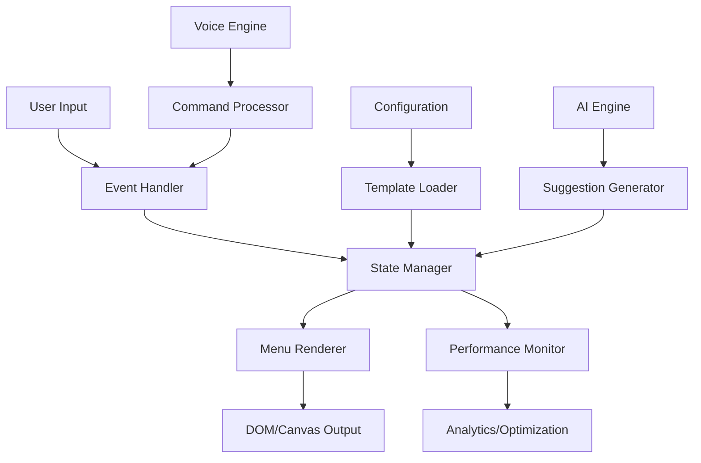

# Menu System Architecture and Implementation Guide

## Table of Contents

1. [Architecture Overview](#architecture-overview)
2. [API Reference](#api-reference)
3. [Best Practices](#best-practices)
4. [Performance Optimization](#performance-optimization)
5. [Troubleshooting Guide](#troubleshooting-guide)
6. [Examples and Templates](#examples-and-templates)
7. [Advanced Features](#advanced-features)
8. [Testing and Benchmarking](#testing-and-benchmarking)

## Architecture Overview

The Menu System is a comprehensive, modular framework designed to provide flexible, performant, and accessible menu interfaces across different platforms and use cases.

### Core Components

```
Menu System
├── Core Engine
│   ├── Menu Renderer
│   ├── Event Handler
│   ├── State Manager
│   └── Performance Monitor
├── Advanced Features
│   ├── AI Integration
│   ├── Voice Control
│   ├── Gesture Recognition
│   └── Multi-language Support
├── Templates & Examples
│   ├── Interactive Demo
│   ├── Builder CLI
│   ├── Advanced Features Demo
│   └── Performance Benchmark
└── Configuration Templates
    ├── Wizard Menu
    ├── Dashboard Menu
    ├── Command Palette
    └── Mobile Menu
```

### Design Principles

- **Modularity**: Each component is self-contained and can be used independently
- **Performance**: Optimized for rendering large datasets with minimal latency
- **Accessibility**: Full support for screen readers, keyboard navigation, and ARIA standards
- **Extensibility**: Plugin architecture allows for custom features and integrations
- **Responsive Design**: Adapts to different screen sizes and input methods

### Data Flow Architecture



## API Reference

### Core Classes

#### MenuSystem

The main class that orchestrates all menu functionality.

```typescript
class MenuSystem extends EventEmitter {
  constructor(config: MenuConfig)
  
  // Core Methods
  init(): Promise<void>
  render(): void
  destroy(): void
  
  // Navigation
  navigateTo(path: string[]): void
  goBack(): void
  goToRoot(): void
  
  // Search
  search(query: string, options?: SearchOptions): Promise<MenuItem[]>
  setSearchProvider(provider: SearchProvider): void
  
  // Events
  on(event: string, callback: Function): void
  emit(event: string, data?: any): void
  
  // Configuration
  updateConfig(config: Partial<MenuConfig>): void
  getConfig(): MenuConfig
}
```

#### MenuItem Interface

Defines the structure for menu items.

```typescript
interface MenuItem {
  // Required fields
  id: string
  label: string
  
  // Optional fields
  description?: string
  icon?: string
  shortcut?: string
  category?: string
  priority?: number
  
  // Functionality
  action?: string | (() => void | Promise<void>)
  submenu?: MenuItem[]
  
  // State
  disabled?: boolean
  hidden?: boolean
  
  // Accessibility
  accessibility?: {
    ariaLabel?: string
    role?: string
    keyboardShortcut?: string
    screenReaderText?: string
    highContrast?: boolean
  }
  
  // Context and Conditions
  context?: {
    userRole?: string[]
    timeOfDay?: string[]
    location?: string[]
    device?: string[]
    conditions?: string[]
  }
  
  // Analytics
  analytics?: {
    popularity: number
    lastUsed?: Date
    clickCount: number
    averageTimeOnItem: number
  }
  
  // AI Features
  ai?: {
    suggestedByAI?: boolean
    confidence?: number
    learningData?: any
    personalizedRanking?: number
  }
  
  // Multi-language Support
  multilang?: {
    [locale: string]: {
      label: string
      description?: string
      keywords?: string[]
    }
  }
}
```

#### MenuConfig Interface

Configuration options for the menu system.

```typescript
interface MenuConfig {
  // Basic Settings
  name: string
  version: string
  description?: string
  theme: string
  
  // Display Options
  settings: {
    searchable: boolean
    showIcons: boolean
    showShortcuts: boolean
    animationsEnabled: boolean
    maxDisplayItems: number
  }
  
  // Layout Configuration
  layout?: {
    type: 'list' | 'grid' | 'tree' | 'stack'
    columns?: number
    spacing?: 'compact' | 'medium' | 'large'
    orientation?: 'vertical' | 'horizontal'
  }
  
  // Advanced Features
  features?: {
    aiEnabled?: boolean
    voiceControl?: boolean
    gestureSupport?: boolean
    collaboration?: boolean
    analytics?: boolean
  }
  
  // Performance Settings
  performance?: {
    virtualScrolling?: boolean
    lazyLoading?: boolean
    cacheSize?: number
    debounceTime?: number
  }
  
  // Items
  items: MenuItem[]
  
  // Metadata
  metadata: {
    created: string
    author?: string
    tags: string[]
    version: string
  }
}
```

### Event System

The menu system uses an event-driven architecture for loose coupling and extensibility.

#### Standard Events

```typescript
// Navigation Events
menuSystem.on('itemSelected', (item: MenuItem) => {})
menuSystem.on('menuChanged', (path: string[]) => {})
menuSystem.on('navigationStart', (from: string[], to: string[]) => {})
menuSystem.on('navigationComplete', (path: string[]) => {})

// Search Events
menuSystem.on('searchStarted', (query: string) => {})
menuSystem.on('searchCompleted', (results: MenuItem[]) => {})
menuSystem.on('searchCleared', () => {})

// Performance Events
menuSystem.on('renderStart', () => {})
menuSystem.on('renderComplete', (duration: number) => {})
menuSystem.on('performanceWarning', (metric: string, value: number) => {})

// AI Events
menuSystem.on('aiSuggestion', (suggestions: MenuItem[]) => {})
menuSystem.on('contextChanged', (context: UserContext) => {})

// Voice Events
menuSystem.on('voiceCommand', (command: string) => {})
menuSystem.on('voiceRecognitionStarted', () => {})
menuSystem.on('voiceRecognitionStopped', () => {})

// Gesture Events
menuSystem.on('gestureDetected', (gesture: string) => {})
menuSystem.on('gestureAction', (action: string) => {})
```

### Plugin Architecture

#### Creating Custom Plugins

```typescript
interface MenuPlugin {
  name: string
  version: string
  
  install(menuSystem: MenuSystem): void
  uninstall(menuSystem: MenuSystem): void
  
  // Optional lifecycle hooks
  beforeRender?(context: RenderContext): void
  afterRender?(context: RenderContext): void
  onItemSelect?(item: MenuItem): boolean | void // return false to prevent default
  onSearch?(query: string, items: MenuItem[]): MenuItem[] // return filtered results
}

// Example Plugin
class CustomPlugin implements MenuPlugin {
  name = 'custom-plugin'
  version = '1.0.0'
  
  install(menuSystem: MenuSystem): void {
    menuSystem.on('itemSelected', this.handleItemSelected.bind(this))
  }
  
  uninstall(menuSystem: MenuSystem): void {
    menuSystem.off('itemSelected', this.handleItemSelected.bind(this))
  }
  
  private handleItemSelected(item: MenuItem): void {
    // Custom logic here
  }
}

// Register Plugin
menuSystem.addPlugin(new CustomPlugin())
```

## Best Practices

### Performance Optimization

#### 1. Virtual Scrolling for Large Datasets

```typescript
const config: MenuConfig = {
  // ... other config
  performance: {
    virtualScrolling: true,
    lazyLoading: true
  },
  settings: {
    maxDisplayItems: 50 // Only render visible items
  }
}
```

#### 2. Efficient Search Implementation

```typescript
// Use indexed search for better performance
class IndexedSearchProvider implements SearchProvider {
  private index = new Map<string, MenuItem[]>()
  
  indexItems(items: MenuItem[]): void {
    items.forEach(item => {
      const keywords = this.extractKeywords(item)
      keywords.forEach(keyword => {
        if (!this.index.has(keyword)) {
          this.index.set(keyword, [])
        }
        this.index.get(keyword)!.push(item)
      })
    })
  }
  
  search(query: string): MenuItem[] {
    return this.index.get(query.toLowerCase()) || []
  }
}
```

#### 3. Memory Management

```typescript
// Clean up unused references
menuSystem.on('menuChanged', (newPath) => {
  // Clean up previous menu items not in current path
  menuSystem.cleanup()
})

// Use WeakMap for temporary data
const itemMetadata = new WeakMap<MenuItem, any>()
```

### Accessibility Best Practices

#### 1. ARIA Labels and Roles

```typescript
const menuItem: MenuItem = {
  id: 'dashboard',
  label: 'Dashboard',
  accessibility: {
    ariaLabel: 'Main dashboard with analytics and overview',
    role: 'menuitem',
    keyboardShortcut: 'Ctrl+D',
    screenReaderText: 'Dashboard - Opens the main analytics dashboard'
  }
}
```

#### 2. Keyboard Navigation

```typescript
// Implement comprehensive keyboard support
const keyboardHandler = {
  'ArrowDown': () => menuSystem.selectNext(),
  'ArrowUp': () => menuSystem.selectPrevious(),
  'Enter': () => menuSystem.activateSelected(),
  'Escape': () => menuSystem.goBack(),
  'Home': () => menuSystem.selectFirst(),
  'End': () => menuSystem.selectLast(),
  'Tab': () => menuSystem.focusNext(),
  'Shift+Tab': () => menuSystem.focusPrevious()
}
```

#### 3. Screen Reader Support

```typescript
// Provide rich context for screen readers
menuSystem.on('itemFocused', (item: MenuItem) => {
  const announcement = [
    item.accessibility?.screenReaderText || item.label,
    item.submenu ? 'has submenu' : 'no submenu',
    item.disabled ? 'disabled' : 'enabled',
    `${item.analytics?.popularity || 0}% popularity`,
    item.accessibility?.keyboardShortcut ? 
      `shortcut ${item.accessibility.keyboardShortcut}` : ''
  ].filter(Boolean).join(', ')
  
  menuSystem.announceToScreenReader(announcement)
})
```

### State Management

#### 1. Centralized State

```typescript
interface MenuState {
  currentPath: string[]
  selectedItemId: string | null
  searchQuery: string
  isLoading: boolean
  error: Error | null
  cache: Map<string, MenuItem[]>
  userPreferences: UserPreferences
}

class MenuStateManager {
  private state: MenuState
  private subscribers: Set<StateSubscriber> = new Set()
  
  updateState(partial: Partial<MenuState>): void {
    this.state = { ...this.state, ...partial }
    this.notifySubscribers()
  }
  
  subscribe(callback: StateSubscriber): () => void {
    this.subscribers.add(callback)
    return () => this.subscribers.delete(callback)
  }
  
  private notifySubscribers(): void {
    this.subscribers.forEach(callback => callback(this.state))
  }
}
```

#### 2. State Persistence

```typescript
// Save state to localStorage
menuSystem.on('stateChanged', (state: MenuState) => {
  localStorage.setItem('menuState', JSON.stringify({
    currentPath: state.currentPath,
    userPreferences: state.userPreferences,
    searchHistory: state.searchHistory
  }))
})

// Restore state on init
const savedState = localStorage.getItem('menuState')
if (savedState) {
  const state = JSON.parse(savedState)
  menuSystem.restoreState(state)
}
```

### Testing Best Practices

#### 1. Unit Testing Menu Components

```typescript
import { MenuSystem, MenuItem } from './menu-system'

describe('MenuSystem', () => {
  let menuSystem: MenuSystem
  let mockItems: MenuItem[]
  
  beforeEach(() => {
    mockItems = [
      { id: '1', label: 'Item 1' },
      { id: '2', label: 'Item 2', submenu: [
        { id: '2.1', label: 'Sub Item 1' }
      ]}
    ]
    
    menuSystem = new MenuSystem({
      name: 'Test Menu',
      items: mockItems,
      settings: { searchable: true }
    })
  })
  
  test('should navigate to submenu', () => {
    menuSystem.navigateTo(['2'])
    expect(menuSystem.getCurrentPath()).toEqual(['2'])
    expect(menuSystem.getCurrentItems()).toHaveLength(1)
  })
  
  test('should search items correctly', async () => {
    const results = await menuSystem.search('Item 1')
    expect(results).toHaveLength(2) // Main item and sub item
  })
  
  test('should emit events on navigation', () => {
    const callback = jest.fn()
    menuSystem.on('navigationComplete', callback)
    
    menuSystem.navigateTo(['2'])
    
    expect(callback).toHaveBeenCalledWith(['2'])
  })
})
```

#### 2. Integration Testing

```typescript
import { render, fireEvent, screen } from '@testing-library/react'
import { MenuComponent } from './menu-component'

describe('Menu Integration', () => {
  test('should handle keyboard navigation', () => {
    render(<MenuComponent items={mockItems} />)
    
    const menu = screen.getByRole('menu')
    
    // Test arrow key navigation
    fireEvent.keyDown(menu, { key: 'ArrowDown' })
    expect(screen.getByText('Item 2')).toHaveFocus()
    
    // Test Enter key activation
    fireEvent.keyDown(menu, { key: 'Enter' })
    expect(screen.getByText('Sub Item 1')).toBeVisible()
  })
  
  test('should handle search functionality', async () => {
    render(<MenuComponent items={mockItems} searchable={true} />)
    
    const searchInput = screen.getByRole('searchbox')
    fireEvent.change(searchInput, { target: { value: 'Sub' } })
    
    await screen.findByText('Sub Item 1')
    expect(screen.queryByText('Item 1')).not.toBeInTheDocument()
  })
})
```

## Performance Optimization

### Rendering Optimization

#### 1. Virtual Scrolling

```typescript
class VirtualScrollRenderer {
  private visibleRange = { start: 0, end: 50 }
  private itemHeight = 40
  private containerHeight = 400
  
  render(items: MenuItem[]): void {
    const visibleItems = items.slice(
      this.visibleRange.start, 
      this.visibleRange.end
    )
    
    // Only render visible items
    this.renderItems(visibleItems)
    
    // Update scroll indicators
    this.updateScrollbar(items.length)
  }
  
  onScroll(scrollTop: number): void {
    const startIndex = Math.floor(scrollTop / this.itemHeight)
    const endIndex = startIndex + Math.ceil(this.containerHeight / this.itemHeight)
    
    if (startIndex !== this.visibleRange.start) {
      this.visibleRange = { start: startIndex, end: endIndex }
      this.requestRerender()
    }
  }
}
```

#### 2. Memoization and Caching

```typescript
class MemoizedRenderer {
  private renderCache = new Map<string, HTMLElement>()
  
  renderItem(item: MenuItem): HTMLElement {
    const cacheKey = this.getCacheKey(item)
    
    if (this.renderCache.has(cacheKey)) {
      return this.renderCache.get(cacheKey)!.cloneNode(true) as HTMLElement
    }
    
    const element = this.createItemElement(item)
    this.renderCache.set(cacheKey, element.cloneNode(true) as HTMLElement)
    
    return element
  }
  
  private getCacheKey(item: MenuItem): string {
    return `${item.id}-${item.label}-${item.disabled}-${item.hidden}`
  }
  
  clearCache(): void {
    this.renderCache.clear()
  }
}
```

#### 3. Lazy Loading

```typescript
class LazyMenuLoader {
  private loadedSections = new Set<string>()
  
  async loadSection(sectionId: string): Promise<MenuItem[]> {
    if (this.loadedSections.has(sectionId)) {
      return this.getFromCache(sectionId)
    }
    
    const items = await this.fetchSectionItems(sectionId)
    this.loadedSections.add(sectionId)
    this.cacheSection(sectionId, items)
    
    return items
  }
  
  async loadItemsOnDemand(visibleItems: MenuItem[]): Promise<void> {
    const sectionsToLoad = visibleItems
      .filter(item => !this.loadedSections.has(item.category || ''))
      .map(item => item.category || '')
      .filter((section, index, array) => array.indexOf(section) === index)
    
    await Promise.all(sectionsToLoad.map(section => this.loadSection(section)))
  }
}
```

### Memory Management

#### 1. Cleanup Strategies

```typescript
class MenuMemoryManager {
  private itemReferences = new WeakMap<MenuItem, any>()
  private eventListeners = new Map<string, Function[]>()
  
  cleanup(): void {
    // Clear event listeners
    this.eventListeners.forEach((listeners, event) => {
      listeners.forEach(listener => {
        menuSystem.off(event, listener)
      })
    })
    this.eventListeners.clear()
    
    // Clear weak references (automatic)
    // WeakMap entries are garbage collected automatically
    
    // Force garbage collection if available
    if (global.gc) {
      global.gc()
    }
  }
  
  trackEventListener(event: string, listener: Function): void {
    if (!this.eventListeners.has(event)) {
      this.eventListeners.set(event, [])
    }
    this.eventListeners.get(event)!.push(listener)
  }
}
```

#### 2. Memory Monitoring

```typescript
class MemoryMonitor {
  private measurements: MemoryMeasurement[] = []
  
  startMonitoring(): void {
    setInterval(() => {
      const usage = process.memoryUsage()
      this.measurements.push({
        timestamp: Date.now(),
        heapUsed: usage.heapUsed,
        heapTotal: usage.heapTotal,
        external: usage.external
      })
      
      // Keep only recent measurements
      if (this.measurements.length > 100) {
        this.measurements.shift()
      }
      
      this.checkMemoryThresholds(usage)
    }, 1000)
  }
  
  private checkMemoryThresholds(usage: NodeJS.MemoryUsage): void {
    const heapUsedMB = usage.heapUsed / 1024 / 1024
    
    if (heapUsedMB > 500) {
      menuSystem.emit('memoryWarning', {
        type: 'high',
        usage: heapUsedMB
      })
    }
    
    if (heapUsedMB > 1000) {
      menuSystem.emit('memoryError', {
        type: 'critical',
        usage: heapUsedMB
      })
      
      // Trigger aggressive cleanup
      this.performEmergencyCleanup()
    }
  }
}
```

## Troubleshooting Guide

### Common Issues and Solutions

#### 1. Performance Problems

**Issue**: Menu is slow with large datasets
**Solution**:
```typescript
// Enable virtual scrolling
const config: MenuConfig = {
  performance: {
    virtualScrolling: true,
    maxDisplayItems: 50
  }
}

// Use debounced search
const debouncedSearch = debounce((query: string) => {
  menuSystem.search(query)
}, 300)
```

**Issue**: Memory usage increases over time
**Solution**:
```typescript
// Implement proper cleanup
menuSystem.on('menuChanged', () => {
  menuSystem.cleanup()
})

// Use WeakMap for temporary associations
const temporary = new WeakMap<MenuItem, any>()
```

#### 2. Accessibility Issues

**Issue**: Screen reader doesn't announce menu changes
**Solution**:
```typescript
// Add proper ARIA live regions
const liveRegion = document.createElement('div')
liveRegion.setAttribute('aria-live', 'polite')
liveRegion.setAttribute('aria-atomic', 'true')
document.body.appendChild(liveRegion)

menuSystem.on('menuChanged', (path: string[]) => {
  liveRegion.textContent = `Navigated to ${path.join(' > ')}`
})
```

**Issue**: Keyboard navigation doesn't work properly
**Solution**:
```typescript
// Ensure proper focus management
class FocusManager {
  private focusableElements: HTMLElement[] = []
  private currentFocusIndex = -1
  
  updateFocusableElements(): void {
    this.focusableElements = Array.from(
      document.querySelectorAll('[tabindex]:not([tabindex="-1"])')
    ) as HTMLElement[]
  }
  
  focusNext(): void {
    this.currentFocusIndex = (this.currentFocusIndex + 1) % this.focusableElements.length
    this.focusableElements[this.currentFocusIndex]?.focus()
  }
}
```

#### 3. Search Problems

**Issue**: Search is too slow with large datasets
**Solution**:
```typescript
// Implement indexed search
class SearchIndex {
  private index = new Map<string, Set<string>>() // keyword -> item IDs
  
  buildIndex(items: MenuItem[]): void {
    items.forEach(item => {
      const keywords = this.extractKeywords(item)
      keywords.forEach(keyword => {
        if (!this.index.has(keyword)) {
          this.index.set(keyword, new Set())
        }
        this.index.get(keyword)!.add(item.id)
      })
    })
  }
  
  search(query: string): Set<string> {
    const terms = query.toLowerCase().split(' ')
    let results: Set<string> | null = null
    
    terms.forEach(term => {
      const termResults = this.index.get(term) || new Set()
      results = results 
        ? new Set([...results].filter(id => termResults.has(id)))
        : termResults
    })
    
    return results || new Set()
  }
}
```

#### 4. Mobile-Specific Issues

**Issue**: Touch events not working properly
**Solution**:
```typescript
// Proper touch event handling
class TouchHandler {
  private startTouch: Touch | null = null
  
  onTouchStart(event: TouchEvent): void {
    this.startTouch = event.touches[0]
  }
  
  onTouchEnd(event: TouchEvent): void {
    if (!this.startTouch) return
    
    const endTouch = event.changedTouches[0]
    const deltaX = endTouch.clientX - this.startTouch.clientX
    const deltaY = endTouch.clientY - this.startTouch.clientY
    
    // Detect swipe gestures
    if (Math.abs(deltaX) > Math.abs(deltaY) && Math.abs(deltaX) > 50) {
      if (deltaX > 0) {
        menuSystem.emit('swipeRight')
      } else {
        menuSystem.emit('swipeLeft')
      }
    }
    
    this.startTouch = null
  }
}
```

#### 5. AI Integration Issues

**Issue**: AI suggestions are not relevant
**Solution**:
```typescript
// Improve learning algorithm
class ImprovedAIEngine {
  private userProfile: UserProfile = {
    preferences: new Map(),
    usagePatterns: new Map(),
    contextHistory: []
  }
  
  learnFromInteraction(item: MenuItem, context: UserContext, success: boolean): void {
    // Update user preferences
    const preference = this.userProfile.preferences.get(item.category) || 0
    this.userProfile.preferences.set(item.category, preference + (success ? 1 : -0.5))
    
    // Track usage patterns
    const timeSlot = this.getTimeSlot(new Date())
    const patterns = this.userProfile.usagePatterns.get(timeSlot) || new Map()
    patterns.set(item.id, (patterns.get(item.id) || 0) + 1)
    this.userProfile.usagePatterns.set(timeSlot, patterns)
    
    // Store context
    this.userProfile.contextHistory.push({ item, context, success, timestamp: Date.now() })
    
    // Keep only recent history
    if (this.userProfile.contextHistory.length > 1000) {
      this.userProfile.contextHistory.shift()
    }
  }
}
```

### Debugging Tools

#### 1. Menu Inspector

```typescript
class MenuInspector {
  inspect(menuSystem: MenuSystem): MenuInspectionResult {
    return {
      itemCount: this.countItems(menuSystem.getItems()),
      memoryUsage: this.getMemoryUsage(),
      renderingStats: this.getRenderingStats(),
      eventListeners: this.getEventListenerCount(),
      performance: this.getPerformanceMetrics()
    }
  }
  
  generateReport(): string {
    const inspection = this.inspect(menuSystem)
    
    return `
Menu System Inspection Report
============================

Items: ${inspection.itemCount}
Memory: ${inspection.memoryUsage.toFixed(2)}MB
Render Time: ${inspection.renderingStats.averageTime}ms
Event Listeners: ${inspection.eventListeners}
Performance Score: ${inspection.performance.score}/100

Recommendations:
${inspection.performance.recommendations.join('\n')}
    `.trim()
  }
}
```

#### 2. Performance Profiler

```typescript
class MenuProfiler {
  private profiles: Map<string, ProfileData> = new Map()
  
  startProfile(name: string): void {
    this.profiles.set(name, {
      startTime: performance.now(),
      startMemory: process.memoryUsage().heapUsed
    })
  }
  
  endProfile(name: string): ProfileResult | null {
    const profile = this.profiles.get(name)
    if (!profile) return null
    
    const endTime = performance.now()
    const endMemory = process.memoryUsage().heapUsed
    
    const result: ProfileResult = {
      name,
      duration: endTime - profile.startTime,
      memoryDelta: endMemory - profile.startMemory,
      timestamp: Date.now()
    }
    
    this.profiles.delete(name)
    return result
  }
  
  getProfileSummary(): string {
    // Generate performance summary
    return 'Performance profile summary...'
  }
}
```

## Examples and Templates

### Quick Start Examples

#### 1. Basic Menu

```typescript
import { MenuSystem } from './menu-system'

const basicMenu = new MenuSystem({
  name: 'Basic Menu',
  version: '1.0.0',
  theme: 'default',
  settings: {
    searchable: true,
    showIcons: true,
    showShortcuts: false,
    animationsEnabled: true,
    maxDisplayItems: 10
  },
  items: [
    {
      id: 'file',
      label: 'File',
      icon: '📁',
      submenu: [
        { id: 'new', label: 'New', action: 'file.new' },
        { id: 'open', label: 'Open', action: 'file.open' },
        { id: 'save', label: 'Save', action: 'file.save' }
      ]
    },
    {
      id: 'edit',
      label: 'Edit',
      icon: '✏️',
      submenu: [
        { id: 'cut', label: 'Cut', action: 'edit.cut' },
        { id: 'copy', label: 'Copy', action: 'edit.copy' },
        { id: 'paste', label: 'Paste', action: 'edit.paste' }
      ]
    }
  ],
  metadata: {
    created: new Date().toISOString(),
    tags: ['basic', 'example'],
    version: '1.0.0'
  }
})

basicMenu.init()
```

#### 2. Advanced Menu with AI

```typescript
import { AdvancedMenuSystem, AIEngine, VoiceEngine } from './advanced-menu'

const aiMenu = new AdvancedMenuSystem({
  // ... basic config
  features: {
    aiEnabled: true,
    voiceControl: true,
    analytics: true
  }
})

// Configure AI engine
const aiEngine = new AIEngine({
  suggestionThreshold: 0.7,
  learningRate: 0.1,
  personalizedRanking: true
})

// Configure voice control
const voiceEngine = new VoiceEngine({
  language: 'en-US',
  continuous: true,
  interimResults: false
})

aiMenu.setAIEngine(aiEngine)
aiMenu.setVoiceEngine(voiceEngine)

// Handle AI suggestions
aiMenu.on('aiSuggestion', (suggestions) => {
  console.log('AI suggests:', suggestions)
})

// Handle voice commands
aiMenu.on('voiceCommand', (command) => {
  console.log('Voice command:', command)
})

aiMenu.init()
```

### Template Usage

#### Using Template Files

```typescript
import { MenuSystem, TemplateLoader } from './menu-system'
import wizardTemplate from '../templates/menus/wizard-menu.template.json'

// Load from template
const wizardMenu = MenuSystem.fromTemplate(wizardTemplate)

// Or load dynamically
const templateLoader = new TemplateLoader()
const dashboardConfig = await templateLoader.load('dashboard-menu.template.json')
const dashboardMenu = new MenuSystem(dashboardConfig)
```

#### Creating Custom Templates

```typescript
// Create a custom template
const customTemplate: MenuTemplate = {
  name: 'Custom Application Menu',
  version: '1.0.0',
  description: 'Menu for my custom application',
  theme: 'custom',
  settings: {
    searchable: true,
    showIcons: true,
    showShortcuts: true,
    animationsEnabled: true,
    maxDisplayItems: 15
  },
  items: [
    // ... menu items
  ],
  customization: {
    allowReorder: true,
    allowResize: false,
    themes: {
      custom: {
        primary: '#007acc',
        secondary: '#ffffff',
        background: '#f5f5f5'
      }
    }
  }
}

// Save template for reuse
templateLoader.save('custom-template.json', customTemplate)
```

## Advanced Features

### AI Integration

#### Smart Suggestions

```typescript
class SmartSuggestionEngine {
  private userModel: UserModel
  private contextAnalyzer: ContextAnalyzer
  
  async generateSuggestions(context: UserContext): Promise<MenuItem[]> {
    // Analyze current context
    const contextVector = await this.contextAnalyzer.analyze(context)
    
    // Get user preferences
    const preferences = this.userModel.getPreferences()
    
    // Find similar contexts from history
    const similarContexts = await this.findSimilarContexts(contextVector)
    
    // Generate suggestions based on patterns
    const suggestions = this.generateFromPatterns(similarContexts, preferences)
    
    // Rank suggestions by confidence
    return suggestions.sort((a, b) => (b.ai?.confidence || 0) - (a.ai?.confidence || 0))
  }
  
  private async findSimilarContexts(contextVector: number[]): Promise<ContextMatch[]> {
    // Use cosine similarity to find similar contexts
    const similarities = this.userModel.contextHistory.map(historical => ({
      context: historical,
      similarity: this.cosineSimilarity(contextVector, historical.vector)
    }))
    
    return similarities
      .filter(s => s.similarity > 0.7)
      .sort((a, b) => b.similarity - a.similarity)
      .slice(0, 10)
  }
}
```

#### Machine Learning Integration

```typescript
class MLMenuOptimizer {
  private model: TensorFlowModel
  private featureExtractor: FeatureExtractor
  
  async optimizeMenuOrder(items: MenuItem[], context: UserContext): Promise<MenuItem[]> {
    // Extract features from items and context
    const features = items.map(item => 
      this.featureExtractor.extract(item, context)
    )
    
    // Predict user preferences
    const predictions = await this.model.predict(features)
    
    // Sort items by predicted preference
    const itemsWithScores = items.map((item, index) => ({
      item,
      score: predictions[index]
    }))
    
    return itemsWithScores
      .sort((a, b) => b.score - a.score)
      .map(({ item }) => item)
  }
  
  async trainModel(interactions: UserInteraction[]): Promise<void> {
    // Prepare training data
    const trainingData = interactions.map(interaction => ({
      features: this.featureExtractor.extract(interaction.item, interaction.context),
      label: interaction.success ? 1 : 0
    }))
    
    // Train the model
    await this.model.train(trainingData)
  }
}
```

### Voice Control Implementation

```typescript
class VoiceControlSystem {
  private recognition: SpeechRecognition
  private synthesis: SpeechSynthesis
  private commandProcessor: CommandProcessor
  
  constructor() {
    this.recognition = new (window.SpeechRecognition || window.webkitSpeechRecognition)()
    this.synthesis = window.speechSynthesis
    this.setupRecognition()
  }
  
  private setupRecognition(): void {
    this.recognition.continuous = true
    this.recognition.interimResults = false
    this.recognition.lang = 'en-US'
    
    this.recognition.onresult = (event) => {
      const transcript = event.results[event.results.length - 1][0].transcript
      this.processVoiceCommand(transcript)
    }
  }
  
  private async processVoiceCommand(transcript: string): Promise<void> {
    const command = await this.commandProcessor.parse(transcript)
    
    if (command) {
      menuSystem.emit('voiceCommand', command)
      
      // Execute command
      switch (command.type) {
        case 'navigate':
          menuSystem.navigateTo(command.path)
          this.speak(`Navigated to ${command.path.join(' then ')}`)
          break
        case 'search':
          const results = await menuSystem.search(command.query)
          this.speak(`Found ${results.length} results for ${command.query}`)
          break
        case 'activate':
          const item = menuSystem.findItem(command.itemId)
          if (item) {
            menuSystem.activateItem(item)
            this.speak(`Activated ${item.label}`)
          }
          break
      }
    } else {
      this.speak("I didn't understand that command")
    }
  }
  
  private speak(text: string): void {
    const utterance = new SpeechSynthesisUtterance(text)
    utterance.rate = 0.8
    utterance.pitch = 1
    this.synthesis.speak(utterance)
  }
}
```

### Gesture Recognition

```typescript
class GestureRecognizer {
  private hammerManager: HammerManager
  private gesturePatterns: Map<string, GestureAction> = new Map()
  
  constructor(element: HTMLElement) {
    this.hammerManager = new Hammer.Manager(element)
    this.setupGestures()
    this.definePatterns()
  }
  
  private setupGestures(): void {
    // Swipe gestures
    const swipe = new Hammer.Swipe()
    this.hammerManager.add(swipe)
    
    // Pan gestures
    const pan = new Hammer.Pan()
    this.hammerManager.add(pan)
    
    // Tap gestures
    const tap = new Hammer.Tap({ taps: 1 })
    const doubleTap = new Hammer.Tap({ taps: 2 })
    this.hammerManager.add([doubleTap, tap])
    
    // Long press
    const press = new Hammer.Press()
    this.hammerManager.add(press)
  }
  
  private definePatterns(): void {
    this.gesturePatterns.set('swipeleft', {
      action: 'goBack',
      description: 'Navigate back'
    })
    
    this.gesturePatterns.set('swiperight', {
      action: 'openSidebar',
      description: 'Open sidebar menu'
    })
    
    this.gesturePatterns.set('swipeup', {
      action: 'showMore',
      description: 'Show more options'
    })
    
    this.gesturePatterns.set('doubletap', {
      action: 'quickAction',
      description: 'Execute quick action'
    })
    
    this.gesturePatterns.set('press', {
      action: 'contextMenu',
      description: 'Show context menu'
    })
  }
  
  onGesture(gestureType: string, data: any): void {
    const pattern = this.gesturePatterns.get(gestureType)
    if (pattern) {
      menuSystem.emit('gestureAction', {
        action: pattern.action,
        data,
        description: pattern.description
      })
    }
  }
}
```

## Testing and Benchmarking

### Performance Testing

#### Automated Performance Tests

```typescript
class PerformanceTestSuite {
  private results: TestResult[] = []
  
  async runAllTests(): Promise<TestSuiteResult> {
    const tests = [
      () => this.testRenderPerformance(),
      () => this.testSearchPerformance(),
      () => this.testMemoryUsage(),
      () => this.testAnimationFrameRate(),
      () => this.testEventHandlingSpeed()
    ]
    
    for (const test of tests) {
      try {
        const result = await test()
        this.results.push(result)
      } catch (error) {
        this.results.push({
          name: test.name,
          success: false,
          error: error.message
        })
      }
    }
    
    return this.generateSummary()
  }
  
  private async testRenderPerformance(): Promise<TestResult> {
    const itemCounts = [100, 1000, 5000, 10000]
    const measurements: number[] = []
    
    for (const count of itemCounts) {
      const items = this.generateTestItems(count)
      const startTime = performance.now()
      
      await this.renderItems(items)
      
      const endTime = performance.now()
      measurements.push(endTime - startTime)
    }
    
    const averageTime = measurements.reduce((a, b) => a + b, 0) / measurements.length
    
    return {
      name: 'Render Performance',
      success: averageTime < 50, // Success if under 50ms average
      duration: averageTime,
      metadata: { measurements, itemCounts }
    }
  }
  
  private async testMemoryUsage(): Promise<TestResult> {
    const initialMemory = process.memoryUsage().heapUsed
    
    // Create large menu
    const items = this.generateTestItems(50000)
    const menu = new MenuSystem({ items })
    
    // Perform operations
    await menu.render()
    await menu.search('test')
    
    const peakMemory = process.memoryUsage().heapUsed
    const memoryUsed = (peakMemory - initialMemory) / 1024 / 1024 // MB
    
    // Cleanup
    menu.destroy()
    
    return {
      name: 'Memory Usage',
      success: memoryUsed < 100, // Success if under 100MB
      metadata: { 
        initialMemory, 
        peakMemory, 
        memoryUsed,
        itemCount: 50000
      }
    }
  }
}
```

#### Continuous Performance Monitoring

```typescript
class ContinuousPerformanceMonitor {
  private metrics: PerformanceMetric[] = []
  private isMonitoring = false
  
  startMonitoring(): void {
    this.isMonitoring = true
    
    // Monitor render times
    menuSystem.on('renderStart', () => {
      this.startMetric('render')
    })
    
    menuSystem.on('renderComplete', () => {
      this.endMetric('render')
    })
    
    // Monitor search performance
    menuSystem.on('searchStarted', () => {
      this.startMetric('search')
    })
    
    menuSystem.on('searchCompleted', () => {
      this.endMetric('search')
    })
    
    // Monitor memory usage
    setInterval(() => {
      if (this.isMonitoring) {
        this.recordMemoryUsage()
      }
    }, 5000)
  }
  
  getPerformanceReport(): PerformanceReport {
    const renderMetrics = this.metrics.filter(m => m.type === 'render')
    const searchMetrics = this.metrics.filter(m => m.type === 'search')
    const memoryMetrics = this.metrics.filter(m => m.type === 'memory')
    
    return {
      renderPerformance: {
        average: this.average(renderMetrics.map(m => m.duration)),
        p95: this.percentile(renderMetrics.map(m => m.duration), 95),
        p99: this.percentile(renderMetrics.map(m => m.duration), 99)
      },
      searchPerformance: {
        average: this.average(searchMetrics.map(m => m.duration)),
        p95: this.percentile(searchMetrics.map(m => m.duration), 95),
        p99: this.percentile(searchMetrics.map(m => m.duration), 99)
      },
      memoryUsage: {
        current: memoryMetrics[memoryMetrics.length - 1]?.value || 0,
        peak: Math.max(...memoryMetrics.map(m => m.value)),
        average: this.average(memoryMetrics.map(m => m.value))
      }
    }
  }
}
```

## Conclusion

This comprehensive guide provides the foundation for building, optimizing, and maintaining high-performance menu systems. The architecture is designed to be flexible, extensible, and capable of handling a wide range of use cases from simple navigation menus to complex, AI-powered interfaces.

Key takeaways:

1. **Performance First**: Always consider performance implications, especially with large datasets
2. **Accessibility**: Ensure your menus work for all users, including those using assistive technologies
3. **Extensibility**: Design with plugins and customization in mind
4. **Testing**: Implement comprehensive testing including performance benchmarks
5. **Monitoring**: Use continuous monitoring to catch performance regressions early

For additional examples, templates, and advanced features, refer to the provided demo files and benchmark suites.