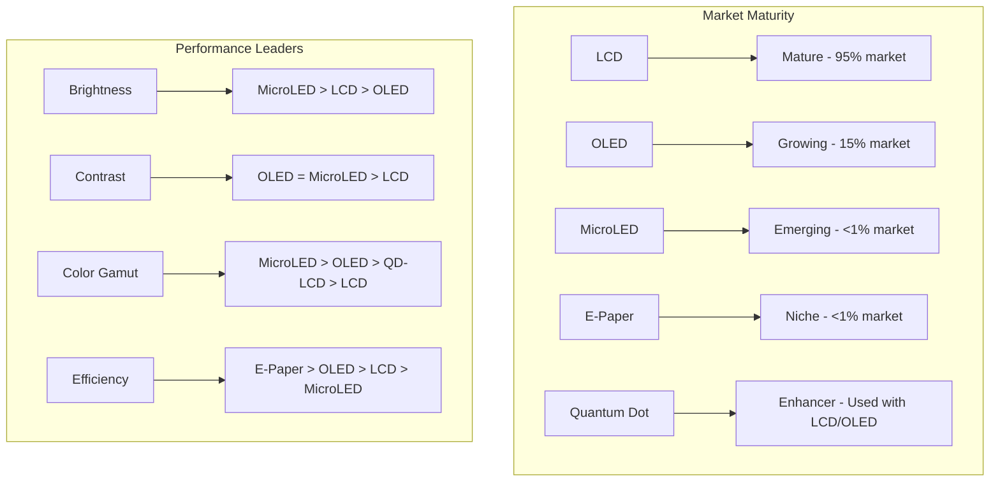
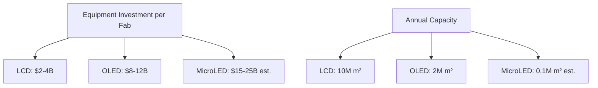
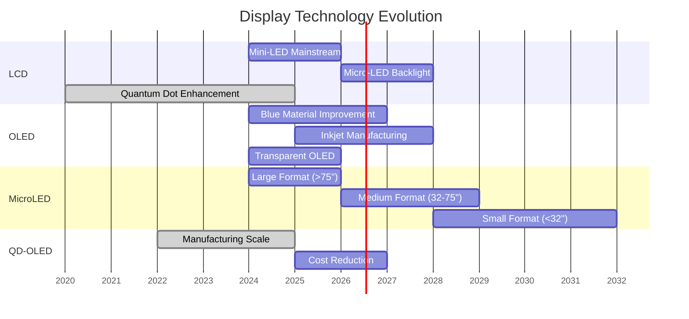

# Display Technology Comparison Matrix

## Table of Contents
- [Executive Summary](#executive-summary)
- [Performance Comparison](#performance-comparison)
- [Manufacturing Comparison](#manufacturing-comparison)
- [Cost Analysis](#cost-analysis)
- [Application Suitability](#application-suitability)
- [Future Outlook](#future-outlook)
- [Decision Framework](#decision-framework)

## Executive Summary

### Technology Readiness Matrix



### Key Differentiation Factors

| Factor | LCD | OLED | MicroLED | E-Paper |
|--------|-----|------|----------|---------|
| **Primary Strength** | Cost, Brightness | Contrast, Response | All-around | Power |
| **Primary Weakness** | Contrast | Lifetime | Cost | Speed |
| **Maturity** | Very High | High | Low | Medium |
| **Volume Production** | Massive | Large | Prototype | Small |

## Performance Comparison

### Display Performance Matrix

| Metric | TN LCD | IPS LCD | VA LCD | OLED | MicroLED | E-Paper |
|--------|--------|---------|--------|------|----------|---------|
| **Contrast Ratio** | 600:1 | 1,000:1 | 3,000:1 | ∞:1 | ∞:1 | 15:1 |
| **Peak Brightness (nits)** | 300 | 400 | 500 | 800 | 4,000+ | 50 |
| **Response Time (ms)** | 1 | 4-8 | 2-5 | <1 | <1 | 100-1000 |
| **Viewing Angle** | 140° | 178° | 178° | 180° | 180° | 180° |
| **Color Gamut (DCI-P3 %)** | 85% | 90% | 88% | 95% | 110%+ | 60% |
| **Power (W/m²)** | 150 | 180 | 170 | 200* | 300 | 0.1 |
| **Lifetime (hours)** | 50,000 | 50,000 | 50,000 | 30,000 | 100,000+ | 50,000+ |

*Content dependent

### Performance Radar Charts

**Gaming Performance:**
```
       Response Time
            10 ↑
               |  
Brightness  8  |  6  Color Accuracy
        ←─────(●)─────→
              6|8
               |
            Contrast
               10

● MicroLED (Theoretical)
■ OLED
▲ TN LCD  
◆ IPS LCD
```

**Professional Content Creation:**
```
       Color Accuracy
            10 ↑
               |  
Uniformity  8  |  8  Gamut Coverage
        ←─────(●)─────→
              6|9
               |
         Calibration Stability
               10

● Reference Monitor (IPS)
■ OLED Professional
▲ Mini-LED LCD
```

### Technology Strengths & Weaknesses

**LCD Advantages:**
- ✅ Mature manufacturing (high yield, low cost)
- ✅ High peak brightness capabilities
- ✅ No burn-in susceptibility
- ✅ Long operational lifetime
- ✅ Wide size range (1" to 100"+)

**LCD Disadvantages:**
- ❌ Limited contrast ratio
- ❌ Poor black levels
- ❌ Higher power consumption
- ❌ Slower response times
- ❌ Requires backlight (thickness)

**OLED Advantages:**
- ✅ Perfect blacks (infinite contrast)
- ✅ Excellent color reproduction
- ✅ Ultra-fast response times
- ✅ Wide viewing angles
- ✅ Thin form factor

**OLED Disadvantages:**
- ❌ Susceptible to burn-in
- ❌ Limited brightness in HDR
- ❌ Shorter operational lifetime
- ❌ Higher manufacturing cost
- ❌ Blue degradation issues

**MicroLED Advantages:**
- ✅ All OLED benefits without weaknesses
- ✅ Extremely high brightness
- ✅ Long lifetime
- ✅ No burn-in
- ✅ High efficiency at high brightness

**MicroLED Disadvantages:**
- ❌ Extremely expensive manufacturing
- ❌ Mass transfer challenges
- ❌ Limited to large formats currently
- ❌ Complex assembly process
- ❌ Immature technology

## Manufacturing Comparison

### Production Complexity Scale

```
Simple    ←────────────────────→    Complex
  1   2   3   4   5   6   7   8   9   10
  │   │   │   │   │   │   │   │   │   │
  TN ─┤   │   │   │   │   │   │   │   │
      └─ IPS ─┤   │   │   │   │   │   │
              └─ VA ─┤   │   │   │   │
                    └─ Mini-LED ─┤   │
                              └─ OLED ─┤
                                      └─ MicroLED
```

### Process Requirements

| Technology | Cleanroom Class | Process Steps | Equipment Types | Yield Rate |
|------------|-----------------|---------------|-----------------|------------|
| **TN LCD** | Class 100-1000 | 8-10 | Standard litho | 85-95% |
| **IPS LCD** | Class 100 | 10-12 | Advanced litho | 80-90% |
| **Mini-LED** | Class 10-100 | 12-15 | Pick & place | 70-85% |
| **OLED** | Class 1-10 | 15-20 | Evaporation | 60-80% |
| **MicroLED** | Class 1 | 25+ | Mass transfer | 10-50% |

### Manufacturing Equipment Costs



### Substrate Size Evolution

| Generation | Substrate Size | Optimal Products | Technology |
|------------|----------------|------------------|------------|
| **Gen 4.5** | 730×920mm | 6×32" or 3×42" | LCD standard |
| **Gen 6** | 1500×1850mm | 8×32" or 6×42" | LCD/OLED |
| **Gen 8.5** | 2200×2500mm | 6×55" or 3×75" | LCD large |
| **Gen 10.5** | 2940×3370mm | 8×65" or 6×75" | LCD ultra-large |

## Cost Analysis

### Manufacturing Cost Structure ($/m²)

| Component | LCD (IPS) | OLED | MicroLED (est.) |
|-----------|-----------|------|-----------------|
| **Substrate** | $20 | $30 | $50 |
| **TFT Processing** | $150 | $200 | $300 |
| **Active Layer** | $50 | $400 | $2,000 |
| **Encapsulation** | $20 | $100 | $50 |
| **Driver IC** | $30 | $40 | $60 |
| **Assembly** | $30 | $50 | $200 |
| **Testing** | $20 | $30 | $100 |
| **Total** | **$320** | **$850** | **$2,760** |

### Market Price Comparison (32" Display)

| Technology | Entry Level | Mid-Range | Premium | Professional |
|------------|-------------|-----------|---------|--------------|
| **TN LCD** | $150 | $200 | $250 | N/A |
| **IPS LCD** | $200 | $350 | $600 | $1,500 |
| **VA LCD** | $180 | $300 | $500 | $800 |
| **OLED** | $800 | $1,200 | $2,000 | $3,500 |
| **MicroLED** | N/A | N/A | $50,000+ | $100,000+ |

### Total Cost of Ownership (3 Years)

```
Cost Breakdown (32" Professional Display):
┌─────────────────────────────────────────┐
│ Initial Purchase:                       │
│ LCD: $1,500                            │
│ OLED: $3,500                           │ 
│                                         │
│ Power Consumption (3 years):           │
│ LCD: $180 (@150W, 8hr/day)            │
│ OLED: $120 (@100W average)            │
│                                         │
│ Replacement Risk:                       │
│ LCD: 5% ($75)                          │
│ OLED: 15% ($525)                       │
│                                         │
│ Total 3-Year Cost:                     │
│ LCD: $1,755                            │
│ OLED: $4,145                           │
└─────────────────────────────────────────┘
```

## Application Suitability

### Application Matrix

| Application | Best Choice | Alternative | Avoid | Key Requirements |
|-------------|-------------|-------------|-------|------------------|
| **Smartphones** | OLED | LCD (budget) | MicroLED | Thin, efficient |
| **Laptops** | IPS LCD | OLED | TN | Battery life, color |
| **Gaming** | TN/Fast IPS | OLED | VA | Response time |
| **Content Creation** | IPS LCD | OLED | TN | Color accuracy |
| **TVs (Home)** | OLED | Mini-LED | LCD | Contrast, HDR |
| **Digital Signage** | LCD | MicroLED | OLED | Brightness, lifetime |
| **Automotive** | LCD | TFT | OLED | Reliability, temp |
| **Medical** | IPS LCD | Mono LCD | OLED | Accuracy, lifetime |
| **Aviation** | LCD | LED | OLED | Reliability, bright |
| **VR/AR** | Fast LCD | MicroLED | OLED | Resolution, speed |

### Detailed Application Analysis

**Smartphone Requirements:**
```
Priority Ranking:
1. Power Efficiency     (40%)
2. Thin Profile        (25%)
3. Outdoor Visibility  (20%)
4. Color Quality       (10%)
5. Cost                (5%)

OLED Advantages:
✓ Always-on display capability
✓ Individual pixel control
✓ Perfect blacks for dark modes
✓ Thin without backlight

LCD Challenges:
✗ Backlight power drain
✗ Poor black levels
✗ Thicker profile
```

**Professional Monitor Requirements:**
```
Priority Ranking:
1. Color Accuracy      (35%)
2. Uniformity         (25%)
3. Stability          (20%)
4. Calibration        (15%)
5. Lifetime           (5%)

IPS LCD Advantages:
✓ Excellent uniformity
✓ Stable over time
✓ Wide color gamuts available
✓ Professional calibration support

OLED Challenges:
✗ Burn-in risk with static content
✗ Color shift over time
✗ ABL (Auto Brightness Limiter)
```

**Gaming Requirements:**
```
Priority Ranking:
1. Response Time       (40%)
2. Input Lag          (30%)
3. Refresh Rate       (20%)
4. Price              (10%)

Technology Suitability:
TN LCD:     Excellent response, lowest cost
Fast IPS:   Good balance, better colors
OLED:       Perfect for single-player, burn-in risk
VA:         Good contrast, slower response
```

## Future Outlook

### Technology Roadmap (2024-2030)



### Market Share Projections

**2025 Projections:**
| Technology | TV Market | Monitor Market | Mobile Market |
|------------|-----------|----------------|---------------|
| **LCD** | 65% | 85% | 40% |
| **OLED** | 30% | 10% | 55% |
| **Mini-LED** | 4% | 4% | 3% |
| **MicroLED** | 1% | 1% | 2% |

**2030 Projections:**
| Technology | TV Market | Monitor Market | Mobile Market |
|------------|-----------|----------------|---------------|
| **LCD** | 45% | 70% | 25% |
| **OLED** | 40% | 20% | 50% |
| **Mini-LED** | 10% | 8% | 15% |
| **MicroLED** | 5% | 2% | 10% |

### Emerging Hybrid Technologies

**QD-OLED (Samsung):**
- Quantum dot color conversion + OLED
- Better color gamut than RGB OLED
- No color filter absorption losses
- **Status**: Commercial since 2022

**QD-Display (Samsung/TCL):**
- Quantum dots with blue LED excitation
- No color filters needed
- Cadmium-free quantum dots
- **Status**: Development phase

**E Ink Color:**
- Electrophoretic displays with color
- Ultra-low power consumption
- Outdoor readable
- **Status**: Limited commercial

## Decision Framework

### Selection Criteria Weighting

**For Consumer Applications:**
```
Decision Matrix Weights:
Cost (30%) ──────────────────────────────────
Performance (25%) ────────────────────────────
Reliability (20%) ──────────────────────────
Power (15%) ────────────────────
Features (10%) ──────────
```

**For Professional Applications:**
```
Decision Matrix Weights:
Performance (35%) ─────────────────────────────────────
Reliability (25%) ─────────────────────────────
Color Accuracy (20%) ────────────────────────
Longevity (15%) ───────────────────
Cost (5%) ───
```

### Technology Selection Guide

**Step 1: Define Requirements**
- Primary use case and content type
- Environmental conditions
- Size and resolution requirements
- Budget constraints
- Performance priorities

**Step 2: Eliminate Unsuitable Technologies**
- Temperature range → Rules out OLED for extreme conditions
- Size requirements → Rules out MicroLED for small displays
- Budget constraints → Rules out premium technologies
- Burn-in sensitivity → Rules out OLED for static content

**Step 3: Compare Remaining Options**
- Performance metrics comparison
- Total cost of ownership calculation
- Future-proofing considerations
- Vendor ecosystem evaluation

**Step 4: Prototype and Validate**
- Visual inspection under actual conditions
- Performance measurement verification
- User acceptance testing
- Long-term stability assessment

### Quick Decision Tree

```
Start: What's your primary requirement?
    │
    ├─ Highest Performance → Budget high?
    │   ├─ Yes → Consider OLED/MicroLED
    │   └─ No → Fast IPS LCD
    │
    ├─ Lowest Cost → Size requirements?
    │   ├─ Small → TN LCD
    │   └─ Large → Basic IPS LCD
    │
    ├─ Best Image Quality → Static content?
    │   ├─ Yes → IPS LCD (professional)
    │   └─ No → OLED
    │
    └─ Longest Lifetime → Budget flexible?
        ├─ Yes → Mini-LED LCD
        └─ No → Standard LCD
```

---

*This comprehensive comparison guide provides decision-making frameworks across all display technologies. For detailed technical specifications, refer to individual technology guides and [Performance Benchmarks](./performance-benchmarks.md).*