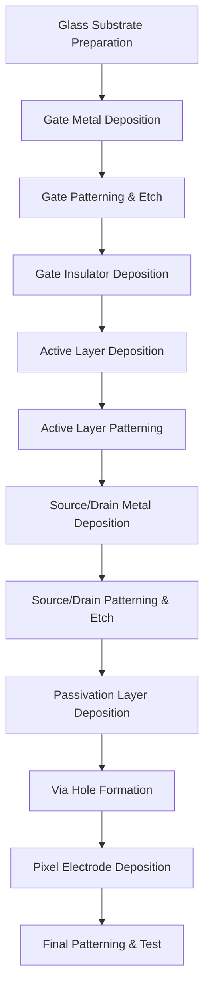
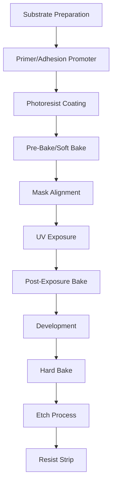

# TFT (Thin Film Transistor) Fabrication

## Table of Contents
- [TFT Fundamentals](#tft-fundamentals)
- [Fabrication Process Flow](#fabrication-process-flow)
- [Critical Process Steps](#critical-process-steps)
- [Materials & Deposition](#materials--deposition)
- [Lithography & Patterning](#lithography--patterning)
- [Quality Control](#quality-control)
- [Advanced Architectures](#advanced-architectures)
- [Yield Optimization](#yield-optimization)

## TFT Fundamentals

### TFT Structure and Operation

**Basic TFT Construction:**
```
Cross-Section View (n-channel TFT):
                Gate (Metal)
                ┌─────────┐
     Source     │ Oxide   │    Drain
    ┌──────┐    │Insulator│   ┌──────┐
    │ n+Si │    │         │   │ n+Si │
    └──┬───┘    └─────────┘   └───┬──┘
       │                          │
    ───┴────────────┬─────────────┴──── n-channel (a-Si:H)
                    │
    ════════════════┴══════════════════ Substrate (Glass)

Operating Principle:
VGS > VTH → Channel conducts → IDS flows
VGS < VTH → Channel off → IDS ≈ 0
```

### TFT Performance Parameters

**Key Electrical Characteristics:**
```latex
\text{On-Current: } I_{on} = \frac{W \cdot C_i \cdot \mu}{2L}(V_{GS} - V_{TH})^2
```

```latex
\text{Off-Current: } I_{off} = W \cdot L \cdot q \cdot n_i \cdot v_{drift}
```

```latex
\text{Mobility: } \mu = \frac{g_m \cdot L}{W \cdot C_i \cdot V_{DS}}
```

**Typical Performance Values:**
| Parameter | a-Si:H | LTPS | IGZO | Target |
|-----------|--------|------|------|--------|
| **Mobility (cm²/V·s)** | 0.5-1.0 | 50-150 | 10-40 | >10 |
| **Threshold Voltage (V)** | 2-4 | 1-3 | -1 to +2 | 0-2 |
| **On/Off Ratio** | 10⁶-10⁷ | 10⁷-10⁸ | 10⁸-10⁹ | >10⁶ |
| **Subthreshold Swing (V/dec)** | 0.3-0.6 | 0.15-0.3 | 0.2-0.4 | <0.5 |

## Fabrication Process Flow

### Standard TFT Process Sequence



### Process Flow Details

**Layer Stack Configuration:**
```
Complete TFT Structure (Bottom to Top):
┌─────────────────────────────────────────┐ ← ITO Pixel Electrode (150nm)
├─────────────────────────────────────────┤ ← Via Hole through passivation
│ Passivation (SiNx) - 300nm             │ 
├─────────────────────────────────────────┤ ← Source/Drain Metal (300nm)
│ Active Layer (a-Si:H) - 150nm          │ ← n+ doped contact layer (50nm)
├─────────────────────────────────────────┤ ← Gate Insulator (SiNx) - 400nm
│ Gate Metal (Mo/Al) - 200nm             │
├─────────────────────────────────────────┤ ← Glass Substrate (0.7mm)
│ Buffer Layer (SiNx) - 50nm             │
└─────────────────────────────────────────┘
```

### Process Temperature Profile

| Process Step | Temperature | Duration | Atmosphere | Purpose |
|--------------|-------------|----------|------------|---------|
| **Substrate Clean** | 250°C | 30min | Air | Outgassing |
| **Gate Metal** | RT | - | Ar | Deposition |
| **Gate Insulator** | 350°C | 45min | SiH₄/NH₃ | PECVD |
| **a-Si Deposition** | 300°C | 20min | SiH₄/H₂ | PECVD |
| **Annealing** | 350°C | 60min | N₂ | Defect reduction |
| **Passivation** | 300°C | 30min | SiH₄/NH₃ | PECVD |

## Critical Process Steps

### Gate Metal Deposition & Patterning

**Materials Selection:**
- **Pure Aluminum**: Low resistance, good etchability
- **Molybdenum**: High temperature stability, hillock resistance
- **Al-Nd Alloy**: Improved electromigration resistance
- **Copper**: Lower resistance, requires barrier layers

**Deposition Parameters:**
```
Sputtering Conditions:
Target: Al (99.99% purity)
Power: 3-5 kW (DC)
Pressure: 3-5 mTorr
Temperature: Room temperature
Rate: 3-5 nm/s
Target Utilization: 60-80%
```

**Pattern Specifications:**
- **Minimum width**: 3-5μm
- **Spacing**: 3-5μm
- **Thickness uniformity**: ±5%
- **Sheet resistance**: <0.1 Ω/□

### Gate Insulator Formation

**PECVD Silicon Nitride Process:**
```
Recipe Parameters:
SiH₄: 50-100 sccm
NH₃: 200-400 sccm  
N₂: 1000-2000 sccm
RF Power: 100-300W
Pressure: 0.3-1.0 Torr
Temperature: 300-380°C
Deposition Rate: 15-25 nm/min
```

**Quality Requirements:**
- **Thickness**: 350-450nm (±5%)
- **Uniformity**: <±3% across substrate
- **Breakdown voltage**: >8MV/cm
- **Dielectric constant**: 6.5-7.5
- **Hydrogen content**: 15-25%

### Active Semiconductor Layer

**Amorphous Silicon (a-Si:H) Deposition:**
```
Process Window:
SiH₄ Flow: 50-150 sccm
H₂ Flow: 0-100 sccm (dilution)
RF Power: 50-150W
Temperature: 250-350°C  
Pressure: 0.5-1.5 Torr
Rate: 3-10 nm/min
H₂ Content: 8-15%
```

**Alternative Materials:**

**IGZO (Indium Gallium Zinc Oxide):**
```
Sputtering Target Composition:
In₂O₃ : Ga₂O₃ : ZnO = 1:1:1 (atomic ratio)

Process Conditions:
RF Power: 100-200W
O₂/(Ar+O₂) Ratio: 5-15%
Substrate Temperature: RT-200°C
Post-Anneal: 300-400°C in air
```

**LTPS (Low-Temperature Polysilicon):**
```
Process Sequence:
1. a-Si:H Deposition (50-100nm)
2. Excimer Laser Annealing:
   - Wavelength: 308nm (XeCl)
   - Fluence: 200-400 mJ/cm²
   - Pulse duration: 20-30ns
   - Overlap: 90-95%
3. Crystallization → Polysilicon
```

### Source/Drain Formation

**Self-Aligned Process:**
```
Source/Drain Etch Sequence:
1. Metal Deposition (Mo, Al, or Cu)
2. Photolithography (S/D pattern)
3. Metal Etch (until a-Si exposed)
4. n+ a-Si:H Etch (selective to i-a-Si:H)
5. Resist Strip and Clean

Critical Control:
- Etch selectivity: >10:1 (n+:i a-Si:H)
- Over-etch: <10% to avoid gate damage
- Profile angle: 60-90°
```

**Contact Resistance Optimization:**
```latex
R_c = \frac{\rho_c}{A_{contact}} = \frac{\sqrt{\rho_c \rho_s}}{L_T} \coth\left(\frac{d}{\sqrt{\rho_c/\rho_s}}\right)
```

**Typical Values:**
- **Contact resistivity**: 10⁻²-10⁻⁴ Ω·cm²
- **Sheet resistance**: 100-500 Ω/□
- **Contact width**: 5-10μm

## Materials & Deposition

### Thin Film Deposition Techniques

**Physical Vapor Deposition (PVD):**

*DC Magnetron Sputtering:*
```
Process Physics:
Ar⁺ + Target → Target atoms + Secondary e⁻
Target atoms → Substrate (coating)

Key Parameters:
- Target voltage: 200-800V
- Current: 1-10 A/target
- Ar pressure: 2-10 mTorr
- Substrate bias: 0 to -100V
- Uniformity: ±5% across Gen 8.5
```

*RF Sputtering (for insulators):*
- **Frequency**: 13.56 MHz
- **Power**: 2-8 W/cm² (target area)
- **Matching**: 50Ω impedance
- **Applications**: SiO₂, Si₃N₄, Al₂O₃

**Chemical Vapor Deposition (CVD):**

*Plasma Enhanced CVD (PECVD):*
```
Silicon Nitride Recipe:
Precursors: SiH₄ + NH₃
Plasma: 13.56 MHz RF
Power density: 0.1-0.5 W/cm²
Temperature: 300-400°C

Reaction:
3SiH₄ + 4NH₃ → Si₃N₄ + 12H₂
```

### Material Properties & Selection

**Conductor Materials:**
| Material | Resistivity (μΩ·cm) | Advantages | Disadvantages |
|----------|---------------------|------------|---------------|
| **Aluminum** | 2.8 | Low cost, easy etch | Hillock formation |
| **Copper** | 1.7 | Lowest resistance | Requires barrier |
| **Molybdenum** | 5.2 | Thermal stability | Higher resistance |
| **ITO** | 10-50 | Transparent | Brittle, expensive |

**Insulator Materials:**
| Material | Dielectric Constant | Breakdown (MV/cm) | Applications |
|----------|-------------------|-------------------|--------------|
| **Si₃N₄** | 6.5-7.5 | 8-10 | Gate insulator |
| **SiO₂** | 3.8-4.2 | 6-8 | Interlayer dielectric |
| **Al₂O₃** | 8-10 | 10-15 | High-k alternative |
| **HfO₂** | 20-25 | 5-8 | Advanced high-k |

**Semiconductor Materials:**
| Material | Mobility (cm²/V·s) | Process Temp | Stability | Cost |
|----------|-------------------|--------------|-----------|------|
| **a-Si:H** | 0.5-1.0 | 300°C | Good | Low |
| **LTPS** | 50-150 | 600°C | Excellent | High |
| **IGZO** | 10-40 | 350°C | Good | Medium |
| **InGaZnO** | 20-50 | 300°C | Fair | Medium |

## Lithography & Patterning

### Photolithography Process

**Standard Process Flow:**


**Critical Dimension Control:**
```latex
CD = CD_{mask} + \text{bias} + \text{process variation}
```

**Process Window Analysis:**
- **Dose latitude**: ±10% exposure dose
- **Focus latitude**: ±1.0μm depth of focus  
- **Overlay accuracy**: ±1.5μm alignment
- **Critical dimension**: ±0.3μm (3σ)

### Advanced Patterning Techniques

**Gray-Tone Lithography:**
- **Application**: Contact holes, 3D structures
- **Method**: Partial transparency masks
- **Benefit**: Single exposure for multiple depths

**Multi-Tone Masks:**
```
Intensity Profile:
  1.0 ├─────┐     ┌─────┐     ┌─────
      │     │     │     │     │
  0.6 │     └─────┘     └─────┘
      │
  0.0 └─────────────────────────────
      Clear  Gray    Clear  Gray

Result: Different resist thicknesses
```

### Etch Processes

**Dry Etch (Plasma):**

*Metal Etch (Aluminum):*
```
Process Chemistry:
BCl₃/Cl₂ plasma
BCl₃: 80-120 sccm
Cl₂: 20-40 sccm  
RF Power: 300-800W
Pressure: 5-15 mTorr
Temperature: 60-80°C
```

*Dielectric Etch (Si₃N₄):*
```
Process Chemistry:
CF₄/CHF₃ plasma
CF₄: 50-100 sccm
CHF₃: 10-30 sccm
O₂: 0-10 sccm (polymer control)
RF Power: 200-500W
Pressure: 20-100 mTorr
```

**Etch Profile Control:**
- **Anisotropic etching**: Vertical sidewalls
- **Selectivity**: >10:1 to underlying layer
- **Uniformity**: <±5% across substrate
- **Residue**: <5% area coverage

## Quality Control

### In-Line Monitoring

**Film Thickness Measurement:**
- **Method**: Ellipsometry, reflectometry
- **Accuracy**: ±1nm for <100nm films
- **Sampling**: 9-49 points per substrate
- **Control limits**: ±5% from target

**Critical Dimension Measurement:**
- **Tool**: CD-SEM, optical CD metrology
- **Accuracy**: ±10nm
- **Sampling**: Statistical per lot
- **Process control**: ±3σ within spec

**Electrical Testing:**
```
TFT Parameters Tested:
- Threshold voltage (VTH)
- Mobility (μ)
- On-current (Ion) 
- Off-current (Ioff)
- Subthreshold swing (SS)

Acceptance Criteria:
VTH: 1.5 ± 0.5V
μ: >0.5 cm²/V·s  
Ion/Ioff: >10⁶
SS: <0.6 V/decade
```

### Defect Analysis & Classification

**Defect Categories:**
1. **Particle Defects** (40% of failures)
   - Size range: 0.5-10μm
   - Sources: Equipment, environment, materials
   - Impact: Shorts, opens, leakage

2. **Pattern Defects** (25% of failures)
   - Shorts between lines
   - Open circuits
   - Critical dimension variations

3. **Material Defects** (20% of failures)
   - Pinholes in insulators
   - Grain boundaries in conductors
   - Interface contamination

4. **Process Defects** (15% of failures)
   - Under/over-etch
   - Resist residues
   - Thermal stress

### Statistical Process Control

**Yield Model:**
```latex
Y = \prod_{i=1}^{n} Y_i = \prod_{i=1}^{n} e^{-D_i \cdot A_i}
```

Where:
- Y = overall yield
- Y_i = yield for process step i
- D_i = defect density for step i
- A_i = critical area for step i

**Control Charts:**
- **X-bar charts**: Process centering
- **R charts**: Process variation  
- **p charts**: Defect rates
- **c charts**: Defect counts per unit

## Advanced Architectures

### High-Performance TFT Designs

**LTPS TFT Optimization:**
```
Laser Crystallization Parameters:
Energy Density: 250-400 mJ/cm²
Beam Overlap: 90-95%
Scan Speed: 50-200 mm/s
Grain Size: 0.1-0.5μm

Performance Benefits:
Mobility: 50-150 cm²/V·s  
Ion/Ioff: >10⁷
Operating Frequency: >1MHz
```

**IGZO TFT Advantages:**
- **Low off-current**: <10⁻¹³ A/μm
- **Large-area uniformity**: Better than a-Si:H
- **Optical transparency**: >80% transmission
- **Low-temperature processing**: <400°C

**Gate Insulator Scaling:**
```
High-k Dielectrics:
Al₂O₃: k=8-10, thickness scaling
HfO₂: k=20-25, interface issues
La₂O₃: k=30, air stability problems

EOT (Equivalent Oxide Thickness):
EOT = t_physical × (3.9/k_material)
```

### Multi-Gate Structures

**Dual-Gate TFT:**
```
Cross-Section:
    Top Gate
    ┌─────────┐
    │ Oxide   │
────┴─────────┴──── Active Layer
    Gate Oxide
    ┌─────────┐
    │ Bottom  │
    │ Gate    │
    └─────────┘

Benefits:
- Better control of channel
- Higher on-current
- Reduced short-channel effects
```

## Yield Optimization

### Defect Reduction Strategies

**Clean Room Management:**
- **Class 1-10**: Critical process areas
- **Particle monitoring**: Real-time sensors
- **Personnel control**: Gowning procedures
- **Equipment maintenance**: Preventive schedules

**Process Window Expansion:**
```
Robust Design Principles:
1. Center process in available window
2. Minimize process sensitivity
3. Implement statistical monitoring
4. Use design for manufacturability

Example - Gate Etch:
Normal window: ±10% over-etch
Robust design: ±20% tolerance
Implementation: Hard mask, optimized chemistry
```

**Design Rules Optimization:**
| Feature | Conservative | Optimized | Impact |
|---------|-------------|-----------|---------|
| **Minimum width** | 5μm | 3μm | +15% aperture |
| **Spacing** | 5μm | 3μm | +12% density |
| **Via size** | 8μm | 6μm | +10% reliability |
| **Overlap** | 2μm | 1μm | +8% aperture |

### Economic Optimization

**Cost-Yield Trade-offs:**
```latex
Cost = \frac{Wafer\,Cost + Process\,Cost}{Yield \times Dies\,per\,Wafer}
```

**Process Cost Model:**
- **Equipment depreciation**: 40% of cost
- **Materials**: 25% of cost
- **Labor**: 20% of cost
- **Utilities**: 10% of cost
- **Maintenance**: 5% of cost

**Yield Learning Curve:**
```
Yield Improvement Over Time:
Year 1: 60% → 75% (startup phase)
Year 2: 75% → 85% (optimization)
Year 3: 85% → 90% (mature process)
Year 4+: 90%+ (continuous improvement)
```

---

*This comprehensive TFT fabrication guide covers all aspects from basic principles through advanced manufacturing. For related processes, see [Substrate Production](./substrate-production.md) and [Assembly Processes](./assembly-processes.md).*