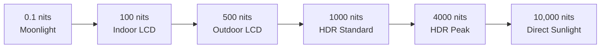

# Display Metrics Comprehensive Guide

## Table of Contents
- [Resolution & Pixel Density](#resolution--pixel-density)
- [Brightness & Contrast](#brightness--contrast)
- [Color Performance](#color-performance)
- [Temporal Performance](#temporal-performance)
- [Viewing Characteristics](#viewing-characteristics)
- [Power & Efficiency](#power--efficiency)
- [Measurement Standards](#measurement-standards)

## Resolution & Pixel Density

### Standard Resolutions

| Name | Resolution | Pixels | Aspect | Common Sizes |
|------|------------|--------|--------|--------------|
| HD | 1280×720 | 0.92M | 16:9 | 32", TV |
| Full HD | 1920×1080 | 2.07M | 16:9 | 24", 27", TV |
| QHD/1440p | 2560×1440 | 3.69M | 16:9 | 27", 32" |
| 4K UHD | 3840×2160 | 8.29M | 16:9 | 32"+, TV |
| 5K | 5120×2880 | 14.7M | 16:9 | 27", iMac |
| 8K UHD | 7680×4320 | 33.2M | 16:9 | 65"+, TV |

### Pixel Density Calculations

**Pixels Per Inch (PPI):**
```latex
PPI = \frac{\sqrt{H_{pixels}^2 + V_{pixels}^2}}{Diagonal_{inches}}
```

**Example Calculations:**
```
27" QHD Monitor:
PPI = √(2560² + 1440²) / 27
PPI = √(6,553,600 + 2,073,600) / 27
PPI = √8,627,200 / 27 = 2937.4 / 27 = 108.8 PPI
```

**Pixel Pitch:**
```latex
Pixel\,Pitch = \frac{25.4mm}{PPI}
```

### Resolution Density Categories

| Category | PPI Range | Viewing Distance | Applications |
|----------|-----------|------------------|---------------|
| Standard | 72-96 | 60-70cm | Desktop monitors |
| High | 110-150 | 50-60cm | Laptops, tablets |
| Retina | 200-300 | 30-40cm | Smartphones |
| Ultra-High | 400+ | 25cm | VR, micro-displays |

### Pixel Arrangements

**RGB Stripe:**
```
Standard RGB Layout:
┌─R─┬─G─┬─B─┬─R─┬─G─┬─B─┐
│ █ │ █ │ █ │ █ │ █ │ █ │
│ █ │ █ │ █ │ █ │ █ │ █ │
└───┴───┴───┴───┴───┴───┘
Resolution: Native
```

**PenTile (OLED):**
```
PenTile Diamond:
  R   G   R   G   R
 ╱ ╲ ╱ ╲ ╱ ╲ ╱ ╲ ╱
G   B   G   B   G   B
 ╲ ╱ ╲ ╱ ╲ ╱ ╲ ╱ ╲
  R   G   R   G   R

Effective Resolution: ~0.7× native
```

## Brightness & Contrast

### Brightness Measurements

**Luminance Units:**
- **cd/m² (nits)**: Standard unit (1 nit = 1 cd/m²)
- **fL (foot-lamberts)**: 1 fL = 3.426 cd/m²
- **lm/m²**: Luminous flux per area

**Typical Brightness Levels:**


### Contrast Ratio Types

**Static Contrast Ratio:**
```latex
CR_{static} = \frac{L_{white}}{L_{black}}
```

**Dynamic Contrast Ratio:**
- **Measurement**: Maximum brightness / minimum achievable black
- **Method**: Backlight dimming or local zones
- **Typical Values**: 10,000:1 - 1,000,000:1

**ANSI Contrast:**
- **Pattern**: Checkerboard of black/white squares
- **Measurement**: Average white / average black
- **More realistic**: Accounts for halo effects

### Technology Comparison

| Technology | Static CR | Dynamic CR | Peak Brightness |
|------------|-----------|------------|-----------------|
| TN LCD | 600:1 | 1,000:1 | 300 nits |
| IPS LCD | 1,000:1 | 5,000:1 | 400 nits |
| VA LCD | 3,000:1 | 50,000:1 | 500 nits |
| Mini-LED LCD | 5,000:1 | 100,000:1 | 1,400 nits |
| OLED | ∞:1 | ∞:1 | 800 nits |
| MicroLED | ∞:1 | ∞:1 | 4,000+ nits |

### HDR Standards

**HDR10:**
- **Peak Brightness**: 1,000-10,000 nits
- **Color Depth**: 10-bit
- **Color Gamut**: Rec. 2020
- **Transfer Function**: PQ (ST-2084)

**Dolby Vision:**
- **Peak Brightness**: Up to 10,000 nits
- **Color Depth**: 12-bit
- **Dynamic Metadata**: Scene-by-scene optimization
- **Backward Compatible**: HDR10

## Color Performance

### Color Space Standards

**sRGB (Standard RGB):**
- **Gamut Coverage**: ~35% of visible colors
- **White Point**: D65 (6500K)
- **Gamma**: 2.2
- **Primary Coordinates**:
  - Red: (0.64, 0.33)
  - Green: (0.30, 0.60)
  - Blue: (0.15, 0.06)

**Adobe RGB:**
- **Gamut Coverage**: ~50% of visible colors
- **Enhanced**: Green reproduction
- **Applications**: Professional photography

**DCI-P3 (Digital Cinema):**
- **Gamut Coverage**: ~45% of visible colors
- **White Point**: DCI (6300K)
- **Enhanced**: Red reproduction
- **Applications**: Cinema, mobile displays

**Rec. 2020 (UHDTV):**
- **Gamut Coverage**: ~75% of visible colors
- **Future Standard**: For 4K/8K content
- **Current Achievement**: 70-80% by best displays

### Color Gamut Measurement

**Coverage Calculation:**
```latex
Coverage\,\% = \frac{Area_{display} \cap Area_{standard}}{Area_{standard}} \times 100\%
```

**Volume Calculation (3D):**
```latex
Volume = \int\int\int_{gamut} dL \, da^* \, db^*
```

### Color Accuracy Metrics

**Delta E (ΔE) Values:**
- **ΔE < 1**: Imperceptible difference
- **ΔE 1-3**: Perceptible to trained eye
- **ΔE 3-6**: Perceptible to average observer
- **ΔE > 6**: Very noticeable difference

**Delta E Formulas:**
```latex
\Delta E_{76} = \sqrt{(\Delta L^*)^2 + (\Delta a^*)^2 + (\Delta b^*)^2}
```

```latex
\Delta E_{00} = \sqrt{\left(\frac{\Delta L'}{k_L S_L}\right)^2 + \left(\frac{\Delta C'}{k_C S_C}\right)^2 + \left(\frac{\Delta H'}{k_H S_H}\right)^2 + R_T \frac{\Delta C'}{k_C S_C} \frac{\Delta H'}{k_H S_H}}
```

### Calibration Standards

**Professional Calibration Targets:**
| Application | White Point | Gamma | ΔE Target |
|-------------|-------------|-------|-----------|
| sRGB | D65 (6500K) | 2.2 | <2 |
| Adobe RGB | D65 (6500K) | 2.2 | <1 |
| DCI-P3 | DCI (6300K) | 2.6 | <1 |
| Rec. 709 | D65 (6500K) | 2.4 | <1 |
| Rec. 2020 | D65 (6500K) | PQ/HLG | <1 |

## Temporal Performance

### Response Time Measurements

**Gray-to-Gray (GtG):**
- **Standard**: 10% to 90% transition
- **Measurement**: Rise time + fall time
- **Typical LCD**: 1-8ms
- **Typical OLED**: <1ms

**Black-to-White-to-Black (BWB):**
- **More stringent**: Full range transition
- **Usually higher**: Than GtG values

**Motion Picture Response Time (MPRT):**
- **Perceptual metric**: How long pixel appears to eye
- **Influenced by**: Persistence and sample-and-hold

### Refresh Rate Standards

| Refresh Rate | Period | Applications | Requirements |
|-------------|--------|--------------|--------------|
| 60Hz | 16.67ms | Standard desktop | GtG <8ms |
| 75Hz | 13.33ms | Gaming entry | GtG <6ms |
| 120Hz | 8.33ms | Gaming standard | GtG <4ms |
| 144Hz | 6.94ms | Gaming premium | GtG <3ms |
| 240Hz | 4.17ms | Competitive gaming | GtG <2ms |
| 360Hz | 2.78ms | Professional esports | GtG <1ms |

### Variable Refresh Rate

**Adaptive Sync Technologies:**
- **FreeSync**: AMD standard, VESA adaptive sync
- **G-Sync**: NVIDIA proprietary
- **G-Sync Compatible**: Validated FreeSync monitors

**VRR Range Examples:**
```
144Hz Monitor VRR Range:
┌─────────────────────────────────────────┐
│ 48Hz        75Hz        144Hz           │
│  │           │            │             │
│  ▼           ▼            ▼             │
│ Min ────────────────── Max              │
│                                         │
│ Outside range: Frame doubling/LFC       │
└─────────────────────────────────────────┘
```

### Motion Handling Technologies

**Overdrive (Response Time Compensation):**
```
Lookup Table Method:
From Gray Level → To Gray Level = Overdrive Value
    0  32  64  96 128 160 192 224 255
 0│ 0  45  80 115 150 185 220 255 255
32│ 0  32  70 105 140 175 210 245 255
64│ 0  20  64  95 130 165 200 235 255
```

**Black Frame Insertion (BFI):**
- **Method**: Insert black frames between content
- **Effect**: Reduces motion blur by 50%
- **Trade-off**: 50% brightness reduction

**Backlight Scanning:**
- **Implementation**: LED backlight strobing
- **Synchronization**: With refresh cycle
- **Benefit**: Reduced persistence without brightness loss

## Viewing Characteristics

### Viewing Angle Specifications

**Contrast Ratio Degradation:**
```latex
CR(\theta) = CR_0 \cdot \cos^n(\theta)
```

Where n varies by technology:
- TN: n ≈ 4
- IPS: n ≈ 1.5
- VA: n ≈ 2-3

**Color Shift Measurement:**
| Technology | ΔE at 30° | ΔE at 60° | Usable Angle |
|------------|-----------|-----------|--------------|
| TN | 8-15 | 25+ | 140°/120° |
| IPS | 2-4 | 6-10 | 178°/178° |
| VA | 3-6 | 8-15 | 178°/178° |
| OLED | 1-2 | 2-4 | 180°/180° |

### Angular Color Uniformity

**Measurement Grid:**
```
9-Point Measurement Pattern:
┌─────┬─────┬─────┐
│  1  │  2  │  3  │ ← Top row
├─────┼─────┼─────┤
│  4  │  5  │  6  │ ← Center row
├─────┼─────┼─────┤
│  7  │  8  │  9  │ ← Bottom row
└─────┴─────┴─────┘

Center (5) is reference point
Maximum ΔE from any point to center
```

### Glare and Reflection

**Anti-Glare (AG) Coatings:**
- **Haze**: 2-25% typical
- **Reflection**: Reduced to <4%
- **Trade-off**: Slight image softening

**Anti-Reflection (AR) Coatings:**
- **Multi-layer**: Interference coatings
- **Reflection**: <1% achievable
- **Maintains**: Image sharpness

## Power & Efficiency

### Power Consumption Models

**LCD Power Components:**
```latex
P_{total} = P_{backlight} + P_{logic} + P_{driver}
```

**Typical Distribution (27" LCD):**
- Backlight: 75% (60W)
- Logic circuits: 15% (12W)
- Driver circuits: 10% (8W)
- Total: 80W

**OLED Power Model:**
```latex
P_{OLED} = \sum_{pixels} L_{pixel} \cdot A_{pixel} \cdot \eta_{pixel}^{-1}
```

**Content Dependency:**
- **White screen**: 150-200W (32" OLED)
- **Typical content**: 100-120W
- **Black screen**: 20-30W (standby)

### Efficiency Metrics

**Luminous Efficacy:**
```latex
\eta = \frac{\text{Luminous flux (lm)}}{\text{Power consumption (W)}}
```

**Technology Comparison:**
| Technology | Efficacy (lm/W) | Peak | Typical |
|------------|-----------------|------|---------|
| CCFL LCD | 3-5 | 300 nits | 250 nits |
| LED LCD | 8-12 | 400 nits | 300 nits |
| Mini-LED LCD | 10-15 | 1000 nits | 400 nits |
| White OLED | 40-80 | 150 nits | 100 nits |
| RGB OLED | 20-60 | 400 nits | 150 nits |

### Energy Star Standards

**Display Energy Consumption:**
```latex
E_{on} = P_{on} \cdot t_{on} + P_{sleep} \cdot t_{sleep}
```

**Requirements by Size:**
| Screen Size | Max Power (W) | Sleep (W) | Auto Power Down |
|-------------|---------------|-----------|-----------------|
| <30" | Formula-based | <0.5 | <15 minutes |
| 30-60" | Formula-based | <1.0 | <15 minutes |
| >60" | Formula-based | <3.0 | <15 minutes |

## Measurement Standards

### International Standards

**IEC 62087-1**: Video Display Energy Measurement
- **Test Patterns**: Defined content for measurement
- **Conditions**: 23°C ±2°C, 45-75% RH
- **Warmup**: 20 minutes minimum

**ISO 13406-2**: Visual Display Unit Requirements
- **Pixel Defects**: Classification and limits
- **Viewing Distance**: 500-700mm
- **Ambient Light**: 200 lux ±50

**VESA DisplayHDR**: HDR Performance Standards
- **DisplayHDR 400**: 400 nits, 95% sRGB
- **DisplayHDR 600**: 600 nits, 99% sRGB
- **DisplayHDR 1000**: 1000 nits, 95% DCI-P3

### Measurement Equipment

**Photometers/Colorimeters:**
- **Konica Minolta CS-200**: Reference grade
- **X-Rite i1Display Pro**: Consumer calibration
- **Klein K10-A**: Professional video

**Measurement Geometry:**
```
Standard Measurement Setup:
        
    Sensor ←──── 50cm ────→ Display
       ↑                      ↑
    Perpendicular         Center of
    to display           active area
       
Dark room: <1 lux ambient
Temperature: 23°C ±2°C
Warm-up: 30 minutes minimum
```

### Test Patterns

**Uniformity Pattern:**
```
White Field Test:
┌─────────────────────────────────────────┐
│                                         │
│                                         │
│            Full White                   │
│             (255,255,255)               │
│                                         │
│                                         │
└─────────────────────────────────────────┘

Measurement: 9 or 13 point grid
Target: <20% luminance variation
```

**Color Accuracy Pattern:**
- **Color patches**: Calibrated reference colors
- **Gray scale**: 21 steps (0, 5, 10, ..., 100%)
- **Skin tones**: Critical colors for evaluation

---

*This comprehensive display metrics guide provides measurement standards and performance characteristics across all display technologies. For technology-specific details, see [LCD Technology](../technologies/lcd-technology.md) and [OLED Technology](../technologies/oled-technology.md).*