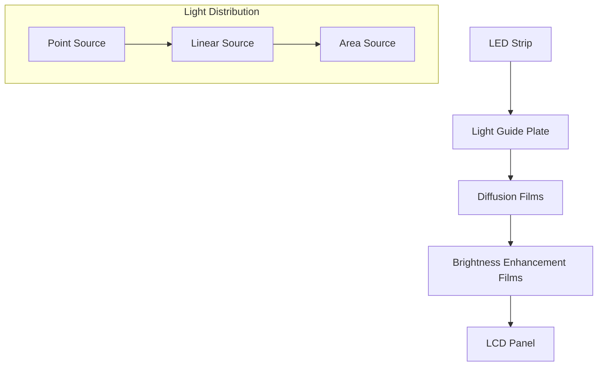
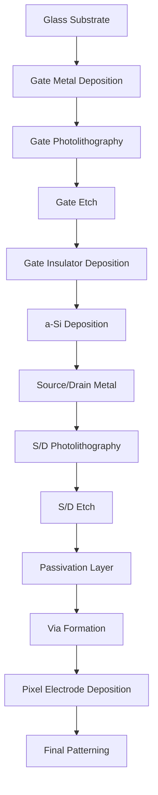

# LCD Technology Deep Dive

## Table of Contents
- [Physics & Principles](#physics--principles)
- [LCD Panel Types](#lcd-panel-types)
- [Backlight Systems](#backlight-systems)
- [Manufacturing Process](#manufacturing-process)
- [Performance Characteristics](#performance-characteristics)
- [Advanced Features](#advanced-features)
- [Future Developments](#future-developments)

## Physics & Principles

### Liquid Crystal Fundamentals

Liquid crystals are organic molecules that exhibit properties between liquids and crystals. They can be electrically manipulated to control light transmission.

```
Molecular Structure:
    
    No Electric Field        Electric Field Applied
    ┌─────────────────┐      ┌─────────────────┐
    │  ╱ ╲   ╱ ╲   ╱ │      │  |   |   |   | │
    │ ╱   ╲ ╱   ╲ ╱  │  →   │  |   |   |   | │
    │╱     ╲     ╲   │      │  |   |   |   | │
    │      Random     │      │    Aligned      │
    │   Orientation   │      │  Orientation    │
    └─────────────────┘      └─────────────────┘
         Light Blocked            Light Passes
```

### LCD Cell Structure

```
Layer Stack (Bottom to Top):
┌─────────────────────────────────────────┐ ← Polarizer 2 (90° rotated)
│ Color Filter (RGB subpixels)            │
├─────────────────────────────────────────┤ ← Glass Substrate (TFT)
│ Thin Film Transistor Array              │
├─────────────────────────────────────────┤ ← Alignment Layer
│ Liquid Crystal Layer (~3-5μm)           │
├─────────────────────────────────────────┤ ← Alignment Layer
│ Common Electrode (ITO)                  │
├─────────────────────────────────────────┤ ← Glass Substrate
│ Polarizer 1                             │
├─────────────────────────────────────────┤ ← Backlight Unit
│ LED Array + Light Guide                 │
└─────────────────────────────────────────┘
```

### Twisted Nematic (TN) Operation

In TN LCDs, liquid crystals twist 90° between substrates:

**OFF State (No Voltage):**
```
Polarizer 1: ═══════════════════════════════
LC Molecules: ╱╲ → ╱╲ → ╱╲ → ╱╲ → ╱╲ (twisted)
Polarizer 2: ║║║║║║║║║║║║║║║║║║║║║║║║║║║║║║║
Result: Light passes through (WHITE)
```

**ON State (Voltage Applied):**
```
Polarizer 1: ═══════════════════════════════
LC Molecules: ||||||||||||||||||||||||||||| (aligned)
Polarizer 2: ║║║║║║║║║║║║║║║║║║║║║║║║║║║║║║║
Result: Light blocked (BLACK)
```

## LCD Panel Types

### In-Plane Switching (IPS)

**Advantages:**
- Wide viewing angles (178°)
- Excellent color reproduction
- No color shift at angles

**Structure:**
```
Top View of IPS Cell:
┌─────────────────────────────────────────┐
│  ←  LC molecules (horizontal alignment) │
│ ╔═══╗  ╔═══╗  ╔═══╗  ╔═══╗  ╔═══╗   │
│ ║ E ║  ║ L ║  ║ E ║  ║ C ║  ║ T ║   │ ← Comb electrodes
│ ╚═══╝  ╚═══╝  ╚═══╝  ╚═══╝  ╚═══╝   │
│  ←  Electric field (horizontal)        │
└─────────────────────────────────────────┘
```

### Vertical Alignment (VA)

**Key Features:**
- High contrast ratios (3000:1 - 5000:1)
- Good black levels
- Moderate viewing angles

**Molecular Alignment:**
```
Side View:
           No Field              With Field
        ┌─────────────┐       ┌─────────────┐
        │      |      │       │  ╱     ╲   │
        │      |      │   →   │ ╱       ╲  │
        │      |      │       │╱         ╲ │
        │   Vertical  │       │ Tilted 45° │
        └─────────────┘       └─────────────┘
```

### Performance Comparison Table

| Parameter | TN | IPS | VA | MVA/PVA |
|-----------|----|----|----|---------| 
| Response Time | 1ms | 4-8ms | 2-5ms | 3-6ms |
| Viewing Angle (H/V) | 160°/140° | 178°/178° | 178°/178° | 178°/178° |
| Contrast Ratio | 600:1 | 1000:1 | 3000:1 | 5000:1 |
| Color Gamut (sRGB) | 95% | 99% | 95% | 98% |
| Power Consumption | Low | Medium | Medium | Medium |
| Cost | Low | High | Medium | High |

## Backlight Systems

### Edge-Lit LED Configuration



### Direct-Lit LED Array

```
LED Array Layout (32" Display):
┌─────┬─────┬─────┬─────┬─────┬─────┐
│ LED │     │ LED │     │ LED │     │
│  ●  │     │  ●  │     │  ●  │     │
├─────┼─────┼─────┼─────┼─────┼─────┤
│     │     │     │     │     │     │
│     │  ●  │     │  ●  │     │  ●  │
├─────┼─────┼─────┼─────┼─────┼─────┤
│ LED │     │ LED │     │ LED │     │
│  ●  │     │  ●  │     │  ●  │     │
└─────┴─────┴─────┴─────┴─────┴─────┘

Typical: 64-256 LEDs for 32" display
Spacing: 40-60mm between LEDs
```

### Mini-LED Backlighting

**Zone Configuration:**
- **Standard LED**: 16-32 zones
- **Mini-LED**: 500-2000+ zones
- **LED Size**: Standard ~3mm, Mini-LED ~0.2mm

**Local Dimming Algorithm:**
```latex
\text{Zone Brightness} = \max\left(\frac{\text{Peak Content}}{\text{Zone Area}}, \text{Global Minimum}\right)
```

## Manufacturing Process

### TFT Substrate Fabrication



### Critical Manufacturing Parameters

| Process Step | Temperature | Pressure | Time | Tolerance |
|--------------|-------------|----------|------|-----------|
| Gate Metal Sputter | 25°C | 5mTorr | 15min | ±2% thickness |
| Annealing | 350°C | Atmosphere | 1hr | ±10°C |
| CVD a-Si | 300°C | 1Torr | 30min | ±5% uniformity |
| Photolithography | 23°C | Atmosphere | 45s | ±50nm alignment |

### Yield Analysis

**Major Defect Categories:**
1. **Particle Defects**: 40% of failures
2. **Pattern Defects**: 25% of failures  
3. **Electrical Shorts**: 20% of failures
4. **Material Defects**: 15% of failures

**Yield Formula:**
```latex
Y = e^{-D \cdot A}
```
Where:
- Y = Yield
- D = Defect density (defects/cm²)
- A = Panel area (cm²)

## Performance Characteristics

### Response Time Analysis

**Gray-to-Gray Response:**
```latex
\tau_{rise} = \frac{\epsilon \cdot d^2}{\pi^2 \cdot K_{11} \cdot \Delta\epsilon \cdot V^2}
```

Where:
- τ = response time
- ε = dielectric constant
- d = cell gap
- K₁₁ = elastic constant
- Δε = dielectric anisotropy
- V = applied voltage

### Color Gamut Limitations

**Standard Color Spaces:**
- **sRGB**: Most LCD panels achieve 95-100%
- **Adobe RGB**: High-end panels achieve 85-90%
- **DCI-P3**: Wide-gamut panels achieve 90-95%

```
Color Gamut Comparison (CIE 1931):
     y
  0.9 │    ╭─────╮
      │   ╱       ╲
  0.6 │  ╱    ●────╲  ← Human Visible
      │ ╱    ╱ sRGB ╲    Spectrum
  0.3 │╱____╱_______╲
      │           DCI╲
  0.0 └─────────────────→ x
     0.0   0.3    0.6   0.9
```

### Viewing Angle Performance

**Contrast Degradation:**
```latex
CR(\theta) = CR_0 \cdot \cos^2(\theta)
```

**Color Shift Analysis:**
| Viewing Angle | IPS ΔE | VA ΔE | TN ΔE |
|---------------|--------|--------|--------|
| 0° (center) | 0 | 0 | 0 |
| 30° horizontal | 1.2 | 2.1 | 4.5 |
| 60° horizontal | 2.8 | 4.2 | 12.3 |
| 30° vertical | 1.5 | 3.8 | 8.7 |

## Advanced Features

### High Refresh Rate Implementation

**Overdrive Technology:**
```
Lookup Table Example (8-bit):
┌─────┬─────┬─────┬─────┬─────┐
│From │  0  │ 64  │128  │255  │
├─────┼─────┼─────┼─────┼─────┤
│  0  │  0  │ 80  │150  │255  │
│ 64  │ 45  │ 64  │140  │255  │
│128  │ 90  │110  │128  │255  │
│255  │180  │220  │240  │255  │
└─────┴─────┴─────┴─────┴─────┘
```

**Frame Rate Doubling:**
- **Black Frame Insertion**: Insert black frames between content
- **Backlight Scanning**: Synchronized LED strobing
- **Motion Interpolation**: Calculate intermediate frames

### HDR Implementation

**Local Dimming Zones:**
```
Zone Mapping (12x8 grid):
┌───┬───┬───┬───┬───┬───┬───┬───┬───┬───┬───┬───┐
│ 1 │ 2 │ 3 │ 4 │ 5 │ 6 │ 7 │ 8 │ 9 │10 │11 │12 │
├───┼───┼───┼───┼───┼───┼───┼───┼───┼───┼───┼───┤
│13 │14 │15 │16 │17 │18 │19 │20 │21 │22 │23 │24 │
├───┼───┼───┼───┼───┼───┼───┼───┼───┼───┼───┼───┤
│25 │26 │27 │28 │29 │30 │31 │32 │33 │34 │35 │36 │
└───┴───┴───┴───┴───┴───┴───┴───┴───┴───┴───┴───┘

Each zone independently controllable
Typical range: 0.1 - 1000 nits
```

## Future Developments

### Emerging LCD Technologies

1. **Dual-Cell LCD**: Two LCD panels for enhanced contrast
2. **Reflective Color LCD**: E-reader applications
3. **Flexible LCD**: Bendable displays
4. **Transparent LCD**: AR/automotive applications

### Next-Generation Features

**Advanced Local Dimming:**
- **Target**: 10,000+ zones
- **Response Time**: <1ms
- **Dimming Ratio**: 10,000:1

**Quantum Dot Enhancement:**
- **Color Gamut**: 110% DCI-P3
- **Efficiency**: +30% brightness
- **Stability**: 30,000 hour lifetime

### Manufacturing Roadmap

| Year | Technology Node | Features |
|------|-----------------|----------|
| 2024 | Gen 10.5 | 75" efficient production |
| 2025 | Mini-LED 2.0 | 5000+ zones standard |
| 2026 | Flexible LCD | Rollable displays |
| 2027 | Transparent LCD | 70% transparency |

## Technical Specifications Reference

### Standard Display Sizes & Resolutions

| Size | Resolution | PPI | Aspect | Pixel Pitch |
|------|------------|-----|--------|-------------|
| 24" | 1920×1080 | 92 | 16:9 | 0.277mm |
| 27" | 2560×1440 | 109 | 16:9 | 0.233mm |
| 32" | 3840×2160 | 138 | 16:9 | 0.184mm |
| 43" | 3840×2160 | 102 | 16:9 | 0.248mm |

### Power Consumption Models

**Panel Power:**
```latex
P_{panel} = P_{backlight} + P_{logic} + P_{driver}
```

**Typical Values (32" display):**
- Backlight: 80-120W
- Logic circuits: 15-25W  
- Driver circuits: 10-15W
- **Total**: 105-160W

---

*This comprehensive LCD technology guide covers fundamental principles through advanced manufacturing. For related technologies, see [OLED Technology](./oled-technology.md) and [Quantum Dot Displays](./quantum-dot-displays.md).*