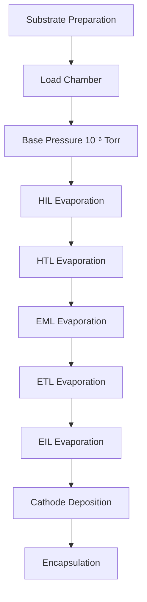

# OLED Technology Deep Dive

## Table of Contents
- [Physics & Principles](#physics--principles)
- [OLED Types & Structures](#oled-types--structures)
- [Manufacturing Processes](#manufacturing-processes)
- [Performance Characteristics](#performance-characteristics)
- [Degradation & Lifetime](#degradation--lifetime)
- [Advanced Implementations](#advanced-implementations)
- [Future Roadmap](#future-roadmap)

## Physics & Principles

### Organic Electroluminescence

OLED operation is based on electroluminescence in organic semiconductor materials. When voltage is applied, electrons and holes recombine to produce light.

```
Energy Band Diagram:
                     Vacuum Level
      ────────────────────────────────────
           │      │                 │
        ┌──▼──┐ ┌─▼─┐             ┌─▼─┐
        │ LUMO│ │   │             │   │
        │     │ │   │ Exciton     │   │ ← Conduction Band
        └──▲──┘ └─┬─┘   Formation └─┬─┘
           │      ▼                 │
        ┌──▼──┐ ┌─▼─┐   hν (Light) │
        │ HOMO│ │   │ ────────────→ │
        │     │ │   │               │ ← Valence Band
        └─────┘ └───┘               └───┘
         Organic   Organic        Electrode
        Material   Material
```

### Exciton Physics

**Exciton Formation:**
```latex
e^- + h^+ → \text{Exciton} → hν + \text{heat}
```

**Quantum Efficiency:**
- **Internal Quantum Efficiency (IQE)**: 25% (fluorescent) / 100% (phosphorescent)
- **External Quantum Efficiency (EQE)**: IQE × Light Outcoupling Efficiency

**Outcoupling Calculation:**
```latex
\eta_{out} = \frac{1}{2n^2} \text{ (without enhancement)}
```
Where n = refractive index (~1.8 for organics)

### OLED Device Stack

```
Complete OLED Structure (Bottom to Top):
┌─────────────────────────────────────────┐ ← Encapsulation (Glass/Barrier)
│ Metal Cathode (Al, Ag) - 100nm          │
├─────────────────────────────────────────┤
│ Electron Injection Layer - 1nm          │
├─────────────────────────────────────────┤
│ Electron Transport Layer - 25nm         │
├─────────────────────────────────────────┤
│ Emissive Layer (Red/Green/Blue) - 15nm  │ ← Light Generation
├─────────────────────────────────────────┤
│ Hole Transport Layer - 40nm             │
├─────────────────────────────────────────┤
│ Hole Injection Layer - 5nm              │
├─────────────────────────────────────────┤
│ Transparent Anode (ITO) - 150nm         │
├─────────────────────────────────────────┤
│ Glass Substrate - 0.7mm                 │
└─────────────────────────────────────────┘
Total Organic Stack: ~85nm
```

## OLED Types & Structures

### Small Molecule vs Polymer OLEDs

**Small Molecule OLED (SMOLED):**
- Vacuum thermal evaporation
- Precise layer control
- High efficiency
- Higher manufacturing cost

**Polymer OLED (PLED):**
- Solution processing (inkjet/spin coating)
- Lower cost potential
- Larger area capability
- Currently lower efficiency

### Active Matrix vs Passive Matrix

**AMOLED Structure:**
```
Pixel Circuit (2T1C):
     VDD
      │
    ┌─┴─┐ T1 (Switch)
  ──│   │──┬─ Data Line
    └─┬─┘  │
      │   ┌┴┐ Storage Capacitor
    ┌─┴─┐ │ │
  ──│   │─┴─┤ T2 (Drive)
    └─┬─┘   │
      │   ┌─┴─┐
      └───│ ⚹ │ OLED
          └─┬─┘
            │
           VSS
```

**PMOLED Structure:**
- Simple matrix addressing
- No switching transistors
- Limited to small displays (<5")
- Lower cost for simple applications

### Color Implementation Methods

**RGB Stripe:**
```
Subpixel Layout:
┌─R─┬─G─┬─B─┬─R─┬─G─┬─B─┐
│ █ │ █ │ █ │ █ │ █ │ █ │
│ █ │ █ │ █ │ █ │ █ │ █ │
└───┴───┴───┴───┴───┴───┘
Equal subpixel areas
```

**PenTile (Samsung):**
```
Diamond Pixel Pattern:
  R   G   R   G
 ╱ ╲ ╱ ╲ ╱ ╲ ╱ ╲
G   B   G   B   G
 ╲ ╱ ╲ ╱ ╲ ╱ ╲ ╱
  R   G   R   G
```

**White OLED + Color Filters:**
```
Structure:
┌─────────────────────────────────────────┐ ← Color Filter (R/G/B/W)
│ White OLED Emission                     │
├─────────────────────────────────────────┤
│ TFT Backplane                          │
└─────────────────────────────────────────┘
```

## Manufacturing Processes

### Vacuum Thermal Evaporation (VTE)



**Process Parameters:**
| Layer | Material | Temperature | Rate | Thickness |
|-------|----------|-------------|------|-----------|
| HIL | PEDOT:PSS | 25°C | - | 40nm |
| HTL | NPB | 380°C | 0.1Å/s | 40nm |
| EML | Alq3:DCM | 420°C | 0.2Å/s | 15nm |
| ETL | Alq3 | 420°C | 0.3Å/s | 25nm |
| Cathode | Al | 1100°C | 2Å/s | 100nm |

### Fine Metal Mask (FMM) Patterning

**Mask Specifications:**
- **Pattern Size**: 100-300μm openings
- **Thickness**: 20-30μm
- **Accuracy**: ±5μm alignment
- **Material**: Invar (Fe-Ni alloy)

```
FMM Cross-Section:
┌─────┬───────┬─────┬───────┬─────┐
│  R  │ Block │  G  │ Block │  B  │ ← Evaporation
├─────┼───────┼─────┼───────┼─────┤
│     │ ████  │     │ ████  │     │ ← Metal Mask
│     │ ████  │     │ ████  │     │
├─────┼───────┼─────┼───────┼─────┤
│ Sub │ strat │ e   │       │     │ ← OLED Substrate
└─────┴───────┴─────┴───────┴─────┘
```

### Solution Processing Techniques

**Inkjet Printing Process:**
1. **Ink Formulation**: Polymer + solvent + additives
2. **Droplet Formation**: Piezoelectric head actuation
3. **Drop Placement**: ±5μm accuracy required
4. **Solvent Evaporation**: Controlled drying
5. **Film Formation**: ~50nm final thickness

**Process Window:**
- **Viscosity**: 8-15 cP
- **Surface Tension**: 25-35 mN/m
- **Volatility**: Appropriate for drying time
- **Print Temperature**: 40-60°C

### Encapsulation Technologies

**Glass-Glass Encapsulation:**
```
Hermetic Seal:
┌─────────────────────────────────────────┐ ← Cover Glass
│ UV-Curable Sealant                      │
├─────────────────────────────────────────┤
│ Getter Material (Moisture/O2 absorber)  │
├─────────────────────────────────────────┤
│ OLED Active Area                        │
├─────────────────────────────────────────┤
│ TFT Substrate                           │
└─────────────────────────────────────────┘

WVTR: <10⁻⁶ g/m²/day
OTR: <10⁻⁵ cc/m²/day
```

**Thin Film Encapsulation (TFE):**
```
Multi-Layer Barrier:
Organic Layer (Planarization) ─ 2μm
Inorganic Layer (Al2O3) ────── 100nm
Organic Layer (Stress relief) ─ 1μm  
Inorganic Layer (SiNx) ─────── 200nm
Organic Layer (Planarization) ─ 2μm
Inorganic Layer (Al2O3) ────── 100nm
═══════════════════════════════════════
           OLED Stack
```

## Performance Characteristics

### Luminance-Current Relationship

**Current-Voltage Characteristics:**
```latex
J = J_0 \left(e^{\frac{qV}{nkT}} - 1\right)
```

**Luminance-Current Density:**
```latex
L = \eta_{EQE} \cdot \frac{J}{q} \cdot \Phi_v
```

Where:
- L = luminance (cd/m²)
- η_EQE = external quantum efficiency
- J = current density (A/m²)
- Φ_v = luminous efficacy (lm/W)

### Color Performance

**CIE Color Coordinates:**
| OLED Color | x | y | CCT | CRI |
|------------|---|---|-----|-----|
| Red (Fluorescent) | 0.67 | 0.33 | - | - |
| Green (Fluorescent) | 0.21 | 0.71 | - | - |
| Blue (Fluorescent) | 0.14 | 0.08 | - | - |
| White (Combined) | 0.31 | 0.33 | 6500K | >90 |

**Phosphorescent Emitters:**
- **Red**: PtOEP, Ir(MDQ)₂(acac)
- **Green**: Ir(ppy)₃, Ir(ppy)₂(acac)
- **Blue**: FIrpic, Ir(dFppy)₂(pic)

### Response Time Analysis

**OLED Response Time Components:**
```latex
t_{response} = t_{RC} + t_{mobility} + t_{recombination}
```

**Typical Values:**
- **RC Time**: 1-10μs (capacitive charging)
- **Carrier Transit**: 100ns-1μs
- **Radiative Decay**: 1ns-1μs (fluorescent), 1-100μs (phosphorescent)

**Total Response**: <1ms (much faster than LCD)

## Degradation & Lifetime

### Degradation Mechanisms

**Intrinsic Degradation:**
1. **Chemical Degradation**: Bond breaking in organic materials
2. **Morphological Changes**: Crystallization, phase separation
3. **Interface Degradation**: Electrode-organic interfaces

**Extrinsic Degradation:**
1. **Moisture Ingress**: H₂O → Metal oxide formation
2. **Oxygen Infiltration**: O₂ → Organic material oxidation
3. **UV Exposure**: High-energy photons → Bond breaking

### Lifetime Models

**Stretched Exponential Model:**
```latex
L(t) = L_0 \cdot e^{-(t/\tau)^{\beta}}
```

Where:
- L(t) = luminance at time t
- L₀ = initial luminance
- τ = characteristic lifetime
- β = stretch parameter (0.5-1.0)

**Acceleration Factors:**
- **Current Density**: n = 1.5-2.0
- **Temperature**: Arrhenius behavior, Ea = 0.3-0.8 eV
- **Humidity**: Exponential dependency

**Lifetime Calculation:**
```latex
LT_{50} = LT_{0} \left(\frac{L_0}{L}\right)^n e^{\frac{E_a}{kT}(T_0^{-1} - T^{-1})}
```

### Material Stability Comparison

| Material Type | Blue Lifetime | Green Lifetime | Red Lifetime |
|---------------|---------------|----------------|---------------|
| Fluorescent | 10,000h | 50,000h | 100,000h |
| Phosphorescent | 20,000h | 100,000h | 500,000h |
| TADF | 30,000h | 80,000h | 200,000h |

## Advanced Implementations

### Micro-OLED Technology

**Ultra-High PPI Displays:**
- **Resolution**: 3000+ PPI
- **Pixel Size**: 5-8μm
- **Applications**: AR/VR, EVFs

```
Silicon Backplane Integration:
┌─────────────────────────────────────────┐
│ OLED Emission ← Organic layers on Si   │
├─────────────────────────────────────────┤
│ Metal Interconnect                      │
├─────────────────────────────────────────┤
│ CMOS Pixel Circuit                      │ ← Silicon wafer
├─────────────────────────────────────────┤
│ p-Si substrate                          │
└─────────────────────────────────────────┘
```

### Flexible OLED Implementation

**Plastic Substrate Requirements:**
- **Glass Transition**: >200°C
- **CTE Match**: Similar to organic materials
- **Barrier Properties**: WVTR < 10⁻³ g/m²/day
- **Optical**: Transmission >85%, haze <2%

**Bending Radius Limits:**
```latex
R_{min} = \frac{t \cdot E}{2 \sigma_{max}}
```

Where:
- R_min = minimum bending radius
- t = total stack thickness
- E = Young's modulus
- σ_max = maximum stress

**Typical Values:**
- **Substrate**: 25-100μm thick
- **Bending Radius**: 2-5mm
- **Flex Cycles**: 100,000+

### Transparent OLED

**Stack Modification:**
```
Transparent OLED Structure:
┌─────────────────────────────────────────┐ ← Transparent cathode
│ Transparent OLED stack                  │
├─────────────────────────────────────────┤
│ Transparent anode (ITO)                 │
├─────────────────────────────────────────┤
│ Transparent substrate (glass/plastic)   │
└─────────────────────────────────────────┘

Transparency: 40-85% (off state)
```

## Future Roadmap

### Next-Generation Materials

**TADF (Thermally Activated Delayed Fluorescence):**
- **Advantage**: 100% IQE without heavy metals
- **Challenge**: Blue stability
- **Timeline**: Commercial deployment 2024-2025

**Solution-Processable Phosphorescent OLEDs:**
- **Target**: Inkjet printing of all colors
- **Benefits**: Lower cost, large area
- **Status**: Green/red available, blue in development

### Manufacturing Advances

**Large-Area Processing:**
| Generation | Substrate Size | Technology | Timeline |
|------------|---------------|------------|-----------|
| Gen 4.5 | 730×920mm | VTE + FMM | Current |
| Gen 6 | 1500×1850mm | Hybrid process | 2024-2025 |
| Gen 8.5 | 2200×2500mm | Solution process | 2026-2027 |

**Process Innovations:**
1. **Laser-Induced Forward Transfer**: Selective material transfer
2. **Vapor Jet Printing**: Direct organic deposition
3. **Electrohydrodynamic Printing**: Sub-micron features

### Performance Targets (2027)

| Parameter | Current OLED | Target | Technology |
|-----------|-------------|---------|------------|
| Blue Lifetime | 20,000h | 50,000h | TADF + Encap |
| Efficiency (lm/W) | 60 | 100 | New materials |
| Cost ($/inch²) | $2-4 | $0.5-1 | Solution process |
| Max Brightness | 800 nits | 2000 nits | New architectures |

### Emerging Applications

**Automotive Integration:**
- **Dashboard**: Curved, high-contrast displays
- **Lighting**: Tail lights, ambient lighting
- **Requirements**: -40°C to +85°C operation

**Architectural Integration:**
- **OLED Panels**: Wall-mounted lighting
- **Flexible Forms**: Curved surfaces
- **Efficiency**: >100 lm/W white OLEDs

## Technical Specifications Summary

### Current Commercial Performance

| Application | Size Range | Resolution | Brightness | Lifetime |
|-------------|------------|-----------|------------|-----------|
| Smartphone | 5-7" | 1080p-1440p | 400-800 nits | 2-3 years |
| Tablet | 8-13" | 1600p-4K | 300-500 nits | 3-5 years |
| TV | 55-88" | 4K-8K | 150-800 nits | 30,000h |
| Monitor | 21-34" | 1440p-4K | 250-400 nits | 30,000h |

### Material Cost Structure

**Cost Breakdown (per square meter):**
- **Organic Materials**: $100-300
- **Substrates**: $20-50
- **Processing**: $200-500
- **Encapsulation**: $50-150
- **Total**: $370-1000

---

*This comprehensive OLED guide covers physics through manufacturing and future developments. For comparison with other technologies, see [LCD Technology](./lcd-technology.md) and [MicroLED Technology](./microled-technology.md).*