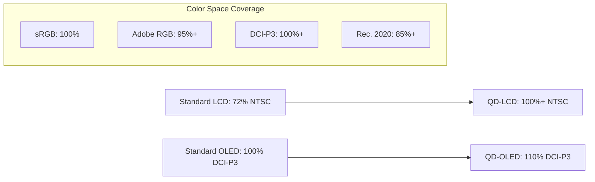
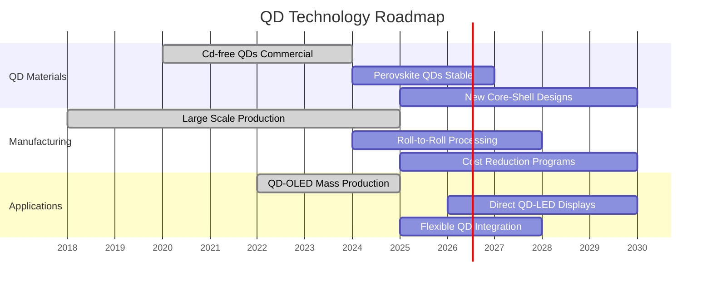

# Quantum Dot Display Technology

## Table of Contents
- [Quantum Dot Fundamentals](#quantum-dot-fundamentals)
- [QD Physics & Properties](#qd-physics--properties)
- [Implementation Architectures](#implementation-architectures)
- [Manufacturing Processes](#manufacturing-processes)
- [Performance Characteristics](#performance-characteristics)
- [Material Developments](#material-developments)
- [Market Applications](#market-applications)
- [Future Roadmap](#future-roadmap)

## Quantum Dot Fundamentals

### What are Quantum Dots?

Quantum dots are semiconductor nanocrystals (2-10nm diameter) that exhibit quantum confinement effects. Their optical properties are precisely tunable by controlling particle size.

```
Size-Dependent Emission:
    UV ────────────────── Visible ──────────── IR
    │                     │                   │
   2nm    3nm    4nm    5nm    6nm    7nm   8nm
    │      │      │      │      │      │      │
   Blue  Cyan  Green Yellow Orange  Red   IR

Quantum Confinement Effect:
E = E_bulk + ℏ²π²/2μR²

Where:
- E = bandgap energy
- E_bulk = bulk semiconductor bandgap  
- μ = reduced mass of electron-hole pair
- R = quantum dot radius
```

### Core-Shell Architecture

**Type I Core-Shell Structure:**
```
CdSe/ZnS Quantum Dot:
    ┌─────────────────┐ ← ZnS Shell (protection)
    │   ┌─────────┐   │   - Higher bandgap
    │   │  CdSe   │   │   - Prevents oxidation
    │   │  Core   │   │   - Improves quantum yield
    │   └─────────┘   │
    └─────────────────┘

Energy Band Alignment:
     ZnS    CdSe    ZnS
      │       │      │
    ──┴─┐   ┌─┴─┐   ┌─┴──  Conduction Band
        │   │ e-│   │
        └─┬─┴───┴─┬─┘
          │  h+   │        Valence Band
        ──┴───────┴────
```

### Color Purity & Tuning

**Emission Characteristics:**
- **FWHM (Full Width Half Maximum)**: 20-40nm
- **Quantum Yield**: 85-95% (optimized)
- **Color Purity**: >90% in Rec. 2020 triangle
- **Photostability**: 10,000+ hours at operating conditions

**Size Control:**
```latex
\lambda_{peak} = 1240/E_g \text{ (nm)}
```

**Example: CdSe QDs**
| Diameter (nm) | Peak λ (nm) | Color | Application |
|---------------|-------------|-------|-------------|
| 2.0 | 480 | Blue | Backlights |
| 3.5 | 530 | Green | Displays |
| 5.5 | 620 | Red | Wide gamut |
| 7.0 | 650 | Deep red | Beyond visible |

## QD Physics & Properties

### Quantum Confinement Physics

**3D Quantum Confinement:**
When all three dimensions are smaller than the exciton Bohr radius:

```latex
a_B = \frac{\epsilon \hbar^2}{μe^2}
```

**Density of States:**
```latex
g(E) = \frac{8\sqrt{2}πm^{3/2}}{h^3}\sqrt{E-E_g}
```

For quantum dots: Discrete energy levels instead of continuous bands

### Optical Properties

**Absorption Coefficient:**
```latex
α(ℏω) = \frac{π e^2 f}{n c m_0 ε_0 ω} \frac{|⟨S|P_z|Z⟩|^2}{V}
```

**Stokes Shift:**
- **Typical value**: 20-40nm
- **Origin**: Phonon relaxation, surface states
- **Impact**: Reduced self-absorption

**Temperature Dependence:**
```latex
λ(T) = λ_0 + \alpha T + \beta T^2
```

Typical values:
- α = 0.2-0.4 nm/K
- β = (1-3)×10⁻⁴ nm/K²

### Surface Chemistry Effects

**Surface Passivation:**
- **Organic ligands**: Oleic acid, octadecylamine
- **Inorganic shells**: ZnS, CdS, ZnSe
- **Impact**: Quantum yield, stability

**Surface Trap States:**
```
Energy Level Diagram:
     CB ────────────────
         ↑ Radiative
    Trap ≈≈≈ ← Surface states
         ↓ Non-radiative
     VB ────────────────

QY = Γ_radiative / (Γ_radiative + Γ_non-radiative)
```

## Implementation Architectures

### QD-Enhanced LCDs (QLED)

**Edge-Lit Configuration:**
```
Cross-Section View:
┌─────────────────────────────────────────┐ ← LCD Panel
│ Color Filters (R/G/B)                   │
├─────────────────────────────────────────┤ ← QD Enhancement Film
│ Blue LED → QD Film → White Light        │
├─────────────────────────────────────────┤ ← Light Guide Plate
│ Reflector                               │
└─────────────────────────────────────────┘

Blue LED (450nm) → QD Conversion → RGB Output
Efficiency: 85-95% conversion efficiency
```

**Direct-Lit with Local Dimming:**
```
Backlight Array:
┌─────┬─────┬─────┬─────┬─────┬─────┐
│ QD  │ QD  │ QD  │ QD  │ QD  │ QD  │
│ ●   │ ●   │ ●   │ ●   │ ●   │ ●   │ ← Blue LEDs
└─────┴─────┴─────┴─────┴─────┴─────┘

Each zone independently controlled
1000-5000 dimming zones typical
HDR peak: 1000-4000 nits
```

### Quantum Dot OLED (QD-OLED)

**Samsung's QD-OLED Architecture:**
```
Layer Structure:
┌─────────────────────────────────────────┐ ← Encapsulation
│ Color Filter (optional)                  │
├─────────────────────────────────────────┤ ← Quantum Dot Layer
│ QD Red    QD Green    Blue Pass         │
├─────────────────────────────────────────┤ ← Blue OLED Emission
│ Blue OLED Stack                         │
├─────────────────────────────────────────┤ ← TFT Backplane
│ Glass Substrate                         │
└─────────────────────────────────────────┘

Advantages:
✓ No color filter absorption losses
✓ Pure color emission
✓ High efficiency
✓ Wide viewing angles
```

### Direct-View Quantum Dot LEDs (QLED)

**Electroluminescent QD-LEDs:**
```
Device Structure:
┌─────────────────────────────────────────┐ ← Al Cathode
│ Electron Transport Layer                │
├─────────────────────────────────────────┤ ← QD Emission Layer
│ Hole Transport Layer                    │
├─────────────────────────────────────────┤ ← ITO Anode
│ Glass Substrate                         │
└─────────────────────────────────────────┘

Current Status:
- Laboratory demonstrations only
- Challenges: Efficiency, lifetime
- EQE: 10-20% (best reported)
- Lifetime: <10,000 hours
```

## Manufacturing Processes

### Quantum Dot Synthesis

**Hot-Injection Method (CdSe example):**
```
Process Steps:
1. Precursor preparation:
   - Cd(myristate)₂ + Se powder in ODE
   - Heat to 240-300°C
   
2. Injection:
   - Rapid injection of Se precursor
   - Temperature drop initiates nucleation
   
3. Growth:
   - Temperature control (250-280°C)
   - Time control (minutes to hours)
   - Size monitoring via optical absorption

4. Purification:
   - Precipitation with methanol
   - Centrifugation and washing
   - Redispersion in toluene
```

**Continuous Flow Synthesis:**
- **Advantages**: Better control, scalability
- **Throughput**: kg/day production
- **Quality**: Improved size distribution
- **Cost**: Lower per gram at scale

### Shell Growth Process

**SILAR (Successive Ionic Layer Adsorption and Reaction):**
```
ZnS Shell Growth:
Cycle 1: QD-Zn²⁺ → Wash → QD-Zn-S²⁻ → Wash
Cycle 2: QD-ZnS-Zn²⁺ → Wash → QD-ZnS-Zn-S²⁻ → Wash
...
Repeat until desired shell thickness

Typical Parameters:
- Precursor concentration: 0.1-0.5M
- Reaction time: 10-30 minutes per cycle
- Temperature: 150-200°C
- Shell thickness: 1-3 monolayers
```

### QD Film Fabrication

**Solvent Casting Method:**
```
Process Flow:
QDs in toluene → Add barrier resin → Mix → Cast → Evaporate → Cure

Film Properties:
- Thickness: 10-100μm
- QD loading: 10-30 wt%
- Transmission: >90% (non-absorbing region)
- Conversion efficiency: 85-95%
```

**Encapsulation Requirements:**
- **Oxygen barrier**: <0.01 cc/m²/day
- **Moisture barrier**: <10⁻⁶ g/m²/day
- **UV protection**: <1% transmission below 400nm
- **Temperature stability**: -40°C to +85°C

### Large-Scale Manufacturing

**Production Challenges:**
1. **Batch-to-batch variation**: <5% color coordinates
2. **Scale-up effects**: Mixing, heat transfer
3. **Quality control**: Real-time monitoring
4. **Cost reduction**: Material usage efficiency

**Manufacturing Metrics:**
| Parameter | Laboratory | Pilot Scale | Production |
|-----------|------------|-------------|------------|
| **Batch Size** | 1-10g | 100g-1kg | 10-100kg |
| **Size Distribution** | <10% | <15% | <20% |
| **Quantum Yield** | >95% | >90% | >85% |
| **Cost ($/g)** | $100-1000 | $10-100 | $1-10 |

## Performance Characteristics

### Color Gamut Enhancement

**Gamut Comparison:**


**Precise Color Points (CIE 1931):**
| QD Color | x | y | FWHM (nm) | Purity |
|----------|---|---|-----------|---------|
| **Red** | 0.705 | 0.295 | 30 | 95% |
| **Green** | 0.170 | 0.797 | 35 | 94% |
| **Blue** | 0.131 | 0.046 | 25 | 96% |

### Efficiency Metrics

**Photoluminescent Quantum Yield:**
```latex
QY = \frac{\text{Photons emitted}}{\text{Photons absorbed}}
```

**Absorption Cross-Section:**
```latex
σ_{abs} = \frac{4π}{3} R^3 \alpha(ω)
```

**Lifetime Characteristics:**
- **Radiative lifetime**: 10-50 ns
- **Non-radiative**: 1-10 ns (surface states)
- **Blinking**: Microsecond timescale
- **Photobleaching**: >10⁵ excitation cycles

### Environmental Stability

**Degradation Mechanisms:**
1. **Photo-oxidation**: O₂ + hν → surface oxidation
2. **Thermal degradation**: Ligand desorption, core dissolution  
3. **Moisture damage**: Surface trap formation
4. **Chemical incompatibility**: Resin interaction

**Stability Testing:**
| Test Condition | Duration | Acceptance | QD Type |
|----------------|----------|------------|---------|
| **85°C/85%RH** | 1000h | <5% ΔλQD | Core-shell |
| **Blue LED excitation** | 10,000h | <10% QY loss | Film |
| **UV exposure** | 100h | <2% color shift | Encapsulated |
| **Thermal cycling** | 500 cycles | No delamination | Barrier film |

## Material Developments

### Cadmium-Free Quantum Dots

**InP (Indium Phosphide) QDs:**
```
Advantages:
✓ Non-toxic (RoHS compliant)
✓ Direct bandgap semiconductor
✓ Tunable 500-700nm
✓ Commercial availability

Challenges:
✗ Lower quantum yield (80-90%)
✗ Broader emission (35-45nm FWHM)
✗ Higher synthesis temperature
✗ Size distribution control
```

**ZnSe-based QDs:**
- **Composition**: ZnSe/ZnS core-shell
- **Emission range**: 420-480nm (blue-green)
- **Advantages**: Non-toxic, stable
- **Applications**: Blue emitters, UV conversion

### Perovskite Quantum Dots

**CsPbX₃ (X = Cl, Br, I) Nanocrystals:**
```
Properties:
- Emission range: 400-700nm
- FWHM: 12-40nm  
- Quantum yield: 70-95%
- Fast synthesis: Room temperature
- Halide composition tuning

Stability Issues:
- Moisture sensitivity
- Phase transitions
- Ion migration
- Thermal instability
```

**Surface Modifications:**
- **Ligand exchange**: Long-chain organic molecules
- **Encapsulation**: Silica, polymer shells
- **Composite formation**: Embedded in matrices

### Novel Architectures

**Core-Multi-Shell Design:**
```
CdSe/CdS/ZnS Structure:
┌─────────────────────────────┐ ← ZnS outer shell
│ ┌─────────────────────────┐ │   - Moisture barrier
│ │ ┌─────────────────────┐ │ │   - Chemical stability
│ │ │       CdSe        │ │ │ ← Core (emission)
│ │ │       Core        │ │ │
│ │ └─────────────────────┘ │ │
│ │      CdS Shell         │ │ ← Intermediate shell  
│ │    (strain relief)     │ │   - Lattice matching
│ └─────────────────────────┘ │   - Efficient shell
└─────────────────────────────┘

Benefits:
- Higher quantum yield (>95%)
- Better photo-stability  
- Reduced blinking
- Improved processability
```

## Market Applications

### Current Commercial Products

**TV Market (QLED TVs):**
- **Samsung**: Full QD-LED backlight systems
- **TCL**: QD enhancement films
- **Sony**: Triluminos QD technology
- **Market share**: 15-20% of premium TV market

**Monitor Market:**
- **Dell**: UltraSharp QD monitors
- **ASUS**: ProArt series
- **Samsung**: Gaming and professional monitors
- **Applications**: Content creation, gaming

### Performance Benefits

**QLED vs. Standard LCD:**
| Metric | Standard LCD | QLED Enhancement |
|--------|-------------|------------------|
| **Color Gamut** | 72% NTSC | 100%+ NTSC |
| **Peak Brightness** | 400 nits | 1000+ nits |
| **Color Volume** | 65% DCI-P3 | 95% DCI-P3 |
| **Power Efficiency** | Baseline | +15-20% |
| **Lifetime** | 50,000h | 50,000h+ |

**QD-OLED vs. RGB OLED:**
| Metric | RGB OLED | QD-OLED |
|--------|----------|---------|
| **Color Purity** | Good | Excellent |
| **Manufacturing** | Complex (FMM) | Simplified |
| **Efficiency** | 80 lm/W | 100+ lm/W |
| **Cost** | High | Medium |
| **Size Scalability** | Limited | Better |

### Emerging Applications

**Micro-LED Enhancement:**
- **QD conversion layers**: Blue μLED → RGB
- **Advantages**: Uniform color, simplified manufacturing
- **Challenges**: Thermal management, efficiency

**Flexible Displays:**
- **QD films on plastic**: Bendable enhancement layers
- **Applications**: Curved TVs, automotive displays
- **Requirements**: Mechanical stability

**Automotive Integration:**
- **Dashboard displays**: Wide temperature range
- **HUDs**: High brightness, color gamut
- **Ambient lighting**: Decorative applications

## Future Roadmap

### Technology Development Timeline



### Performance Targets (2027-2030)

| Parameter | Current | 2027 Target | 2030 Vision |
|-----------|---------|-------------|-------------|
| **QD Quantum Yield** | 90% | 95% | 98% |
| **Color Gamut** | 100% DCI-P3 | 110% DCI-P3 | 90% Rec. 2020 |
| **Lifetime** | 30,000h | 50,000h | 100,000h |
| **Cost** | $5/g | $2/g | $0.50/g |
| **FWHM** | 35nm | 25nm | 20nm |

### Research Frontiers

**Next-Generation Materials:**
- **III-V QDs**: AlInP, GaInP for blue emission
- **Carbon Dots**: Biomass-derived, environmentally friendly
- **2D Materials**: MoS₂, WSe₂ quantum dots
- **Doped QDs**: Mn, Cu doping for white emission

**Advanced Architectures:**
- **Quantum Wells**: 2D confinement structures
- **Quantum Rods**: 1D confinement, polarized emission
- **Heterostructures**: Type-II band alignment
- **Plasmonic Enhancement**: Metal nanoparticle coupling

**Manufacturing Innovation:**
- **Continuous synthesis**: Flow chemistry, automated
- **3D printing**: Direct QD device fabrication
- **Molecular assembly**: Bottom-up construction
- **Machine learning**: Optimized synthesis conditions

### Market Projections

**QD Material Market:**
- **2024**: $5B global market
- **2027**: $12B projected
- **2030**: $25B+ potential

**Application Breakdown (2030 projection):**
- **Display backlights**: 60% of market
- **QD-OLED**: 25% of market  
- **Direct QD-LED**: 10% of market
- **Other applications**: 5% of market

---

*This comprehensive quantum dot display guide covers fundamental physics through commercial applications and future developments. For related display technologies, see [LCD Technology](./lcd-technology.md) and [OLED Technology](./oled-technology.md).*