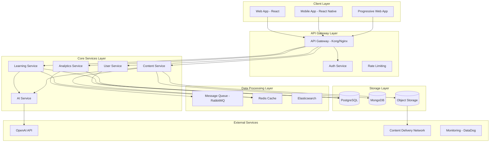

# SPARC METHODOLOGY - INTEGRATED LEARNING PLATFORM
## Phase 3: ARCHITECTURE

### 3.1 SYSTEM ARCHITECTURE OVERVIEW



### 3.2 MICROSERVICES ARCHITECTURE

#### 3.2.1 User Service
**Responsibilities:**
- User authentication and authorization
- Profile management
- Preferences and settings
- Learning goals and tracking

**Technologies:**
- Node.js + TypeScript
- Express.js framework
- JWT authentication
- bcrypt for password hashing

**Database Schema:**
```sql
-- Users table
CREATE TABLE users (
    id UUID PRIMARY KEY DEFAULT gen_random_uuid(),
    email VARCHAR(255) UNIQUE NOT NULL,
    password_hash VARCHAR(255) NOT NULL,
    first_name VARCHAR(100),
    last_name VARCHAR(100),
    timezone VARCHAR(50),
    language_preference VARCHAR(10),
    created_at TIMESTAMP DEFAULT NOW(),
    updated_at TIMESTAMP DEFAULT NOW()
);

-- User profiles table
CREATE TABLE user_profiles (
    id UUID PRIMARY KEY DEFAULT gen_random_uuid(),
    user_id UUID REFERENCES users(id) ON DELETE CASCADE,
    learning_style VARCHAR(50),
    difficulty_preferences JSONB,
    notification_settings JSONB,
    avatar_url VARCHAR(500),
    streak_count INTEGER DEFAULT 0,
    total_points INTEGER DEFAULT 0
);

-- User learning goals
CREATE TABLE learning_goals (
    id UUID PRIMARY KEY DEFAULT gen_random_uuid(),
    user_id UUID REFERENCES users(id) ON DELETE CASCADE,
    subject VARCHAR(100) NOT NULL,
    target_competency DECIMAL(3,2),
    target_date DATE,
    current_progress DECIMAL(3,2) DEFAULT 0.00,
    status VARCHAR(20) DEFAULT 'active'
);
```

#### 3.2.2 Learning Service
**Responsibilities:**
- Spaced repetition algorithms
- Adaptive difficulty management
- Progress tracking
- Learning session management

**Technologies:**
- Node.js + TypeScript
- Fastify for high performance
- Bull Queue for job processing
- Redis for caching and sessions

**Database Schema:**
```sql
-- Learning items
CREATE TABLE learning_items (
    id UUID PRIMARY KEY DEFAULT gen_random_uuid(),
    subject VARCHAR(100) NOT NULL,
    topic VARCHAR(100) NOT NULL,
    content JSONB NOT NULL,
    difficulty_level DECIMAL(3,2),
    item_type VARCHAR(50),
    metadata JSONB,
    created_at TIMESTAMP DEFAULT NOW()
);

-- User learning progress
CREATE TABLE user_learning_progress (
    id UUID PRIMARY KEY DEFAULT gen_random_uuid(),
    user_id UUID REFERENCES users(id) ON DELETE CASCADE,
    learning_item_id UUID REFERENCES learning_items(id),
    easiness_factor DECIMAL(4,2) DEFAULT 2.50,
    interval_days INTEGER DEFAULT 1,
    review_count INTEGER DEFAULT 0,
    last_reviewed TIMESTAMP,
    next_review TIMESTAMP,
    consecutive_correct INTEGER DEFAULT 0
);

-- Learning sessions
CREATE TABLE learning_sessions (
    id UUID PRIMARY KEY DEFAULT gen_random_uuid(),
    user_id UUID REFERENCES users(id) ON DELETE CASCADE,
    subject VARCHAR(100),
    started_at TIMESTAMP DEFAULT NOW(),
    ended_at TIMESTAMP,
    items_studied INTEGER,
    correct_responses INTEGER,
    session_quality DECIMAL(3,2)
);

-- User responses
CREATE TABLE user_responses (
    id UUID PRIMARY KEY DEFAULT gen_random_uuid(),
    user_id UUID REFERENCES users(id) ON DELETE CASCADE,
    learning_item_id UUID REFERENCES learning_items(id),
    session_id UUID REFERENCES learning_sessions(id),
    response_content JSONB,
    is_correct BOOLEAN,
    response_time_ms INTEGER,
    quality_rating INTEGER CHECK (quality_rating BETWEEN 0 AND 5),
    feedback_provided JSONB,
    created_at TIMESTAMP DEFAULT NOW()
);
```

#### 3.2.3 Content Service
**Responsibilities:**
- Content management and storage
- AI-generated content handling
- Media file processing
- Content versioning and curation

**Technologies:**
- Node.js + TypeScript
- Express.js framework
- MongoDB for flexible content storage
- AWS S3 for media storage
- Sharp for image processing

**MongoDB Collections:**
```javascript
// Content items collection
{
  _id: ObjectId,
  contentType: "conjugation" | "vocabulary" | "math_problem" | "image_question",
  subject: String,
  topic: String,
  difficulty: Number, // 0.1 - 1.0
  content: {
    question: Mixed,
    answer: Mixed,
    explanation: String,
    hints: [String],
    media: {
      images: [String], // URLs
      audio: [String],  // URLs
      video: [String]   // URLs
    }
  },
  metadata: {
    aiGenerated: Boolean,
    sourceModel: String,
    generationPrompt: String,
    validatedBy: String,
    quality_score: Number
  },
  tags: [String],
  created_at: Date,
  updated_at: Date,
  version: Number
}
```

#### 3.2.4 Analytics Service
**Responsibilities:**
- Performance metrics calculation
- Learning analytics and insights
- Reporting and dashboards
- A/B testing framework

**Technologies:**
- Node.js + TypeScript
- PostgreSQL with TimescaleDB
- Apache Kafka for event streaming
- Python + pandas for analytics

**Database Schema:**
```sql
-- Performance metrics (using TimescaleDB)
CREATE TABLE user_performance_metrics (
    time TIMESTAMPTZ NOT NULL,
    user_id UUID NOT NULL,
    subject VARCHAR(100),
    metric_name VARCHAR(100),
    metric_value DECIMAL(10,4),
    metadata JSONB
);

SELECT create_hypertable('user_performance_metrics', 'time');

-- Learning insights
CREATE TABLE learning_insights (
    id UUID PRIMARY KEY DEFAULT gen_random_uuid(),
    user_id UUID REFERENCES users(id),
    insight_type VARCHAR(100),
    insight_data JSONB,
    confidence_score DECIMAL(3,2),
    generated_at TIMESTAMP DEFAULT NOW(),
    expires_at TIMESTAMP
);

-- A/B test experiments
CREATE TABLE experiments (
    id UUID PRIMARY KEY DEFAULT gen_random_uuid(),
    name VARCHAR(200) NOT NULL,
    description TEXT,
    config JSONB,
    status VARCHAR(20) DEFAULT 'draft',
    start_date TIMESTAMP,
    end_date TIMESTAMP,
    created_at TIMESTAMP DEFAULT NOW()
);

-- A/B test assignments
CREATE TABLE experiment_assignments (
    id UUID PRIMARY KEY DEFAULT gen_random_uuid(),
    experiment_id UUID REFERENCES experiments(id),
    user_id UUID REFERENCES users(id),
    variant VARCHAR(50),
    assigned_at TIMESTAMP DEFAULT NOW(),
    UNIQUE(experiment_id, user_id)
);
```

#### 3.2.5 AI Service
**Responsibilities:**
- OpenAI API integration
- Local model serving
- Content generation orchestration
- AI model performance monitoring

**Technologies:**
- Python + FastAPI
- OpenAI Python SDK
- Transformers library for local models
- Ray Serve for model serving
- MLflow for model tracking

### 3.3 API DESIGN

#### 3.3.1 RESTful API Structure

**Base URL:** `https://api.learningplatform.com/v1`

**Authentication:**
- Bearer token authentication
- JWT tokens with 24h expiration
- Refresh token mechanism

**Core Endpoints:**

```yaml
# User Management
POST /auth/login
POST /auth/register
POST /auth/refresh
DELETE /auth/logout

GET /users/profile
PUT /users/profile
GET /users/preferences
PUT /users/preferences

# Learning
GET /learning/subjects
GET /learning/topics/{subject}
POST /learning/sessions/start
PUT /learning/sessions/{sessionId}/end
POST /learning/responses
GET /learning/progress/{subject}
GET /learning/next-review

# Content
GET /content/items
POST /content/generate
GET /content/search
PUT /content/{itemId}/validate

# Analytics
GET /analytics/dashboard
GET /analytics/progress/{timeframe}
GET /analytics/insights
GET /analytics/performance-trends
```

#### 3.3.2 GraphQL Schema (Optional Advanced Queries)

```graphql
type User {
  id: ID!
  email: String!
  profile: UserProfile!
  learningGoals: [LearningGoal!]!
  progress: [SubjectProgress!]!
}

type LearningSession {
  id: ID!
  subject: String!
  startedAt: DateTime!
  endedAt: DateTime
  items: [LearningItem!]!
  responses: [UserResponse!]!
  performance: SessionPerformance!
}

type Query {
  me: User!
  nextReviewItems(subject: String, limit: Int = 10): [LearningItem!]!
  analyticsInsights(timeframe: Timeframe!): AnalyticsInsights!
  learningPath(targetCompetency: Float!): [LearningPathStep!]!
}

type Mutation {
  startLearningSession(subject: String!): LearningSession!
  submitResponse(input: ResponseInput!): ResponseResult!
  generateContent(input: ContentGenerationInput!): GeneratedContent!
  updateDifficulty(subject: String!, adjustment: Float!): DifficultyUpdate!
}
```

### 3.4 DATABASE DESIGN

#### 3.4.1 PostgreSQL Schema Design

**Normalization Strategy:**
- 3NF for transactional data
- Selective denormalization for performance-critical queries
- Partitioning for large tables (user_responses, performance_metrics)

**Indexing Strategy:**
```sql
-- Performance-critical indexes
CREATE INDEX CONCURRENTLY idx_user_responses_user_item 
ON user_responses(user_id, learning_item_id);

CREATE INDEX CONCURRENTLY idx_user_responses_created_at 
ON user_responses(created_at DESC);

CREATE INDEX CONCURRENTLY idx_user_learning_progress_next_review 
ON user_learning_progress(next_review) 
WHERE next_review <= NOW();

-- Composite indexes for analytics
CREATE INDEX CONCURRENTLY idx_performance_metrics_user_time 
ON user_performance_metrics(user_id, time DESC);

CREATE INDEX CONCURRENTLY idx_learning_sessions_user_subject_date 
ON learning_sessions(user_id, subject, started_at DESC);
```

**Partitioning Strategy:**
```sql
-- Partition user_responses by month
CREATE TABLE user_responses (
    id UUID,
    created_at TIMESTAMP NOT NULL,
    -- other columns
) PARTITION BY RANGE (created_at);

-- Create monthly partitions
CREATE TABLE user_responses_2024_01 
PARTITION OF user_responses
FOR VALUES FROM ('2024-01-01') TO ('2024-02-01');
```

#### 3.4.2 Redis Caching Strategy

**Cache Patterns:**
```javascript
// User session cache
const userSessionKey = `session:${userId}`;
const sessionTTL = 24 * 60 * 60; // 24 hours

// Learning progress cache
const progressKey = `progress:${userId}:${subject}`;
const progressTTL = 60 * 60; // 1 hour

// Content cache
const contentKey = `content:${itemId}`;
const contentTTL = 7 * 24 * 60 * 60; // 7 days

// Generated content cache
const generatedContentKey = `generated:${hash(prompt)}`;
const generatedContentTTL = 24 * 60 * 60; // 24 hours
```

### 3.5 SECURITY ARCHITECTURE

#### 3.5.1 Authentication & Authorization
- **Multi-factor Authentication (MFA)** support
- **Role-based Access Control (RBAC)**
- **OAuth 2.0** for third-party integrations
- **API rate limiting** per user/IP

#### 3.5.2 Data Protection
- **Encryption at rest** (AES-256)
- **Encryption in transit** (TLS 1.3)
- **PII anonymization** for analytics
- **GDPR compliance** with data deletion

#### 3.5.3 Security Monitoring
- **Real-time threat detection**
- **Audit logging** for all data access
- **Vulnerability scanning** in CI/CD
- **Security headers** and CSP

### 3.6 SCALABILITY & PERFORMANCE

#### 3.6.1 Horizontal Scaling Strategy
- **Kubernetes** orchestration
- **Auto-scaling** based on CPU/memory metrics
- **Load balancing** with health checks
- **Database sharding** by user_id

#### 3.6.2 Performance Optimization
- **CDN** for static content delivery
- **Database query optimization** with explain plans
- **Connection pooling** for database connections
- **Async processing** for non-critical operations

#### 3.6.3 Monitoring & Observability
- **Application Performance Monitoring (APM)**
- **Distributed tracing** with OpenTelemetry
- **Custom metrics** for business KPIs
- **Alert management** with escalation policies