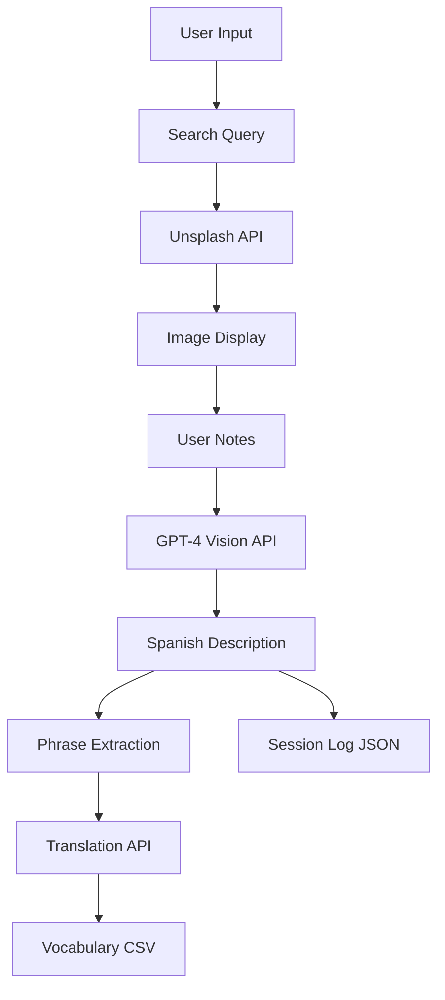

# Unsplash GPT Tool - Technical Specifications

## Project Overview
**Name:** Unsplash Image Search with GPT Description Generator  
**Version:** 1.0.0  
**Type:** Desktop GUI Application  
**Purpose:** Educational tool for Spanish language learning through AI-powered image descriptions  

## System Requirements

### Minimum Requirements
- **OS:** Windows 10/11, macOS 10.14+, Linux (Ubuntu 20.04+)
- **Python:** 3.8 - 3.13
- **RAM:** 2GB minimum, 4GB recommended
- **Storage:** 100MB for application + data files
- **Internet:** Required for API access
- **Display:** 1100x800 minimum resolution

### API Requirements
- **Unsplash API Key:** Free tier (50 requests/hour)
- **OpenAI API Key:** Pay-as-you-go account with credits
- **Network:** HTTPS connections to api.unsplash.com and api.openai.com

## Architecture

### Application Structure
```
unsplash-gpt-tool/
├── main.py                 # Main application (625 lines)
├── config_manager.py       # Configuration & setup wizard (220 lines)
├── test_setup.py          # API validation script (120 lines)
├── requirements.txt       # Python dependencies
├── pyproject.toml         # Poetry configuration
├── .env.example           # Environment template
├── .gitignore            # Git exclusions
├── README.md             # User documentation
├── LICENSE               # MIT license
├── build.bat/sh          # Build scripts
└── data/                 # Runtime data directory
    ├── config.ini        # User configuration
    ├── session_log.json  # Session history
    └── vocabulary.csv    # Extracted vocabulary
```

### Core Components

#### 1. Configuration Manager (`config_manager.py`)
- **ConfigManager Class**
  - Auto-detects exe vs script environment
  - Loads .env or config.ini
  - Manages API keys securely
  - Handles data directory paths
  
- **SetupWizard Class**
  - Modal dialog for first-run setup
  - API key input with validation
  - Model selection (gpt-4o-mini, gpt-4o, gpt-4-turbo)
  - Saves configuration locally

#### 2. Main Application (`main.py`)
- **ImageSearchApp Class** (Tkinter-based)
  - Image search with Unsplash API
  - GPT-4 Vision integration
  - Vocabulary extraction system
  - Translation service
  - Session management

### Data Flow


## Features Specification

### 1. Image Search
- **API:** Unsplash Search Photos endpoint
- **Pagination:** 10 images per page
- **Deduplication:** Tracks shown images by canonical URL
- **Error Handling:** 3 retries with exponential backoff
- **Rate Limiting:** Automatic detection and user notification

### 2. AI Description Generation
- **Models Supported:**
  - gpt-4o-mini (default, ~$0.001/description)
  - gpt-4o (~$0.01/description)
  - gpt-4-turbo (~$0.005/description)
- **Input:** Image URL + optional user notes
- **Output:** 1-2 paragraph Spanish description
- **Max Tokens:** 600
- **Temperature:** 0.7 (creative but coherent)

### 3. Phrase Extraction
- **Categories:** Sustantivos, Verbos, Adjetivos, Adverbios, Frases clave
- **Format:** JSON structured output
- **Sorting:** Alphabetical, ignoring articles (el, la, los, las)
- **Display:** Clickable buttons in 3-column grid

### 4. Translation Service
- **Direction:** Spanish to US English
- **Context-Aware:** Uses description for accuracy
- **Caching:** Prevents duplicate translations
- **Storage:** CSV with timestamp and context

### 5. Data Persistence

#### Session Log (JSON)
```json
{
  "sessions": [
    {
      "session_start": "2024-01-15T10:30:00",
      "session_end": "2024-01-15T11:00:00",
      "entries": [
        {
          "timestamp": "2024-01-15T10:30:00",
          "query": "coffee",
          "image_url": "https://...",
          "user_note": "User's notes",
          "generated_description": "Spanish description..."
        }
      ],
      "vocabulary_learned": 15,
      "target_phrases": ["el café - coffee", "..."]
    }
  ]
}
```

#### Vocabulary CSV
```csv
Spanish,English,Date,Context
el café,coffee,2024-01-15 10:35,En la imagen se aprecia...
la mesa,table,2024-01-15 10:36,Una mesa de madera...
```

## API Integration

### Unsplash API
- **Endpoint:** `https://api.unsplash.com/search/photos`
- **Authentication:** Client-ID header
- **Parameters:**
  - query: search term
  - page: pagination (1-n)
  - per_page: 10
- **Rate Limit:** 50 requests/hour (free tier)

### OpenAI API
- **Client:** OpenAI Python SDK v1.0+
- **Endpoints Used:**
  - Chat Completions (with vision)
  - JSON mode for structured extraction
- **Rate Limits:** Based on account tier
- **Error Codes Handled:**
  - 401: Invalid API key
  - 429: Rate limit exceeded
  - 402: Insufficient quota

## UI Specifications

### Window Layout
```
┌─────────────────────────────────────────────────┐
│  Search: [___________] [Search] [→Progress Bar] │
│  [Another Image] [New Search]                   │
│  Status: Ready                                  │
├──────────────────┬──────────────────────────────┤
│                  │  Notes/Description:          │
│   Image Preview  │  [________________]          │
│    (600x600)     │                              │
│                  │  GPT Description:            │
│                  │  [________________]          │
│                  │  [Generate] [Copy]           │
│                  ├──────────────┬───────────────┤
│                  │ Extracted    │ Target       │
│                  │ Phrases      │ Vocabulary   │
└──────────────────┴──────────────┴───────────────┘
```

### Components
- **Search Bar:** Entry + Button + Progress indicator
- **Image Display:** 600x600 max thumbnail
- **Text Areas:** ScrolledText widgets
- **Phrase Buttons:** Dynamic grid layout
- **Target List:** Listbox with 14pt font
- **Status Bar:** Real-time operation feedback

## Performance Metrics

### Response Times
- **Image Search:** 1-3 seconds (network dependent)
- **Image Load:** 1-2 seconds per image
- **GPT Description:** 3-5 seconds
- **Phrase Extraction:** 2-3 seconds
- **Translation:** 1-2 seconds per phrase

### Resource Usage
- **Memory:** ~50-100MB runtime
- **CPU:** Minimal (< 5% idle)
- **Network:** ~1-5MB per session
- **Disk:** ~1MB per 100 vocabulary items

## Security Considerations

### API Key Management
- **Storage:** Local config.ini (user directory)
- **Transmission:** HTTPS only
- **Display:** Masked in UI (show="*")
- **Git:** Excluded via .gitignore

### Data Privacy
- **Local Storage:** All data stored locally
- **No Telemetry:** No usage tracking
- **User Control:** Manual session saves
- **Cleanup:** User can delete data directory

## Error Handling

### Graceful Failures
- **Network Errors:** Retry with backoff
- **API Limits:** Clear user messaging
- **Invalid Keys:** Setup wizard re-prompt
- **Corrupted Data:** Fallback formats

### User Notifications
- **Progress Indicators:** Indeterminate progress bar
- **Status Messages:** Real-time updates
- **Error Dialogs:** Specific, actionable messages
- **Rate Limits:** Time remaining displayed

## Build & Distribution

### Build Process
```bash
# Install dependencies
pip install -r requirements.txt

# Run tests
python test_setup.py

# Build executable
pyinstaller --onefile --windowed \
  --name "unsplash-gpt-tool" \
  --add-data ".env.example;." \
  main.py
```

### Distribution Formats
1. **Source Code:** GitHub repository
2. **Python Package:** pip installable
3. **Windows EXE:** Single file, 40-50MB
4. **macOS App:** DMG package (planned)
5. **Linux AppImage:** Portable (planned)

## Testing Checklist

### Functional Tests
- [x] API key validation
- [x] Image search and pagination
- [x] Description generation
- [x] Phrase extraction
- [x] Translation accuracy
- [x] Data persistence
- [x] Error recovery

### Integration Tests
- [x] First-run experience
- [x] Configuration updates
- [x] API rate limits
- [x] Network interruptions
- [x] Large datasets (>1000 items)

## Future Enhancements

### Version 1.1 (Planned)
- [ ] Batch image processing
- [ ] Export to Anki flashcards
- [ ] Dark mode support
- [ ] Custom GPT prompts
- [ ] Offline mode with cache

### Version 2.0 (Concept)
- [ ] Multiple language support
- [ ] Voice descriptions (TTS)
- [ ] Image annotation tools
- [ ] Spaced repetition system
- [ ] Cloud sync option

## Support & Maintenance

### Dependencies
```
requests>=2.31.0       # HTTP client
Pillow>=10.0.0        # Image processing
openai>=1.0.0         # GPT API client
python-dotenv>=1.0.0  # Environment variables
pyinstaller>=6.0.0    # Executable builder (dev)
```

### Update Policy
- Security patches: Immediate
- Feature updates: Quarterly
- Dependency updates: Monthly review
- API changes: As required

## License & Attribution
- **License:** MIT (open source)
- **APIs:** Unsplash, OpenAI (user-provided keys)
- **Framework:** Python/Tkinter
- **Icons:** System default

---

*Last Updated: January 2024*  
*Version: 1.0.0*  
*Status: Production Ready*