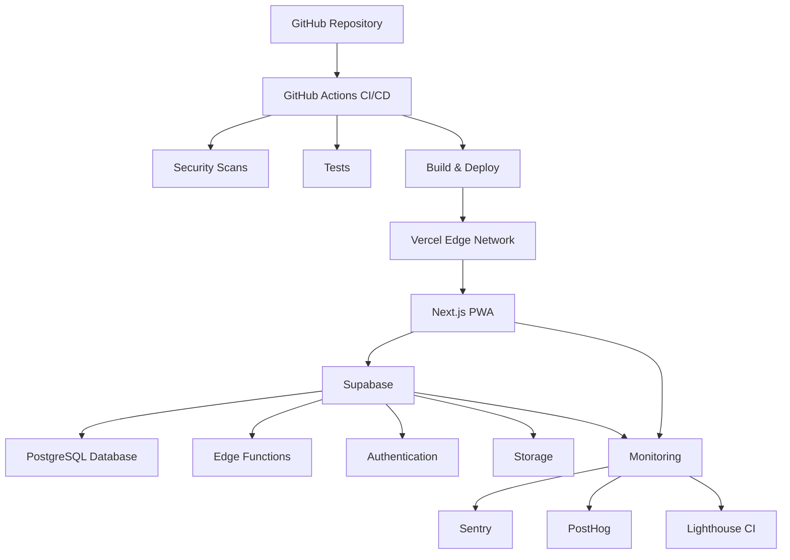
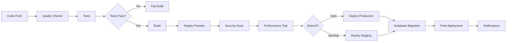

# Complete Deployment and CI/CD Strategy

This document provides a comprehensive guide for deploying the Unsplash GPT PWA with Supabase backend across multiple environments.

## Table of Contents

1. [Overview](#overview)
2. [Architecture](#architecture)
3. [Environment Setup](#environment-setup)
4. [CI/CD Pipeline](#cicd-pipeline)
5. [Deployment Process](#deployment-process)
6. [Monitoring & Observability](#monitoring--observability)
7. [Security](#security)
8. [Troubleshooting](#troubleshooting)
9. [Best Practices](#best-practices)

## Overview

### Technology Stack

- **Frontend**: Next.js 14 (PWA) deployed on Vercel
- **Backend**: Supabase (PostgreSQL + Edge Functions)
- **CI/CD**: GitHub Actions
- **Monitoring**: Sentry + PostHog + Web Vitals
- **Infrastructure**: Terraform for IaC
- **Security**: OWASP ZAP, Dependabot, CodeQL

### Environments

| Environment | Purpose | Domain | Supabase | Vercel |
|------------|---------|--------|----------|---------|
| Development | Local dev | localhost:3000 | Local instance | Local dev server |
| Staging | Pre-production testing | staging-unsplash-gpt.vercel.app | Free tier | Preview |
| Production | Live application | unsplash-gpt.com | Pro tier | Production |

## Architecture



## Environment Setup

### Prerequisites

1. **Accounts Required**:
   - GitHub (repository hosting)
   - Vercel (frontend hosting)
   - Supabase (backend services)
   - OpenAI (AI descriptions)
   - Unsplash (image search)

2. **Local Development Tools**:
   - Node.js 18+
   - Docker (for Supabase local)
   - Terraform (for IaC)
   - Supabase CLI

### Local Development Setup

```bash
# 1. Clone repository
git clone https://github.com/your-org/unsplash-image-search-gpt-description.git
cd unsplash-image-search-gpt-description

# 2. Install dependencies
npm install

# 3. Start Supabase locally
npx supabase start

# 4. Set up environment variables
cp .env.example .env.local
# Edit .env.local with your API keys

# 5. Run database migrations
npx supabase db push

# 6. Start development server
npm run dev
```

### Environment Variables

#### Development (.env.local)
```bash
# Supabase
NEXT_PUBLIC_SUPABASE_URL=http://localhost:54321
NEXT_PUBLIC_SUPABASE_ANON_KEY=eyJhbGciOiJIUzI1NiIsInR5cCI6IkpXVCJ9...
SUPABASE_SERVICE_ROLE_KEY=eyJhbGciOiJIUzI1NiIsInR5cCI6IkpXVCJ9...

# External APIs
OPENAI_API_KEY=sk-your-openai-key
UNSPLASH_ACCESS_KEY=your-unsplash-access-key

# App Configuration
NEXT_PUBLIC_APP_ENV=development
NEXT_PUBLIC_APP_NAME=UnsplashGPT Dev
```

#### Production (Vercel Environment Variables)
Set these in Vercel dashboard or via CLI:

```bash
# Supabase Production
NEXT_PUBLIC_SUPABASE_URL=https://your-project.supabase.co
NEXT_PUBLIC_SUPABASE_ANON_KEY=your-anon-key
SUPABASE_SERVICE_ROLE_KEY=your-service-role-key

# External APIs (same as dev, or production keys)
OPENAI_API_KEY=sk-your-production-openai-key
UNSPLASH_ACCESS_KEY=your-production-unsplash-key

# Monitoring
NEXT_PUBLIC_SENTRY_DSN=https://your-sentry-dsn
NEXT_PUBLIC_POSTHOG_KEY=your-posthog-key

# App Configuration
NEXT_PUBLIC_APP_ENV=production
NEXT_PUBLIC_APP_NAME=UnsplashGPT
```

## CI/CD Pipeline

### GitHub Actions Workflows

#### 1. Main CI/CD Pipeline (`.github/workflows/ci-cd-pipeline.yml`)

**Triggers**: Push to main/develop, PRs, manual dispatch

**Jobs**:
- **quality-checks**: ESLint, Prettier, TypeScript, Security scans
- **test-suite**: Unit, integration, E2E tests
- **performance-tests**: Lighthouse CI, bundle analysis
- **build-and-deploy**: Build and deploy to Vercel
- **database-migration**: Run Supabase migrations
- **post-deployment**: Notifications, monitoring setup

#### 2. Preview Deployment (`.github/workflows/preview-deployment.yml`)

**Triggers**: PRs to main/develop

**Features**:
- Deploy preview to unique URL
- Run smoke tests on preview
- Security scan on preview
- Performance audit
- Accessibility tests
- Comment PR with preview link

#### 3. Scheduled Maintenance (`.github/workflows/scheduled-maintenance.yml`)

**Schedule**: Daily at 2 AM UTC

**Features**:
- Dependency updates check
- Security audits
- Performance monitoring
- Database maintenance
- Health checks
- Weekly reports

### Pipeline Flow



## Deployment Process

### Automatic Deployments

#### Production Deployment
1. **Trigger**: Push to `main` branch
2. **Process**:
   - All CI checks pass
   - Build Next.js application
   - Deploy to Vercel production
   - Run database migrations on production Supabase
   - Update Sentry release
   - Send Slack notification

#### Staging Deployment
1. **Trigger**: Push to `develop` branch
2. **Process**:
   - All CI checks pass
   - Deploy to Vercel preview
   - Run database migrations on staging Supabase
   - Seed test data (if configured)

### Manual Deployment

```bash
# Deploy to production manually
npm run deploy:production

# Deploy to staging manually
npm run deploy:staging

# Deploy specific commit
vercel --prod --confirm
```

### Database Migrations

#### Automatic Migrations
- Triggered by successful deployment
- Uses Supabase CLI in GitHub Actions
- Applies pending migrations in order

#### Manual Migrations
```bash
# Create new migration
npx supabase migration new add_user_preferences

# Apply migrations locally
npx supabase db push

# Apply migrations to remote
npx supabase db push --project-ref your-project-ref
```

### Rollback Strategy

#### Application Rollback
```bash
# Rollback to previous deployment
vercel rollback

# Rollback to specific deployment
vercel rollback --url deployment-url
```

#### Database Rollback
```bash
# Create rollback migration
npx supabase migration new rollback_user_preferences

# Apply rollback
npx supabase db push
```

## Monitoring & Observability

### Error Tracking (Sentry)

**Setup**:
- Automatic error collection
- Performance monitoring
- Release tracking
- User feedback

**Configuration**: `config/monitoring/sentry.config.js`

**Key Metrics**:
- Error rate < 0.1%
- Performance score > 90
- User satisfaction > 4.5/5

### Analytics (PostHog)

**Features**:
- User behavior tracking
- Feature flag management
- A/B testing
- Cohort analysis

**Configuration**: `config/monitoring/analytics.config.js`

**Key Events**:
- Page views
- Search performed
- Vocabulary added
- Quiz completed

### Performance Monitoring

#### Lighthouse CI
- Runs on every deployment
- Performance budget enforcement
- Core Web Vitals tracking

#### Web Vitals
- First Contentful Paint (FCP) < 1.8s
- Largest Contentful Paint (LCP) < 2.5s
- Cumulative Layout Shift (CLS) < 0.1
- First Input Delay (FID) < 100ms

### Uptime Monitoring

#### Health Checks
- `/api/health` endpoint
- Database connectivity
- External API availability
- Service worker status

#### Alerts
- Slack notifications for downtime
- Email alerts for critical issues
- Escalation for extended outages

## Security

### Security Measures

#### Code Security
- **CodeQL**: Static analysis on every PR
- **Dependabot**: Automatic dependency updates
- **OWASP ZAP**: Dynamic security testing
- **Bandit**: Python security linting (for migration scripts)

#### API Security
- **Server-side API keys**: Never expose keys to client
- **Rate limiting**: Prevent API abuse
- **CORS**: Proper origin restrictions
- **Authentication**: Supabase JWT validation

#### Infrastructure Security
- **Environment variables**: Secure secret management
- **HTTPS**: Enforced SSL/TLS
- **CSP headers**: Content Security Policy
- **Security headers**: X-Frame-Options, X-Content-Type-Options

### Security Headers

```javascript
// next.config.js
const securityHeaders = [
  {
    key: 'X-DNS-Prefetch-Control',
    value: 'on'
  },
  {
    key: 'X-XSS-Protection',
    value: '1; mode=block'
  },
  {
    key: 'X-Frame-Options',
    value: 'SAMEORIGIN'
  },
  {
    key: 'X-Content-Type-Options',
    value: 'nosniff'
  },
  {
    key: 'Referrer-Policy',
    value: 'origin-when-cross-origin'
  }
]
```

### OWASP ZAP Configuration

**Scan Types**:
- Baseline scan on every PR
- Full scan on scheduled maintenance
- API security testing

**Configuration**: `.zap/rules.tsv`

## Troubleshooting

### Common Issues

#### 1. Build Failures

**Symptom**: Build fails in CI/CD
**Solutions**:
```bash
# Check build locally
npm run build

# Check TypeScript errors
npm run typecheck

# Check for dependency issues
npm install --frozen-lockfile
```

#### 2. Deployment Failures

**Symptom**: Vercel deployment fails
**Solutions**:
```bash
# Check Vercel logs
vercel logs

# Redeploy manually
vercel --prod

# Check environment variables
vercel env ls
```

#### 3. Database Connection Issues

**Symptom**: Database queries failing
**Solutions**:
```bash
# Check Supabase status
npx supabase status

# Test database connection
npx supabase db query "SELECT 1"

# Check environment variables
echo $NEXT_PUBLIC_SUPABASE_URL
```

#### 4. Performance Issues

**Symptom**: Lighthouse scores dropping
**Solutions**:
- Check bundle size: `npm run analyze`
- Review Core Web Vitals
- Optimize images and assets
- Check database query performance

### Debug Commands

```bash
# Local development debugging
npm run dev:debug

# Build analysis
npm run analyze

# Test specific environment
NODE_ENV=test npm run test

# Check security
npm audit

# Lighthouse audit
npm run lighthouse
```

## Best Practices

### Development Workflow

1. **Branch Strategy**:
   - `main`: Production-ready code
   - `develop`: Integration branch
   - `feature/*`: Feature development
   - `hotfix/*`: Production fixes

2. **Commit Standards**:
   - Use conventional commits
   - Include issue numbers
   - Keep commits atomic

3. **Pull Request Process**:
   - Fill out PR template
   - Ensure all checks pass
   - Get code review
   - Test preview deployment

### Deployment Best Practices

1. **Pre-deployment**:
   - All tests pass
   - Security scans clean
   - Performance benchmarks met
   - Database migrations tested

2. **Post-deployment**:
   - Monitor error rates
   - Check performance metrics
   - Verify key user flows
   - Monitor database performance

3. **Rollback Criteria**:
   - Error rate > 1%
   - Performance degradation > 20%
   - Critical feature broken
   - Database issues

### Monitoring Best Practices

1. **Set up alerts**:
   - Error rate thresholds
   - Performance degradation
   - Uptime monitoring
   - Database slow queries

2. **Regular reviews**:
   - Weekly performance reports
   - Monthly security audits
   - Quarterly architecture review

3. **Documentation**:
   - Keep runbooks updated
   - Document incident responses
   - Maintain troubleshooting guides

## Scripts and Commands

### Package.json Scripts

```json
{
  "scripts": {
    "dev": "next dev",
    "build": "next build",
    "start": "next start",
    "test": "jest",
    "test:watch": "jest --watch",
    "test:e2e": "playwright test",
    "test:smoke": "playwright test --grep '@smoke'",
    "lint": "next lint",
    "lint:fix": "next lint --fix",
    "typecheck": "tsc --noEmit",
    "format": "prettier --write .",
    "format:check": "prettier --check .",
    "lighthouse": "lighthouse-ci",
    "analyze": "cross-env ANALYZE=true next build",
    "db:migrate": "supabase db push",
    "db:seed": "supabase db seed",
    "db:reset": "supabase db reset",
    "deploy:staging": "vercel",
    "deploy:production": "vercel --prod",
    "postbuild": "next-sitemap"
  }
}
```

### Useful Commands

```bash
# Environment management
vercel env pull .env.local
vercel env add NEXT_PUBLIC_SUPABASE_URL

# Database management
supabase migration list
supabase db diff --schema public
supabase gen types typescript --local > types/database.ts

# Monitoring
vercel logs --follow
supabase logs --type api

# Security
npm audit fix
npx depcheck
```

## Conclusion

This deployment strategy provides:

- **Automated CI/CD** with comprehensive testing
- **Multi-environment support** with proper isolation
- **Security-first approach** with continuous scanning
- **Performance monitoring** with automated alerts
- **Infrastructure as Code** for reproducible deployments
- **Comprehensive documentation** for team onboarding

The strategy is designed to scale from a small team to enterprise-level operations while maintaining code quality, security, and performance standards.

For questions or issues, refer to the troubleshooting section or create an issue in the GitHub repository.