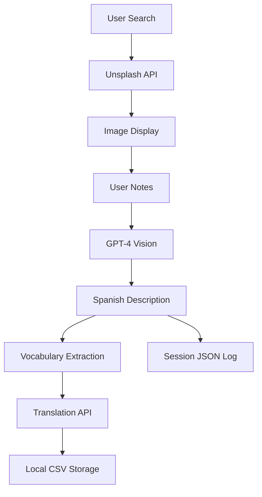
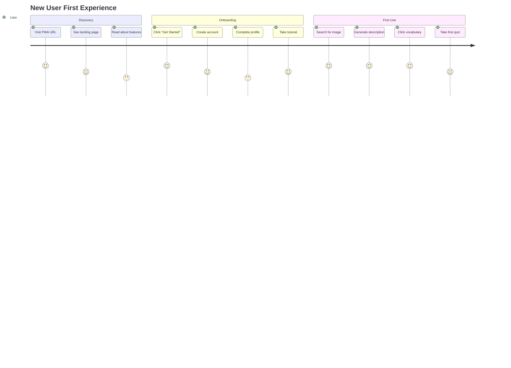
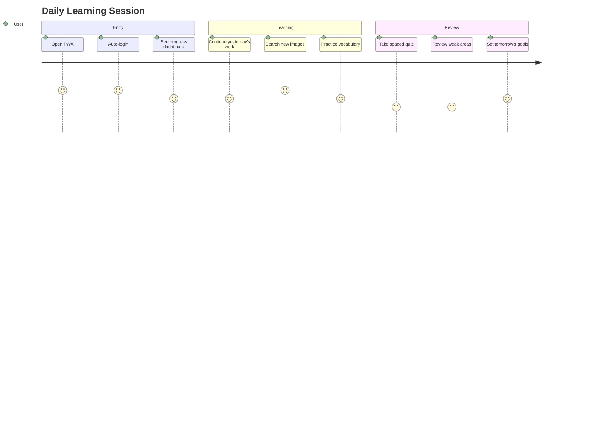
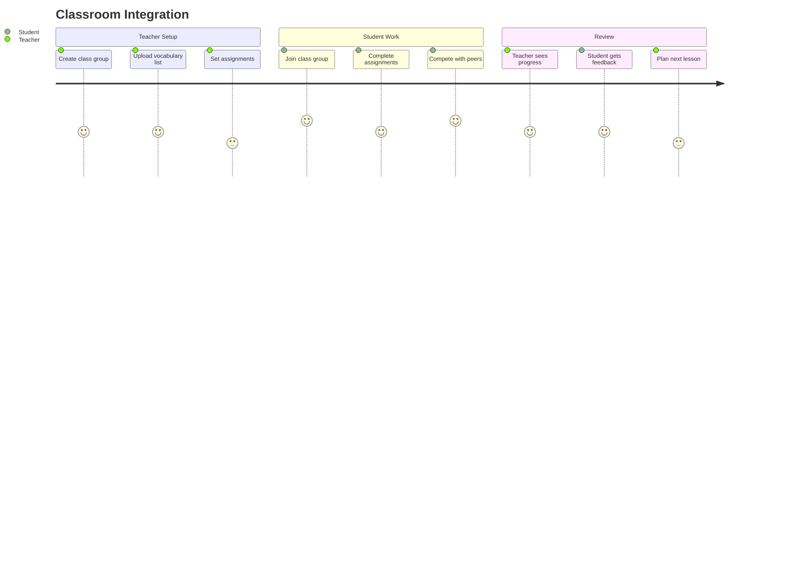

# PWA Conversion Specification - SPARC Methodology

## Executive Summary

This document specifies the conversion of the Unsplash Image Search & GPT Description desktop application to a Progressive Web App (PWA). The current desktop application is a sophisticated language learning tool with 1,966 lines of Python code, featuring image search, AI-powered Spanish descriptions, vocabulary extraction, and interactive learning systems.

## Current System Analysis

### Desktop Application Architecture
- **Language:** Python 3.8+ with Tkinter GUI
- **Size:** 1,966 lines monolithic code + modular components
- **APIs:** Unsplash API, OpenAI GPT-4 Vision API
- **Storage:** Local CSV files and JSON session logs
- **Features:** 
  - Image search with pagination
  - AI Spanish description generation (3 styles: academic, poetic, technical)
  - Interactive vocabulary extraction and clicking
  - Translation services
  - Quiz system with spaced repetition
  - Session tracking and analytics
  - Multiple description styles and vocabulary levels
  - Data export capabilities

### Current Data Flow


## 1. FUNCTIONAL REQUIREMENTS

### FR-001: Core Image Search Functionality
**Priority:** High  
**Description:** Maintain all existing image search capabilities in web environment

**Acceptance Criteria:**
- Users can search Unsplash images with query terms
- Pagination through search results (10 images per page)
- Image preview with zoom capabilities
- Deduplication of previously shown images
- Mobile-responsive image display

### FR-002: AI Description Generation
**Priority:** High  
**Description:** Preserve GPT-4 powered Spanish description generation with enhanced features

**Acceptance Criteria:**
- Support for 3 description styles: Academic, Poetic, Technical
- 4 vocabulary levels: Beginner, Intermediate, Advanced, Native
- Real-time streaming of AI responses (token-by-token)
- Context-aware descriptions based on user notes
- Customizable prompt templates
- Description history and version tracking

### FR-003: Interactive Vocabulary System
**Priority:** High  
**Description:** Enhanced vocabulary extraction and learning system

**Acceptance Criteria:**
- Click-to-translate functionality on any Spanish word/phrase
- Automatic categorization: Sustantivos, Verbos, Adjetivos, Frases clave
- Personal vocabulary collection with progress tracking
- Smart duplicate detection and consolidation
- Contextual vocabulary suggestions based on learning history

### FR-004: User Authentication & Profiles
**Priority:** High  
**Description:** Multi-user system with personalized learning

**Acceptance Criteria:**
- Email/password authentication via Supabase Auth
- OAuth2 integration (Google, GitHub)
- User profiles with learning preferences
- Guest mode for anonymous usage
- Account recovery and email verification
- Multi-device session synchronization

### FR-005: Cloud Data Persistence
**Priority:** High  
**Description:** Replace local storage with cloud-based data management

**Acceptance Criteria:**
- Real-time vocabulary synchronization across devices
- Session history stored in cloud database
- User preferences and settings persistence
- Data backup and recovery capabilities
- Export functionality (CSV, JSON, Anki flashcards)
- Import from desktop application data

### FR-006: Progressive Web App Features
**Priority:** High  
**Description:** Native-like web application experience

**Acceptance Criteria:**
- Installable on desktop and mobile devices
- Offline functionality with service worker caching
- Push notifications for study reminders
- Background sync for offline actions
- App icon and splash screen
- Native sharing integration

### FR-007: Enhanced Quiz System
**Priority:** Medium  
**Description:** Improved vocabulary testing with spaced repetition

**Acceptance Criteria:**
- Multiple quiz types: Translation, Multiple choice, Audio recognition
- Spaced repetition algorithm (SM-2 or similar)
- Progress tracking and learning analytics
- Adaptive difficulty based on performance
- Daily streak tracking and gamification
- Social features for shared vocabulary lists

### FR-008: Mobile-First Design
**Priority:** High  
**Description:** Optimized experience for mobile devices

**Acceptance Criteria:**
- Touch-friendly interface design
- Responsive layout for all screen sizes
- Gesture-based navigation (swipe, pinch-to-zoom)
- Mobile keyboard optimization
- Portrait and landscape orientations
- Accessibility features (screen reader support)

### FR-009: Real-time Collaboration
**Priority:** Low  
**Description:** Social learning features

**Acceptance Criteria:**
- Share vocabulary lists with other users
- Collaborative image annotation
- Comment system on descriptions
- Teacher/student relationship management
- Class/group vocabulary sharing
- Learning progress sharing and challenges

### FR-010: Advanced Search & Filtering
**Priority:** Medium  
**Description:** Enhanced image search capabilities

**Acceptance Criteria:**
- Advanced search filters (color, orientation, category)
- Search history and saved searches
- Image collections and favorites
- AI-powered image recommendations
- Search analytics and insights
- Bulk image processing

## 2. NON-FUNCTIONAL REQUIREMENTS

### NFR-001: Performance Requirements
**Category:** Performance  
**Priority:** High

**Specifications:**
- Initial page load: < 2 seconds on 3G connection
- Image search response: < 1 second
- AI description generation: < 5 seconds with streaming
- Interactive responses: < 100ms
- Offline mode activation: < 500ms
- Database queries: < 200ms (95th percentile)
- PWA installation: < 3 seconds

**Measurement:**
- Lighthouse Performance Score: > 90
- Core Web Vitals: LCP < 2.5s, FID < 100ms, CLS < 0.1
- Time to Interactive (TTI): < 3 seconds
- First Contentful Paint: < 1.5 seconds

### NFR-002: Scalability Requirements
**Category:** Scalability  
**Priority:** High

**Specifications:**
- Support 10,000+ concurrent users
- Handle 1 million vocabulary entries per user
- Process 100+ AI requests per minute
- Scale to 50GB+ of user-generated content
- Support 99.9% uptime with auto-scaling

**Architecture:**
- Supabase Edge Functions for API processing
- CDN for static assets and images
- Database connection pooling
- Horizontal scaling capabilities
- Load balancing across regions

### NFR-003: Security Requirements
**Category:** Security  
**Priority:** High

**Specifications:**
- Server-side API key management
- Encrypted data transmission (TLS 1.3)
- Secure authentication with JWT tokens
- API rate limiting and abuse prevention
- Data privacy compliance (GDPR, CCPA)
- Regular security audits and updates

**Implementation:**
- Supabase Row Level Security (RLS) policies
- API key rotation and environment management
- Input validation and sanitization
- CORS policy configuration
- Content Security Policy (CSP) headers

### NFR-004: Availability Requirements
**Category:** Reliability  
**Priority:** High

**Specifications:**
- 99.9% uptime SLA (8.76 hours downtime/year)
- Recovery Time Objective (RTO): < 15 minutes
- Recovery Point Objective (RPO): < 5 minutes
- Graceful degradation during service outages
- Automatic failover mechanisms

### NFR-005: Compatibility Requirements
**Category:** Compatibility  
**Priority:** High

**Specifications:**
- Browser support: Chrome 80+, Firefox 75+, Safari 13+, Edge 80+
- Mobile platforms: iOS 13+, Android 8+
- Screen resolutions: 320px to 4K displays
- Offline functionality on all supported platforms
- Progressive enhancement for older browsers

### NFR-006: Usability Requirements
**Category:** Usability  
**Priority:** High

**Specifications:**
- Intuitive interface requiring < 5 minutes learning time
- Accessibility compliance (WCAG 2.1 AA)
- Multi-language interface support
- Consistent design across all devices
- Context-sensitive help system
- User onboarding tutorial

### NFR-007: Data Requirements
**Category:** Data  
**Priority:** Medium

**Specifications:**
- Real-time data synchronization (< 1 second latency)
- Conflict resolution for concurrent edits
- Data versioning and history tracking
- Automatic backup every 24 hours
- Point-in-time recovery capabilities
- Data retention policies (7 years)

## 3. USER STORIES & ACCEPTANCE CRITERIA

### Epic 1: Core Learning Experience

#### US-001: As a language learner, I want to search for images and generate Spanish descriptions
**Story Points:** 8  
**Priority:** High

**Acceptance Criteria:**
- Given I am on the search page
- When I enter a search term and click search
- Then I see relevant images from Unsplash
- And I can click "Generate Description" to get AI-powered Spanish text
- And the description matches my selected learning level and style

#### US-002: As a vocabulary collector, I want to click Spanish words to learn their meanings
**Story Points:** 5  
**Priority:** High

**Acceptance Criteria:**
- Given I have a generated Spanish description
- When I click on any Spanish word or phrase
- Then I see an instant English translation
- And the word is added to my personal vocabulary collection
- And I can see the word in context with the original image

### Epic 2: Multi-Device Learning

#### US-003: As a mobile learner, I want to access my vocabulary from any device
**Story Points:** 13  
**Priority:** High

**Acceptance Criteria:**
- Given I have created vocabulary on desktop
- When I log in on my mobile device
- Then I see all my vocabulary synchronized
- And I can continue learning where I left off
- And all my progress is maintained across devices

#### US-004: As an offline learner, I want to continue studying without internet
**Story Points:** 21  
**Priority:** Medium

**Acceptance Criteria:**
- Given I have used the app while online
- When I lose internet connection
- Then I can still view my cached vocabulary
- And I can practice with offline quizzes
- And my progress syncs when I reconnect

### Epic 3: Social Learning

#### US-005: As a teacher, I want to share vocabulary lists with my students
**Story Points:** 13  
**Priority:** Low

**Acceptance Criteria:**
- Given I have created a vocabulary list
- When I click "Share with Students"
- Then I can generate a shareable link
- And students can access the vocabulary without editing
- And I can see their learning progress

#### US-006: As a student, I want to compete with classmates in vocabulary challenges
**Story Points:** 8  
**Priority:** Low

**Acceptance Criteria:**
- Given I am part of a class group
- When I complete vocabulary quizzes
- Then I can see my ranking compared to classmates
- And I receive badges for achievements
- And I can challenge specific classmates to vocabulary duels

### Epic 4: Advanced Features

#### US-007: As a data-driven learner, I want to see my learning analytics
**Story Points:** 8  
**Priority:** Medium

**Acceptance Criteria:**
- Given I have been using the app for multiple sessions
- When I visit my progress dashboard
- Then I see charts of my vocabulary growth over time
- And I can identify my strongest and weakest word categories
- And I get personalized recommendations for improvement

## 4. SUPABASE INTEGRATION ARCHITECTURE

### 4.1 Database Schema Design

```sql
-- User authentication and profiles
CREATE TABLE profiles (
  id uuid references auth.users on delete cascade,
  email text unique,
  full_name text,
  avatar_url text,
  learning_level text check (learning_level in ('beginner', 'intermediate', 'advanced', 'native')),
  preferred_style text check (preferred_style in ('academic', 'poetic', 'technical')),
  created_at timestamp with time zone default timezone('utc'::text, now()),
  updated_at timestamp with time zone default timezone('utc'::text, now()),
  primary key (id)
);

-- Vocabulary entries
CREATE TABLE vocabulary (
  id uuid default gen_random_uuid(),
  user_id uuid references profiles(id) on delete cascade,
  spanish_text text not null,
  english_translation text not null,
  context text,
  image_url text,
  search_query text,
  word_type text check (word_type in ('sustantivo', 'verbo', 'adjetivo', 'frase')),
  learning_score integer default 0,
  last_reviewed timestamp with time zone,
  next_review timestamp with time zone,
  created_at timestamp with time zone default timezone('utc'::text, now()),
  primary key (id)
);

-- Learning sessions
CREATE TABLE sessions (
  id uuid default gen_random_uuid(),
  user_id uuid references profiles(id) on delete cascade,
  search_query text,
  image_url text,
  generated_description text,
  user_notes text,
  style_used text,
  level_used text,
  duration_seconds integer,
  vocabulary_learned integer default 0,
  created_at timestamp with time zone default timezone('utc'::text, now()),
  primary key (id)
);

-- Quiz attempts and results
CREATE TABLE quiz_attempts (
  id uuid default gen_random_uuid(),
  user_id uuid references profiles(id) on delete cascade,
  vocabulary_id uuid references vocabulary(id) on delete cascade,
  correct boolean not null,
  response_time_ms integer,
  quiz_type text,
  created_at timestamp with time zone default timezone('utc'::text, now()),
  primary key (id)
);

-- Shared vocabulary collections
CREATE TABLE shared_collections (
  id uuid default gen_random_uuid(),
  owner_id uuid references profiles(id) on delete cascade,
  name text not null,
  description text,
  is_public boolean default false,
  created_at timestamp with time zone default timezone('utc'::text, now()),
  primary key (id)
);
```

### 4.2 Row Level Security (RLS) Policies

```sql
-- Users can only see and edit their own profile
create policy "Users can view own profile" 
  on profiles for select 
  using (auth.uid() = id);

create policy "Users can update own profile" 
  on profiles for update 
  using (auth.uid() = id);

-- Users can only access their own vocabulary
create policy "Users can manage own vocabulary" 
  on vocabulary for all 
  using (auth.uid() = user_id);

-- Users can only access their own sessions
create policy "Users can manage own sessions" 
  on sessions for all 
  using (auth.uid() = user_id);
```

### 4.3 Real-time Subscriptions

```typescript
// Vocabulary synchronization
const vocabularySubscription = supabase
  .channel('vocabulary-changes')
  .on('postgres_changes', 
    { 
      event: '*', 
      schema: 'public', 
      table: 'vocabulary',
      filter: `user_id=eq.${userId}`
    }, 
    handleVocabularyChange
  )
  .subscribe();
```

### 4.4 Edge Functions Architecture

```
Edge Functions/
├── image-search/          # Unsplash API proxy
├── ai-description/        # OpenAI GPT integration  
├── translation/           # Translation services
├── vocabulary-extract/    # Phrase extraction logic
├── quiz-generator/        # Adaptive quiz creation
└── analytics/            # Learning analytics
```

## 5. USER JOURNEY MAPS

### 5.1 New User Journey


### 5.2 Returning User Journey


### 5.3 Teacher/Student Journey


## 6. FEATURE PRIORITY MATRIX

### MVP (Phase 1) - Month 1-2
**Must Have for Launch**

| Feature | Priority | Effort | Impact | Risk |
|---------|----------|--------|--------|------|
| User Authentication | High | Medium | High | Low |
| Basic Image Search | High | Low | High | Low |
| AI Description Generation | High | Medium | High | Medium |
| Click-to-Translate | High | Medium | High | Low |
| Cloud Data Storage | High | High | High | Medium |
| Mobile Responsive Design | High | High | High | Low |
| PWA Installation | High | Low | Medium | Low |

**Success Criteria:**
- 90% feature parity with desktop app
- < 2 second page load time
- User can complete full learning session
- Data syncs across devices

### Phase 2 - Month 3-4
**Enhanced Learning Features**

| Feature | Priority | Effort | Impact | Risk |
|---------|----------|--------|--------|------|
| Offline Mode | Medium | High | High | High |
| Advanced Quiz System | Medium | Medium | High | Low |
| Progress Analytics | Medium | Medium | Medium | Low |
| Export/Import Data | Low | Low | Medium | Low |
| Push Notifications | Low | Medium | Medium | Medium |

### Phase 3 - Month 5-6
**Social & Advanced Features**

| Feature | Priority | Effort | Impact | Risk |
|---------|----------|--------|--------|------|
| Shared Collections | Low | High | Medium | Medium |
| Real-time Collaboration | Low | Very High | Low | High |
| Advanced Search | Low | Medium | Medium | Low |
| Voice Features | Low | High | Medium | High |

## 7. SUCCESS METRICS & KPIS

### 7.1 Technical Performance Metrics
- **Page Load Time:** < 2 seconds (target < 1.5s)
- **API Response Time:** < 500ms (target < 200ms) 
- **Offline Capability:** 90% of features work offline
- **Cross-Device Sync:** < 1 second sync latency
- **Error Rate:** < 0.1% of user actions result in errors
- **Uptime:** 99.9% availability

### 7.2 User Engagement Metrics
- **Daily Active Users (DAU):** Target 1,000 within 3 months
- **Session Duration:** Average 15+ minutes per session
- **User Retention:** 
  - 1-day: 70%
  - 7-day: 40% 
  - 30-day: 20%
- **Feature Adoption:**
  - Vocabulary clicking: 80% of users
  - Quiz completion: 60% of users
  - Multi-device usage: 40% of users

### 7.3 Learning Effectiveness Metrics
- **Vocabulary Growth:** Average 50+ words per user per month
- **Quiz Performance:** 70% average accuracy rate
- **Spaced Repetition:** 80% of users review vocabulary within optimal timeframe
- **Learning Streaks:** 30% of users maintain 7+ day streaks

### 7.4 Business Metrics
- **User Acquisition Cost:** < $5 per user
- **Monthly Active Users:** 500+ within 6 months
- **User Satisfaction:** 4.5+ stars average rating
- **Support Ticket Volume:** < 5% of MAU generate support requests

## 8. MIGRATION RISKS & MITIGATION STRATEGIES

### 8.1 Technical Risks

#### **Risk 1: API Key Security Exposure**
**Probability:** High | **Impact:** High
- **Description:** Client-side API keys could be exposed, leading to abuse
- **Mitigation:** 
  - Implement server-side API proxy with Edge Functions
  - Use environment variables and Supabase secrets
  - Implement rate limiting and usage monitoring
  - API key rotation strategy

#### **Risk 2: Performance Degradation**
**Probability:** Medium | **Impact:** High  
- **Description:** Web app may be slower than desktop version
- **Mitigation:**
  - Implement service worker caching
  - Use CDN for static assets
  - Optimize bundle size with code splitting
  - Implement lazy loading for images
  - Progressive image loading

#### **Risk 3: Offline Functionality Complexity**
**Probability:** High | **Impact:** Medium
- **Description:** Complex state management for offline/online sync
- **Mitigation:**
  - Implement robust service worker
  - Use IndexedDB for local storage
  - Conflict resolution strategies
  - Background sync API
  - Graceful degradation

### 8.2 User Experience Risks

#### **Risk 4: Mobile Usability Issues**
**Probability:** Medium | **Impact:** High
- **Description:** Complex desktop UI may not translate well to mobile
- **Mitigation:**
  - Mobile-first design approach
  - Extensive mobile device testing
  - Touch-friendly interface elements
  - Progressive disclosure of features
  - User testing on various devices

#### **Risk 5: Data Migration Complexity**
**Probability:** Medium | **Impact:** Medium
- **Description:** Users may lose data during migration from desktop
- **Mitigation:**
  - CSV/JSON import functionality
  - Clear migration instructions
  - Data validation and error handling
  - Rollback capabilities
  - Support documentation

### 8.3 Business Risks

#### **Risk 6: User Adoption Resistance**
**Probability:** Medium | **Impact:** High
- **Description:** Existing users may prefer desktop application
- **Mitigation:**
  - Maintain desktop app during transition
  - Clear communication of benefits
  - Gradual feature rollout
  - User feedback integration
  - Comprehensive onboarding

#### **Risk 7: API Cost Escalation**  
**Probability:** Medium | **Impact:** Medium
- **Description:** Cloud hosting and API costs may exceed budget
- **Mitigation:**
  - Implement usage monitoring and alerts
  - Optimize API calls and caching
  - Freemium model consideration
  - Cost-effective tier selection
  - Usage analytics and optimization

### 8.4 Risk Monitoring Plan

| Risk | Monitoring Method | Frequency | Threshold | Response |
|------|------------------|-----------|-----------|-----------|
| API Abuse | Usage analytics | Real-time | >110% of expected | Auto rate limiting |
| Performance | Lighthouse CI | Daily | Score <90 | Performance review |
| User Satisfaction | In-app surveys | Weekly | <4.0 rating | Feature priority adjustment |
| Cost Overrun | Supabase dashboard | Daily | >$20/month | Usage optimization |

## 9. TECHNICAL IMPLEMENTATION ROADMAP

### Phase 1: Foundation (Weeks 1-4)
- [ ] Supabase project setup and configuration
- [ ] User authentication system implementation
- [ ] Database schema creation and RLS policies
- [ ] Basic PWA shell with service worker
- [ ] Image search API proxy (Edge Function)
- [ ] Core UI components (React/Vue.js)

### Phase 2: Core Features (Weeks 5-8)
- [ ] AI description generation integration
- [ ] Interactive vocabulary system
- [ ] Real-time data synchronization  
- [ ] Mobile-responsive design
- [ ] Offline functionality implementation
- [ ] Data import from desktop version

### Phase 3: Enhanced Features (Weeks 9-12)
- [ ] Advanced quiz system with spaced repetition
- [ ] Progress tracking and analytics
- [ ] Push notifications
- [ ] Export/import functionality
- [ ] Performance optimization
- [ ] Security audit and hardening

### Phase 4: Advanced Features (Weeks 13-16)
- [ ] Social features (sharing, collaboration)
- [ ] Advanced search and filtering
- [ ] Voice features and accessibility
- [ ] Comprehensive testing and QA
- [ ] Production deployment and monitoring

## 10. CONCLUSION

This specification outlines a comprehensive approach to converting the desktop Unsplash Image Search & GPT Description application to a modern Progressive Web App. The conversion maintains all existing functionality while adding cloud synchronization, mobile optimization, and enhanced social learning features.

The phased approach ensures a stable migration path with minimal risk to existing users while delivering significant improvements in accessibility, performance, and collaborative learning capabilities.

**Key Success Factors:**
1. Server-side API key management for security
2. Real-time data synchronization across devices  
3. Mobile-first responsive design
4. Robust offline functionality
5. Comprehensive user onboarding and migration support

**Expected Outcomes:**
- 10x increase in potential user base through web accessibility
- Enhanced learning experience through social features
- Improved data persistence and cross-device synchronization
- Foundation for future advanced features and integrations

This specification provides the foundation for the next phases of SPARC methodology: Pseudocode, Architecture, Refinement, and Completion.