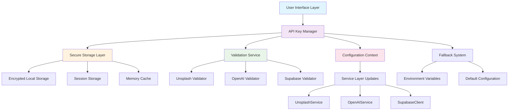
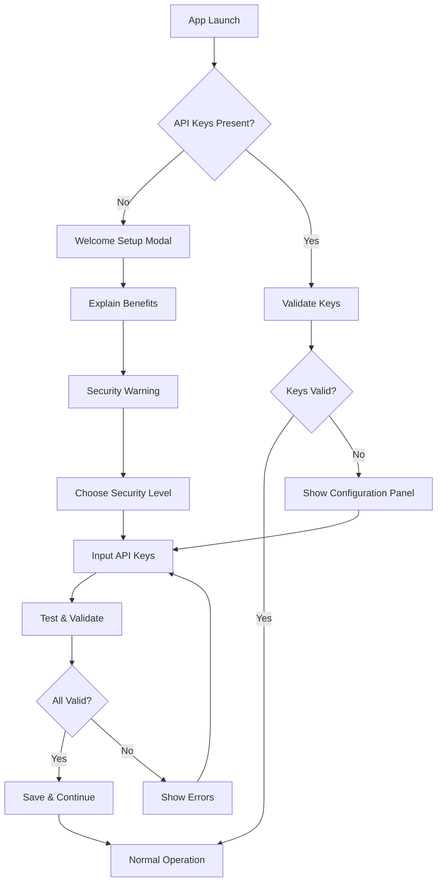

# Runtime API Key Configuration System Architecture

## System Overview

This document outlines the comprehensive architecture for VocabLens's runtime API key configuration system, allowing users to input and manage their own API keys within the application rather than requiring build-time environment variables.

## Architecture Diagram



## Core Components

### 1. Security Architecture

#### 1.1 Encryption Strategy
```typescript
interface EncryptionConfig {
  algorithm: 'AES-GCM';
  keyLength: 256;
  ivLength: 12;
  tagLength: 16;
  derivationRounds: 100000;
}

interface SecureStorage {
  encrypt(data: string, masterKey: string): Promise<string>;
  decrypt(encryptedData: string, masterKey: string): Promise<string>;
  generateSalt(): string;
  deriveKey(password: string, salt: string): Promise<CryptoKey>;
}
```

#### 1.2 Key Derivation Process
- Uses PBKDF2 with SHA-256 for key derivation
- Minimum 100,000 iterations for strong security
- Unique salt per user session
- Master key derived from user-provided passphrase or device fingerprint

#### 1.3 Storage Security Levels
```typescript
enum SecurityLevel {
  MEMORY_ONLY = 'memory',      // Session-only, cleared on refresh
  SESSION_STORAGE = 'session', // Browser session, encrypted
  LOCAL_STORAGE = 'local',     // Persistent, encrypted with warning
  SECURE_VAULT = 'vault'       // Future: Hardware security module
}
```

### 2. User Interface Architecture

#### 2.1 Settings Panel Structure
```
Settings Panel
├── API Keys Tab
│   ├── Service Status Dashboard
│   ├── Key Input Forms
│   │   ├── Unsplash API Key
│   │   ├── OpenAI API Key
│   │   ├── Supabase Configuration
│   │   └── Translation Services
│   ├── Validation Status
│   ├── Test Connectivity
│   └── Security Options
├── Storage Preferences
│   ├── Security Level Selection
│   ├── Auto-clear Options
│   └── Master Password Setup
└── Migration Tools
    ├── Import from Environment
    ├── Export Configuration
    └── Reset to Defaults
```

#### 2.2 First-Time User Experience Flow


### 3. Service Layer Integration

#### 3.1 Runtime Configuration Injection
```typescript
interface RuntimeConfig {
  unsplash: {
    accessKey: string;
    baseUrl: string;
    rateLimit: RateLimitConfig;
  };
  openai: {
    apiKey: string;
    organizationId?: string;
    baseUrl: string;
    model: string;
    maxTokens: number;
  };
  supabase: {
    url: string;
    anonKey: string;
    serviceKey?: string;
  };
}

class ConfigurableService {
  protected config: RuntimeConfig;
  
  constructor(config: RuntimeConfig) {
    this.config = config;
  }
  
  updateConfig(newConfig: Partial<RuntimeConfig>): void {
    this.config = { ...this.config, ...newConfig };
    this.reinitialize();
  }
  
  protected abstract reinitialize(): void;
}
```

#### 3.2 Service Factory Pattern
```typescript
class ServiceFactory {
  private static instances = new Map<string, any>();
  
  static createService<T>(
    serviceType: string,
    config: RuntimeConfig,
    ServiceClass: new (config: RuntimeConfig) => T
  ): T {
    const key = `${serviceType}_${this.getConfigHash(config)}`;
    
    if (!this.instances.has(key)) {
      this.instances.set(key, new ServiceClass(config));
    }
    
    return this.instances.get(key);
  }
  
  static updateServiceConfig(serviceType: string, newConfig: Partial<RuntimeConfig>): void {
    // Update all matching service instances
    for (const [key, instance] of this.instances.entries()) {
      if (key.startsWith(serviceType)) {
        instance.updateConfig(newConfig);
      }
    }
  }
}
```

### 4. Validation System

#### 4.1 API Key Validation Pipeline
```typescript
interface ValidationResult {
  valid: boolean;
  service: ServiceName;
  errors: string[];
  warnings: string[];
  capabilities: string[];
  rateLimit?: RateLimitInfo;
  expiresAt?: Date;
}

class APIKeyValidator {
  async validateKey(service: ServiceName, apiKey: string): Promise<ValidationResult> {
    const validator = this.getValidator(service);
    return await validator.validate(apiKey);
  }
  
  async testConnectivity(service: ServiceName, apiKey: string): Promise<boolean> {
    // Performs minimal API call to test connectivity
  }
  
  async validateBatch(keys: Record<ServiceName, string>): Promise<Record<ServiceName, ValidationResult>> {
    // Validate multiple keys in parallel
  }
}
```

#### 4.2 Real-time Validation
- Format validation (immediate)
- Connectivity testing (on-demand)
- Capability assessment (background)
- Rate limit monitoring (continuous)

### 5. Fallback Strategy

#### 5.1 Configuration Priority
```typescript
enum ConfigSource {
  USER_INPUT = 1,      // Highest priority
  LOCAL_STORAGE = 2,
  SESSION_STORAGE = 3,
  ENVIRONMENT_VAR = 4,
  DEFAULT_CONFIG = 5   // Lowest priority
}

class ConfigurationResolver {
  resolve(service: ServiceName): ServiceConfig {
    const sources = [
      () => this.getUserInput(service),
      () => this.getFromLocalStorage(service),
      () => this.getFromSession(service),
      () => this.getFromEnvironment(service),
      () => this.getDefaultConfig(service)
    ];
    
    for (const source of sources) {
      const config = source();
      if (this.isValidConfig(config)) {
        return config;
      }
    }
    
    throw new Error(`No valid configuration found for ${service}`);
  }
}
```

#### 5.2 Graceful Degradation
- Missing Unsplash key: Show upload option
- Missing OpenAI key: Disable AI features, show manual input
- Missing Supabase: Use local-only mode
- All keys missing: Guided setup flow

### 6. Migration Path

#### 6.1 Environment Variable Support
```typescript
class MigrationManager {
  async migrateFromEnvironment(): Promise<boolean> {
    const envKeys = this.extractEnvironmentKeys();
    if (Object.keys(envKeys).length === 0) {
      return false; // No environment variables found
    }
    
    const userConsent = await this.requestMigrationConsent(envKeys);
    if (!userConsent) {
      return false;
    }
    
    await this.securelyStoreKeys(envKeys);
    return true;
  }
  
  private extractEnvironmentKeys(): Record<ServiceName, string> {
    return {
      unsplash: import.meta.env.VITE_UNSPLASH_ACCESS_KEY || '',
      openai: import.meta.env.VITE_OPENAI_API_KEY || '',
      supabase: import.meta.env.VITE_SUPABASE_ANON_KEY || ''
    };
  }
}
```

#### 6.2 Dual Mode Operation
- Development: Environment variables (as current)
- Production: Runtime configuration (new system)
- Hybrid: Runtime overrides environment when present

## Implementation Plan

### Phase 1: Foundation (Week 1-2)
1. **Secure Storage Implementation**
   - Create encryption utilities
   - Implement secure local storage wrapper
   - Add session management

2. **API Key Manager Core**
   - Design configuration data structures
   - Implement basic CRUD operations
   - Add configuration validation

### Phase 2: User Interface (Week 3-4)
1. **Settings Panel Development**
   - Create API key input forms
   - Implement security level selection
   - Add validation feedback UI

2. **First-Time Setup Flow**
   - Design onboarding modals
   - Implement guided setup process
   - Add help documentation

### Phase 3: Service Integration (Week 5-6)
1. **Service Layer Updates**
   - Modify existing services for runtime config
   - Implement configuration hot-swapping
   - Add fallback mechanisms

2. **Validation System**
   - Create service-specific validators
   - Implement real-time testing
   - Add capability detection

### Phase 4: Advanced Features (Week 7-8)
1. **Migration Tools**
   - Environment variable import
   - Configuration export/import
   - Backup and restore

2. **Security Enhancements**
   - Master password implementation
   - Auto-clear mechanisms
   - Security audit logging

### Phase 5: Testing & Polish (Week 9-10)
1. **Comprehensive Testing**
   - Unit tests for encryption
   - Integration tests for services
   - End-to-end user flow tests

2. **Documentation & Training**
   - User documentation
   - Developer guides
   - Migration instructions

## Security Considerations

### Data Protection
- **No Server Transmission**: API keys never sent to any backend
- **Client-Side Only**: All processing happens in browser
- **Encryption at Rest**: Keys encrypted before storage
- **Memory Safety**: Sensitive data cleared from memory
- **Audit Trail**: Configuration changes logged locally

### Best Practices
- **Principle of Least Privilege**: Minimal permissions required
- **Defense in Depth**: Multiple security layers
- **User Control**: Full transparency and control over data
- **Secure Defaults**: Most secure options selected by default
- **Regular Cleanup**: Automatic clearing of unused data

### Risk Mitigation
- **XSS Protection**: Content Security Policy enforcement
- **Storage Quotas**: Prevent storage abuse
- **Rate Limiting**: Prevent API abuse
- **Error Handling**: No sensitive data in error messages
- **Browser Security**: Leverage browser security features

## Performance Considerations

### Optimization Strategies
- **Lazy Loading**: Load configuration only when needed
- **Caching**: Intelligent caching of validated configurations
- **Batch Operations**: Group API validation calls
- **Background Tasks**: Non-blocking validation and testing
- **Resource Management**: Automatic cleanup of unused services

### Scalability
- **Service Discovery**: Dynamic service registration
- **Plugin Architecture**: Easy addition of new services
- **Configuration Versioning**: Handle breaking changes gracefully
- **Progressive Enhancement**: Core functionality without all services

## Testing Strategy

### Security Testing
- Encryption/decryption verification
- Storage isolation tests
- Memory leak detection
- XSS vulnerability assessment

### Functional Testing
- API key validation accuracy
- Service integration testing
- Fallback mechanism verification
- Migration process testing

### User Experience Testing
- First-time user onboarding
- Error handling and recovery
- Performance impact assessment
- Accessibility compliance

## Success Metrics

### User Experience
- Time to first successful API call
- Setup completion rate
- Error recovery success rate
- User satisfaction scores

### Security
- Zero data breaches
- Proper encryption verification
- Audit compliance
- Vulnerability scan results

### Performance
- Configuration load time < 100ms
- API validation response time < 2s
- Memory usage within limits
- No impact on app startup time

This architecture provides a comprehensive, secure, and user-friendly solution for runtime API key management in VocabLens, ensuring both security best practices and excellent user experience.