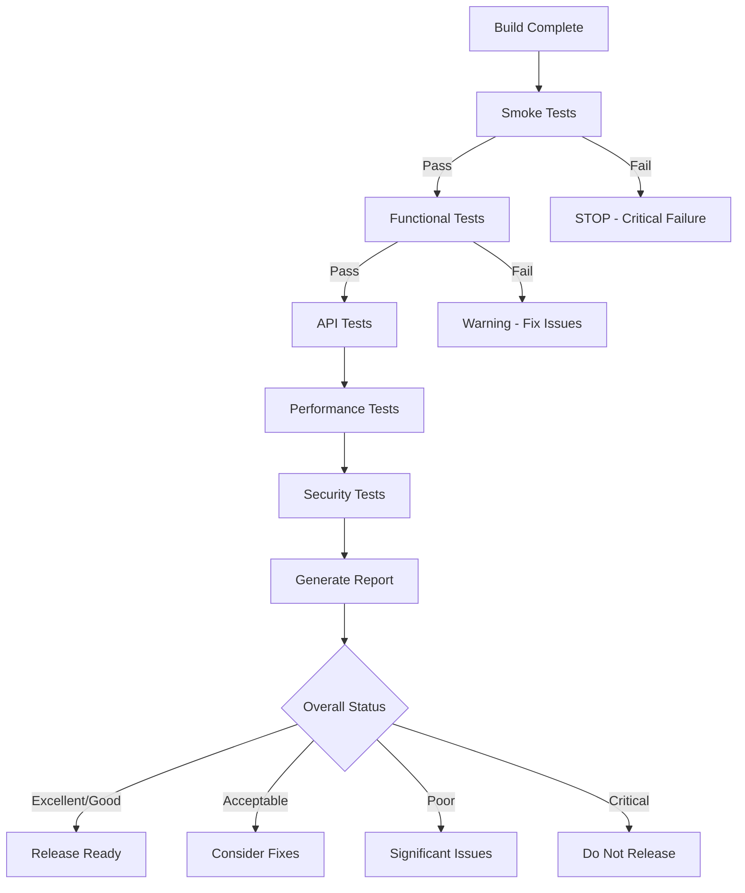

# Testing Procedures and Workflows

## Overview

This document provides comprehensive testing procedures for the Unsplash Image Search GPT Tool executable. It covers pre-build testing, post-build validation, and production readiness assessment.

## Table of Contents

1. [Testing Strategy Overview](#testing-strategy-overview)
2. [Pre-Build Testing](#pre-build-testing)
3. [Build Process Testing](#build-process-testing)
4. [Post-Build Validation](#post-build-validation)
5. [Manual Testing Procedures](#manual-testing-procedures)
6. [Automated Testing Workflows](#automated-testing-workflows)
7. [Performance Testing](#performance-testing)
8. [Security Testing](#security-testing)
9. [Regression Testing](#regression-testing)
10. [Test Reporting](#test-reporting)
11. [Troubleshooting](#troubleshooting)

---

## Testing Strategy Overview

### Testing Pyramid

```
         /\
        /E2E\      <- Manual integration tests
       /------\
      / System \   <- Post-build validation  
     /----------\
    / Integration\ <- API and UI tests
   /--------------\
  /     Unit       \ <- Code-level tests
 /------------------\
```

### Test Categories

| Category | Purpose | Automation | Frequency |
|----------|---------|------------|-----------|
| Unit Tests | Code functionality | Automated | Every commit |
| Integration Tests | Component interaction | Automated | Daily builds |
| System Tests | End-to-end workflows | Semi-automated | Release candidate |
| Performance Tests | Resource usage | Automated | Weekly |
| Security Tests | Vulnerability assessment | Mixed | Release candidate |
| User Acceptance | Real-world scenarios | Manual | Final validation |

---

## Pre-Build Testing

### Development Environment Tests

Run these tests before building the executable:

```bash
# 1. Unit Tests
python -m pytest tests/unit/ -v

# 2. Integration Tests  
python -m pytest tests/integration/ -v

# 3. Code Quality
python -m flake8 main.py config_manager.py
python -m mypy main.py config_manager.py

# 4. Security Scan
python -m bandit -r . -x tests/

# 5. Dependency Check
python -m safety check
```

### Pre-Build Checklist

- [ ] All unit tests pass (100% pass rate required)
- [ ] Integration tests pass (95% pass rate required)
- [ ] Code coverage > 80%
- [ ] No high-severity security issues
- [ ] No critical dependency vulnerabilities
- [ ] Code style compliance (flake8)
- [ ] Type checking passes (mypy)
- [ ] All TODOs and FIXMEs addressed

### Pre-Build Validation Script

```python
# Run comprehensive pre-build validation
python run_tests.py --suite coverage --html-report
python scripts/pre-build-validation.ps1  # If available
```

---

## Build Process Testing

### Build Verification

After running the build process:

```bash
# Standard build
python -m PyInstaller main.spec

# Verify build artifacts
ls -la dist/
file dist/main.exe  # Check file type
```

### Build Quality Checks

1. **File Size Verification**
   - Executable size: 10MB - 500MB (reasonable range)
   - No missing dependencies
   - All required assets included

2. **Build Integrity**
   - Digital signature (if applicable)
   - Virus scan results clean
   - No corrupted files

3. **Dependency Verification**
   - All Python packages included
   - No missing DLL files
   - Correct Python interpreter embedded

### Build Testing Commands

```bash
# Quick build verification
python tests/smoke_test_suite.py --exe dist/main.exe

# Detailed build analysis  
python scripts/build-analyzer.py dist/main.exe
```

---

## Post-Build Validation

### Automated Validation Suite

The primary post-build validation uses our comprehensive test suite:

```bash
# Full validation suite
python tests/post_build_validation.py --exe dist/main.exe --output validation_results/

# Individual test suites
python tests/smoke_test_suite.py --exe dist/main.exe
python tests/api_mock_tests.py
python tests/ui_responsiveness_tests.py --exe dist/main.exe
```

### Validation Test Categories

#### 1. Smoke Tests (Critical - Must Pass 100%)
- ✅ Executable exists and is valid
- ✅ Application launches successfully  
- ✅ UI window appears and is responsive
- ✅ Configuration system works
- ✅ Data directories are created
- ✅ Process terminates cleanly

#### 2. Functional Tests (Must Pass 90%)
- ✅ Search functionality works
- ✅ Image display and zoom
- ✅ AI description generation (mocked)
- ✅ Vocabulary extraction and translation
- ✅ Data export features
- ✅ Theme switching
- ✅ Keyboard shortcuts

#### 3. API Integration Tests (Must Pass 80%)
- ✅ API key configuration
- ✅ Network error handling
- ✅ Rate limit management
- ✅ Mock fallback systems
- ✅ Offline mode graceful degradation

#### 4. Performance Tests (Must Pass 80%)
- ✅ Startup time < 10 seconds
- ✅ Memory usage < 300MB initial
- ✅ No significant memory leaks
- ✅ CPU usage reasonable
- ✅ Resource cleanup on exit

#### 5. Security Tests (Must Pass 100%)
- ✅ API keys stored securely
- ✅ No unauthorized file access
- ✅ Input validation works
- ✅ No information leakage
- ✅ Process isolation maintained

### Validation Workflow



---

## Manual Testing Procedures

### User Acceptance Testing (UAT)

#### Test Environment Setup
1. Clean Windows 10/11 system
2. No development tools installed
3. Standard user account (not administrator)
4. Typical internet connection
5. Common screen resolution (1920x1080 or 1366x768)

#### Test Scenarios

##### Scenario 1: First-Time User Experience
**Objective**: Verify new user can set up and use the application

**Steps**:
1. Download and run the executable
2. Complete first-time setup wizard
3. Enter API keys (use test keys if available)
4. Perform first image search
5. Generate description and extract vocabulary
6. Export vocabulary to different formats

**Expected Results**:
- Setup wizard is intuitive and clear
- Error messages are helpful
- First search completes successfully
- Export functionality works as expected

**Pass Criteria**: User can complete all steps without assistance

##### Scenario 2: Daily Usage Workflow
**Objective**: Test typical daily usage patterns

**Steps**:
1. Launch application (should remember previous settings)
2. Search for multiple different topics
3. Use "Another Image" feature
4. Generate descriptions for various images
5. Build vocabulary list (20+ words)
6. Use keyboard shortcuts
7. Switch themes
8. Export final vocabulary

**Expected Results**:
- Fast startup after first run
- Smooth workflow transitions
- Keyboard shortcuts work
- Data persists between sessions

**Pass Criteria**: Workflow feels natural and efficient

##### Scenario 3: Error Handling and Recovery
**Objective**: Test application behavior under error conditions

**Steps**:
1. Start with invalid API keys
2. Try to search during network outage
3. Enter extremely long search queries
4. Try special characters and Unicode
5. Fill up available disk space
6. Try to run multiple instances
7. Force-close and restart application

**Expected Results**:
- Clear error messages for all failure modes
- Application doesn't crash
- Recovery is possible after errors
- No data corruption occurs

**Pass Criteria**: Application handles all errors gracefully

#### Manual Testing Checklist

**Installation and Setup**:
- [ ] Executable downloads cleanly
- [ ] No antivirus warnings (false positives)
- [ ] Application starts on first run
- [ ] Setup wizard is complete and clear
- [ ] Help documentation is accessible

**Core Functionality**:
- [ ] Search returns relevant images
- [ ] Images load and display properly
- [ ] Zoom controls work smoothly
- [ ] Description generation produces good Spanish text
- [ ] Vocabulary extraction is accurate
- [ ] Translation quality is acceptable
- [ ] Export formats work correctly

**User Interface**:
- [ ] Layout is clean and intuitive
- [ ] Text is readable at default size
- [ ] Colors are appropriate and accessible
- [ ] Theme switching works
- [ ] Window resizing behaves correctly
- [ ] Keyboard navigation is logical

**Performance**:
- [ ] Startup time is acceptable (< 10 seconds)
- [ ] Image loading is reasonably fast (< 5 seconds)
- [ ] AI processing doesn't freeze UI (< 30 seconds)
- [ ] No noticeable memory leaks during extended use
- [ ] Application exits cleanly

**Data Management**:
- [ ] Vocabulary is saved correctly
- [ ] Session data persists
- [ ] Configuration is remembered
- [ ] Export files are well-formatted
- [ ] No data loss on unexpected shutdown

---

## Automated Testing Workflows

### Continuous Integration Pipeline

```yaml
# .github/workflows/test.yml
name: Test Suite
on: [push, pull_request]

jobs:
  test:
    runs-on: windows-latest
    steps:
      - uses: actions/checkout@v2
      
      - name: Setup Python
        uses: actions/setup-python@v2
        with:
          python-version: '3.9'
          
      - name: Install dependencies
        run: |
          pip install -r requirements-dev.txt
          
      - name: Run unit tests
        run: python -m pytest tests/unit/ --cov=main --cov-report=xml
        
      - name: Run integration tests  
        run: python -m pytest tests/integration/
        
      - name: Code quality checks
        run: |
          python -m flake8 main.py config_manager.py
          python -m mypy main.py config_manager.py
          python -m bandit -r . -x tests/
          
      - name: Build executable
        run: python -m PyInstaller main.spec
        
      - name: Post-build validation
        run: python tests/post_build_validation.py --exe dist/main.exe
```

### Nightly Build Testing

```bash
#!/bin/bash
# nightly_test.sh

# Clean build
rm -rf build/ dist/
python -m PyInstaller main.spec

# Full validation suite
python tests/post_build_validation.py \
  --exe dist/main.exe \
  --output "nightly_$(date +%Y%m%d)"

# Performance benchmarking
python tests/performance_benchmark.py --exe dist/main.exe

# Upload results to test reporting system
python scripts/upload_test_results.py nightly_$(date +%Y%m%d)/
```

### Release Testing Pipeline

```bash
#!/bin/bash
# release_testing.sh

set -e  # Exit on any error

echo "🚀 Starting Release Testing Pipeline"

# Step 1: Pre-build validation
echo "📋 Step 1: Pre-build validation"
python run_tests.py --suite coverage
python -m bandit -r . -x tests/
python -m safety check

# Step 2: Clean build
echo "🔨 Step 2: Building executable"
rm -rf build/ dist/
python -m PyInstaller main.spec

# Step 3: Post-build validation
echo "✅ Step 3: Post-build validation"
python tests/post_build_validation.py \
  --exe dist/main.exe \
  --output "release_validation"

# Step 4: Extended testing
echo "⏱️  Step 4: Extended performance testing"
python tests/extended_performance_tests.py --exe dist/main.exe

# Step 5: Security testing
echo "🔒 Step 5: Security testing"
python tests/security_tests.py --exe dist/main.exe

# Step 6: Generate final report
echo "📋 Step 6: Generating final report"
python scripts/generate_release_report.py release_validation/

echo "✅ Release testing complete!"
```

---

## Performance Testing

### Performance Benchmarks

| Metric | Target | Warning | Critical |
|--------|--------|---------|----------|
| Startup Time | < 5s | < 10s | > 15s |
| Memory Usage (Initial) | < 150MB | < 300MB | > 500MB |
| Memory Growth (1hr) | < 50MB | < 100MB | > 200MB |
| Search Response | < 3s | < 5s | > 10s |
| Description Generation | < 15s | < 30s | > 60s |
| Export Operation | < 2s | < 5s | > 10s |

### Performance Testing Procedures

#### Load Testing
```python
# Simulate heavy usage
for i in range(100):
    search_query = f"test query {i}"
    perform_search(search_query)
    generate_description()
    extract_vocabulary()
    time.sleep(1)  # Brief pause between operations
```

#### Stress Testing
```python
# Test resource limits
concurrent_operations = []
for i in range(10):
    operation = async_search(f"stress test {i}")
    concurrent_operations.append(operation)

# Wait for all operations to complete
await asyncio.gather(*concurrent_operations)
```

#### Memory Leak Testing
```python
# Extended operation monitoring
initial_memory = get_memory_usage()
for hour in range(8):  # 8-hour test
    perform_typical_operations()
    current_memory = get_memory_usage()
    memory_growth = current_memory - initial_memory
    
    if memory_growth > 100 * 1024 * 1024:  # 100MB
        raise Exception(f"Memory leak detected: {memory_growth} bytes")
```

### Performance Test Automation

```bash
# Run performance test suite
python tests/performance/startup_benchmark.py
python tests/performance/memory_profiling.py  
python tests/performance/load_testing.py
python tests/performance/stress_testing.py

# Generate performance report
python tests/performance/generate_report.py
```

---

## Security Testing

### Security Test Categories

#### 1. Input Validation Testing
- SQL injection attempts in search fields
- XSS payloads in user input
- Buffer overflow attempts
- Unicode and special character handling
- Path traversal attempts

#### 2. Configuration Security
- API key storage encryption
- Configuration file permissions
- Sensitive data in logs
- Environment variable handling
- Temporary file security

#### 3. Network Security
- HTTPS enforcement
- Certificate validation
- Request tampering attempts
- Man-in-the-middle simulation
- DNS spoofing protection

#### 4. Process Security
- Process isolation verification
- Resource limit enforcement
- Privilege escalation attempts
- File system access control
- Registry access (Windows)

### Security Testing Tools

```bash
# Static analysis security testing
python -m bandit -r . -f json -o security_report.json

# Dependency vulnerability scanning
python -m safety check --json

# Custom security tests
python tests/security/input_validation_tests.py
python tests/security/config_security_tests.py
python tests/security/network_security_tests.py
```

### Manual Security Testing

#### Penetration Testing Checklist

**Input Security**:
- [ ] Search fields reject malicious input
- [ ] File paths are validated
- [ ] Configuration values are sanitized
- [ ] Error messages don't leak information

**Data Security**:
- [ ] API keys are encrypted at rest
- [ ] Temporary files are cleaned up
- [ ] Memory is cleared after use
- [ ] No sensitive data in logs

**Network Security**:
- [ ] All API calls use HTTPS
- [ ] Certificates are validated
- [ ] No data sent to unauthorized endpoints
- [ ] Rate limiting is implemented

**Process Security**:
- [ ] Application runs with minimal privileges
- [ ] No unauthorized file system access
- [ ] Process isolation is maintained
- [ ] Resources are properly released

---

## Regression Testing

### Regression Test Strategy

After each significant change, run regression tests to ensure existing functionality hasn't broken:

```bash
# Full regression suite
python run_tests.py --suite all

# Specific regression areas
python tests/regression/ui_regression_tests.py
python tests/regression/api_regression_tests.py
python tests/regression/data_regression_tests.py
```

### Critical Path Regression Tests

1. **Application Startup**
   - First-time setup wizard
   - Configuration loading
   - UI initialization
   - API key validation

2. **Core Search Functionality**
   - Unsplash API integration
   - Image display and caching
   - Pagination handling
   - Error recovery

3. **AI Description Generation**
   - OpenAI API integration
   - Spanish description quality
   - Phrase extraction accuracy
   - Translation functionality

4. **Data Management**
   - Vocabulary storage
   - Session persistence
   - Export functionality
   - Import compatibility

### Regression Testing Automation

```python
# Automated regression test runner
def run_regression_tests():
    critical_paths = [
        test_application_startup,
        test_search_functionality,
        test_ai_integration,
        test_data_management
    ]
    
    for test_path in critical_paths:
        result = test_path()
        if not result.passed:
            raise RegressionError(f"Critical path failed: {test_path.__name__}")
    
    print("✅ All regression tests passed")
```

---

## Test Reporting

### Test Report Structure

```json
{
  "test_run_id": "20231201_release_candidate",
  "timestamp": "2023-12-01T10:00:00Z",
  "executable_path": "dist/main.exe",
  "test_environment": {
    "os": "Windows 11",
    "python_version": "3.9.18",
    "architecture": "x86_64"
  },
  "test_suites": {
    "smoke_tests": {
      "total": 10,
      "passed": 10,
      "failed": 0,
      "pass_rate": 100.0,
      "critical": true
    },
    "functional_tests": {
      "total": 25,
      "passed": 23,
      "failed": 2,
      "pass_rate": 92.0,
      "critical": false
    }
  },
  "performance_metrics": {
    "startup_time": 4.2,
    "memory_usage_mb": 145.6,
    "response_time_avg": 2.1
  },
  "security_assessment": {
    "vulnerabilities_high": 0,
    "vulnerabilities_medium": 1,
    "vulnerabilities_low": 3,
    "overall_score": "PASS"
  },
  "overall_status": "READY_FOR_RELEASE",
  "recommendations": [
    "Fix medium priority security issue in config handling",
    "Improve error message clarity for API failures"
  ]
}
```

### Report Generation

```bash
# Generate comprehensive test report
python scripts/generate_test_report.py \
  --test-results validation_results/ \
  --output-format html,json,pdf \
  --include-screenshots \
  --include-metrics

# Upload to test dashboard
python scripts/upload_to_dashboard.py validation_results/
```

### Report Distribution

1. **Automated Reports**
   - Email summary to development team
   - Slack notifications for failures
   - Dashboard updates for metrics tracking
   - GitHub status checks for PR validation

2. **Release Reports**
   - Comprehensive PDF for stakeholders
   - Executive summary with key metrics
   - Detailed technical appendix
   - Recommendations and action items

---

## Troubleshooting

### Common Testing Issues

#### Issue: Smoke Tests Fail - Application Won't Start
**Symptoms**: Executable launches but immediately crashes
**Diagnosis**:
```bash
# Check for missing dependencies
python scripts/dependency_checker.py dist/main.exe

# Run in verbose mode
dist/main.exe --verbose --debug

# Check system compatibility
python scripts/system_compatibility.py
```
**Solutions**:
- Rebuild with all dependencies included
- Check for conflicting system libraries
- Verify Python interpreter embedding
- Test on clean system without dev tools

#### Issue: API Tests Fail Due to Network
**Symptoms**: All API-related tests timeout or fail
**Diagnosis**:
```bash
# Test network connectivity
ping api.unsplash.com
ping api.openai.com

# Check proxy settings
echo $HTTP_PROXY $HTTPS_PROXY

# Test with curl
curl -I https://api.unsplash.com/search/photos
```
**Solutions**:
- Configure proxy settings if needed
- Use mock tests for CI/CD environments
- Implement retry logic with exponential backoff
- Add network connectivity checks

#### Issue: UI Tests Fail on Different Screen Resolutions
**Symptoms**: UI interaction tests work on development machine but fail in CI
**Diagnosis**:
```python
# Check screen resolution
import pyautogui
print(f"Screen size: {pyautogui.size()}")

# Check available displays
import tkinter as tk
root = tk.Tk()
print(f"Screen: {root.winfo_screenwidth()}x{root.winfo_screenheight()}")
```
**Solutions**:
- Use relative positioning instead of absolute coordinates
- Add screen size detection and adaptation
- Test on multiple resolutions
- Use virtual display for headless environments

#### Issue: Memory Tests Show False Positives
**Symptoms**: Memory usage appears to grow but is actually normal
**Diagnosis**:
```python
# Distinguish between different memory types
import psutil
process = psutil.Process()
memory = process.memory_info()
print(f"RSS: {memory.rss}, VMS: {memory.vms}")
print(f"Memory percent: {process.memory_percent()}")
```
**Solutions**:
- Use RSS (Resident Set Size) instead of VMS
- Account for normal garbage collection patterns
- Run longer tests to see true trends
- Compare with baseline measurements

### Testing Environment Setup

#### Development Environment
```bash
# Install all testing dependencies
pip install -r requirements-dev.txt

# Install UI automation tools (Windows)
pip install pyautogui pygetwindow

# Install system monitoring tools
pip install psutil

# Setup test data directories
mkdir -p test_data/images test_data/configs test_data/exports
```

#### CI/CD Environment
```yaml
# GitHub Actions setup for testing
- name: Setup test environment
  run: |
    # Install dependencies
    pip install -r requirements-dev.txt
    
    # Setup virtual display for UI tests (Linux)
    sudo apt-get install xvfb
    export DISPLAY=:99
    Xvfb :99 -screen 0 1024x768x24 > /dev/null 2>&1 &
    
    # Create test directories
    mkdir -p test_results test_data
```

#### Production Test Environment
- Clean Windows 10/11 virtual machine
- No development tools installed
- Standard user privileges
- Typical corporate network configuration
- Common antivirus software installed
- Various screen resolutions and DPI settings

### Test Data Management

#### Test Data Sets
```
test_data/
├── images/
│   ├── sample_small.jpg (< 100KB)
│   ├── sample_large.jpg (> 5MB)
│   ├── sample_portrait.jpg
│   └── sample_landscape.jpg
├── configs/
│   ├── valid_config.ini
│   ├── invalid_config.ini
│   └── empty_config.ini
├── api_responses/
│   ├── unsplash_success.json
│   ├── unsplash_empty.json
│   └── openai_responses.json
└── vocabulary/
    ├── sample_vocabulary.csv
    └── large_vocabulary.csv (1000+ entries)
```

#### Test Data Generation
```python
# Generate test configurations
python scripts/generate_test_data.py --configs --images --responses

# Create performance test data
python scripts/create_large_datasets.py --size 1000

# Generate localization test data
python scripts/generate_unicode_test_data.py
```

---

## Conclusion

This comprehensive testing strategy ensures the Unsplash Image Search GPT Tool is thoroughly validated before release. The combination of automated and manual testing procedures provides confidence in the application's quality, performance, and security.

### Key Success Metrics

- **Smoke Tests**: 100% pass rate (critical)
- **Functional Tests**: 90% pass rate minimum
- **Performance Tests**: All benchmarks within acceptable ranges
- **Security Tests**: No high-severity vulnerabilities
- **User Acceptance**: Positive feedback on usability

### Continuous Improvement

1. **Monitor Test Results**: Track trends in test pass rates and performance metrics
2. **Update Test Cases**: Add new tests based on user feedback and bug reports
3. **Refine Automation**: Improve test reliability and reduce false positives
4. **Performance Baselines**: Update performance targets as application evolves
5. **Security Updates**: Regular security testing as threats evolve

For questions about testing procedures or to report issues with the test suite, please refer to the project's issue tracker or contact the development team.

---

*Last Updated: December 2023*  
*Document Version: 1.0*  
*Application Version: 2.0*