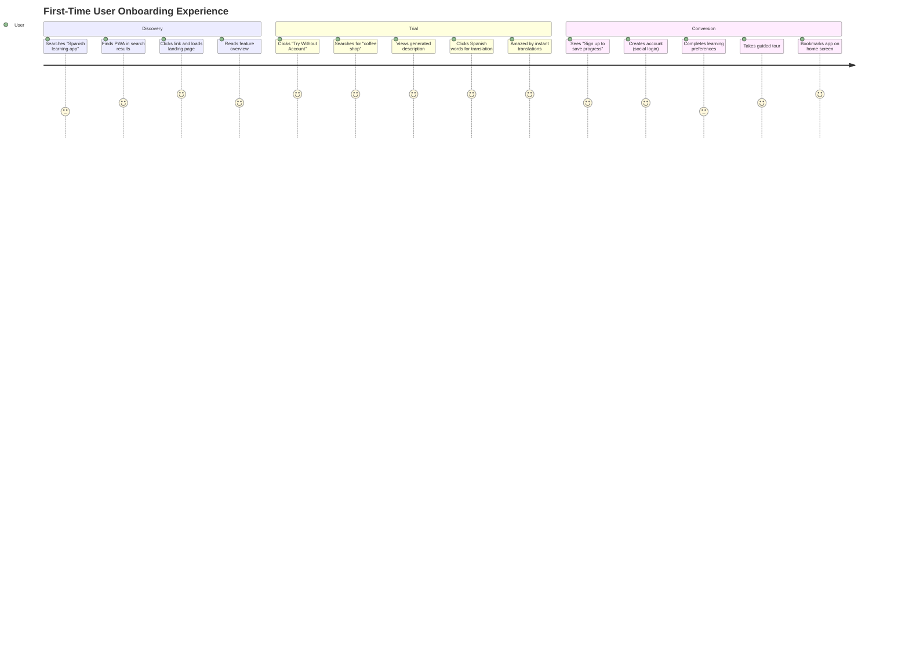
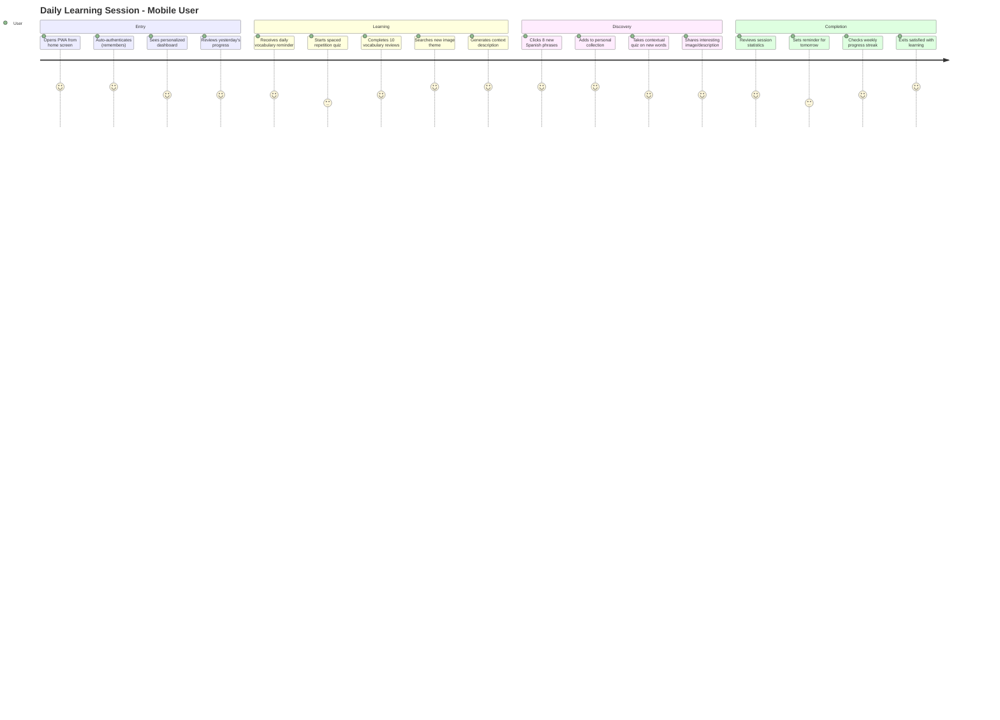
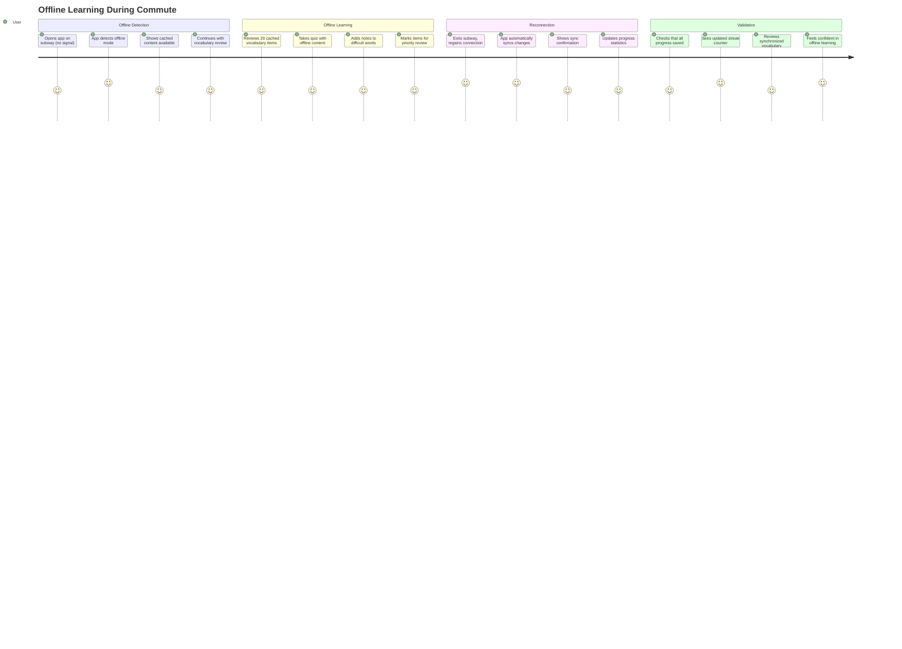

# User Journey Specifications - PWA Conversion

## Overview

This document provides detailed user journey specifications for the Progressive Web App conversion, focusing on user experience flows, interactions, and acceptance criteria for different user personas.

## User Personas

### Primary Personas

#### 1. Maria - Intermediate Spanish Learner
**Demographics:** 28 years old, Marketing professional, Studies Spanish 30 minutes daily
**Goals:** Build professional Spanish vocabulary, improve reading comprehension
**Devices:** Primarily mobile (iPhone), occasionally laptop
**Pain Points:** Limited time, needs quick access to learning materials

#### 2. Dr. Rodriguez - Spanish Teacher
**Demographics:** 45 years old, High school teacher, Manages 120 students
**Goals:** Create engaging vocabulary exercises, track student progress
**Devices:** Desktop computer, iPad for classroom use
**Pain Points:** Time-consuming content creation, difficulty tracking individual progress

#### 3. Alex - Beginner Language Enthusiast
**Demographics:** 22 years old, College student, New to Spanish
**Goals:** Basic vocabulary acquisition, fun learning experience
**Devices:** Android phone, gaming laptop
**Pain Points:** Overwhelming grammar, needs structured learning path

## Journey Maps

### Journey 1: First-Time User Onboarding

**Critical Success Factors:**
- Landing page loads in < 2 seconds
- Guest mode allows full feature trial
- Social login reduces friction
- Immediate value demonstration

**Acceptance Criteria:**
- [ ] 80% of trial users complete first vocabulary interaction
- [ ] 40% of trial users create accounts within session
- [ ] 90% of new users complete onboarding tutorial
- [ ] PWA installation prompt appears after 2+ sessions

### Journey 2: Daily Learning Session (Returning User)

**Performance Requirements:**
- App opens in < 1 second from home screen
- Dashboard loads user data in < 500ms
- Vocabulary sync happens in background
- Offline mode works for cached content

**Acceptance Criteria:**
- [ ] 70% of users complete daily learning streak
- [ ] Average session duration > 15 minutes
- [ ] 85% of vocabulary interactions result in collection
- [ ] Push notification engagement rate > 25%

### Journey 3: Teacher Classroom Integration

**Collaboration Features:**
- Real-time shared vocabulary lists
- QR code sharing for instant access
- Live participation tracking
- Bulk export to learning management systems

**Acceptance Criteria:**
- [ ] Teachers can create vocabulary sets in < 10 minutes
- [ ] 95% of shared links work on first attempt
- [ ] Real-time updates sync within 2 seconds
- [ ] Progress reports export in standard formats

### Journey 4: Offline Learning Experience

**Offline Capabilities:**
- Last 100 vocabulary items cached
- Quiz functionality works offline
- Progress tracking stored locally
- Background sync when reconnected

**Acceptance Criteria:**
- [ ] 90% of core features work offline
- [ ] Sync conflicts resolved automatically
- [ ] Offline indicator clearly visible
- [ ] No data loss during network interruption

## Critical User Flows

### Flow 1: Image Search to Vocabulary Collection

**Steps:**
1. User enters search query (e.g., "beach vacation")
2. System displays Unsplash image results
3. User selects preferred image
4. User adds optional context notes
5. System generates Spanish description using GPT-4
6. User clicks Spanish words/phrases for translations
7. Selected vocabulary automatically saved to personal collection
8. System updates learning statistics and progress

**Alternative Flows:**
- **A1:** No search results found
  - System suggests alternative search terms
  - User modifies query or tries suggested terms
  
- **A2:** AI description fails to generate
  - System provides fallback using cached responses
  - User can retry or skip to next image

**Error Handling:**
- API timeouts: Show retry button with explanation
- Network errors: Enable offline mode with cached content
- Invalid search terms: Provide search suggestions

### Flow 2: Spaced Repetition Quiz System

**Steps:**
1. System calculates due vocabulary using spaced repetition algorithm
2. User receives push notification (if enabled) about due reviews
3. User opens quiz interface showing progress (e.g., "5/20 words due")
4. System presents vocabulary in optimal review order
5. User responds to translation/definition prompts
6. System adjusts difficulty and next review date based on performance
7. Completion screen shows session statistics and progress

**Adaptive Logic:**
- Correct answers → increase interval (SM-2 algorithm)
- Incorrect answers → reset to shorter interval  
- Consistent accuracy → advance difficulty level
- Multiple errors → suggest focused practice

### Flow 3: Social Vocabulary Sharing

**Steps:**
1. User selects vocabulary items to share
2. User creates collection name and description
3. User sets sharing permissions (public/private/specific users)
4. System generates shareable link or QR code
5. Recipients access shared collection
6. Recipients can study but not modify original
7. Owner receives statistics on collection usage

**Privacy Controls:**
- Default to private sharing
- Individual vocabulary item privacy settings
- Revoke access to shared collections
- Export shared collections for backup

## Mobile-Specific Considerations

### Touch Interactions
- **Tap:** Primary selection and navigation
- **Long Press:** Context menus and additional options
- **Swipe:** Navigate between images, dismiss notifications
- **Pinch/Zoom:** Image viewing and text size adjustment
- **Pull to Refresh:** Update content and sync data

### Screen Adaptations
- **Portrait Mode:** Stacked layout with collapsible sections
- **Landscape Mode:** Side-by-side image and text panels
- **Small Screens (< 375px):** Single-column layout with slide-over panels
- **Large Screens (> 768px):** Multi-column layout with persistent navigation

### Performance Optimizations
- **Progressive Image Loading:** Load thumbnails first, full resolution on demand
- **Virtualized Lists:** Render only visible vocabulary items
- **Lazy Loading:** Load content as user scrolls
- **Touch Response:** < 100ms feedback for all touch interactions

## Accessibility Requirements

### Screen Reader Support
- Semantic HTML structure with proper ARIA labels
- Alt text for all images including generated descriptions
- Screen reader announcements for vocabulary translations
- Keyboard navigation support for all interactions

### Visual Accessibility
- High contrast mode support
- Font size adjustment (125%-200% scaling)
- Color-blind friendly color scheme
- Focus indicators for keyboard navigation

### Motor Accessibility
- Large touch targets (minimum 44px)
- Voice input support for search queries
- Switch navigation support
- Adjustable tap sensitivity

## Success Metrics by Journey

### Onboarding Success
- **Completion Rate:** 80% of users complete initial tutorial
- **Time to First Value:** < 3 minutes to first vocabulary collection
- **Account Creation:** 40% of trial users create accounts
- **Retention:** 60% return within 24 hours

### Daily Usage Success
- **Session Frequency:** 4+ sessions per week per active user
- **Session Duration:** 15+ minutes average session length
- **Feature Adoption:** 80% use vocabulary collection, 60% take quizzes
- **Streak Maintenance:** 30% maintain 7+ day learning streaks

### Teacher Adoption Success
- **Content Creation:** Teachers create 5+ vocabulary sets per month
- **Student Engagement:** 85% of shared collections accessed by students
- **Classroom Integration:** 70% of teachers use app during class
- **Progress Tracking:** 90% of teachers access student progress reports

These user journey specifications provide detailed requirements for implementing user-centered design in the PWA conversion, ensuring that all user needs and workflows are properly supported in the new web-based application.